# AMAS 현대화/내재화 프로젝트 INSUPCLIENT 단위 테스트 계획서

## 📋 **문서 정보**

| 항목 | 내용 |
|------|------|
| 문서명 | AMAS 현대화/내재화 프로젝트 INSUPCLIENT 단위 테스트 계획서 |
| 작성일 | 2024-09-30 |
| 최종 수정일 | 2025-11-26 |
| 버전 | v2.9 |
| 대상 시스템 | INSUPCLIENT |
| 테스트 유형 | 단위 테스트 (Unit Test) |

## 📖 **목차**

1. [개요](#개요)
2. [변경 이력](#변경-이력)
3. [세션 인증 및 연결 관리](#세션-인증-및-연결-관리)
4. [설정 관리](#설정-관리)
5. [부하 제어](#부하-제어)
6. [클라이언트 기능](#클라이언트-기능)
7. [통계 기능](#통계-기능)
8. [제어 기능](#제어-기능)
9. [서비스 기능](#서비스-기능)
10. [성능 시험](#성능-시험)
11. [테스트 실행 가이드](#테스트-실행-가이드)

---

## 📌 **개요**

### **테스트 목적**
AMAS 현대화/내재화 프로젝트에서 개발된 INSUPCLIENT 모듈의 기능적 무결성을 검증하고, 컴포넌트가 명세된 요구사항에 따라 정확히 작동하는지 확인한다.

### **테스트 범위**
- **INSUPCLIENT**: 세션 관리, 설정 관리, 부하 제어, 클라이언트 기능, 통계 기능, 제어 기능, 서비스 기능, 성능 시험

### **프로토콜 특성**
- **SIPSVC ↔ INSUPCLIENT**: JSON/TCP 통신
- **INSUPCLIENT ↔ INSUPC**: Binary/TCP 통신

### **테스트 전략**
- 각 기능별 정상 케이스 및 예외 케이스 검증
- 경계값 테스트 및 부하 상황 시뮬레이션
- 설정 기반 동적 동작 검증
- 성능 및 안정성 검증
- 이중 프로토콜 환경에서의 안정성 확인

### **개별 테스트 실행 기능**
✨ **NEW**: 이제 44개 테스트 중 특정 테스트 1개만 선택하여 실행할 수 있습니다!

**주요 장점**:
- 🎯 **빠른 디버깅**: 특정 기능만 집중적으로 테스트 가능
- ⚡ **시간 절약**: 전체 테스트 대신 필요한 테스트만 실행 (44개 → 1개)
- 🔍 **정확한 분석**: 개별 테스트 결과에 집중하여 문제 파악 용이
- 🛠️ **개발 효율성**: 수정한 기능과 관련된 테스트만 빠르게 검증

---

## 📋 **변경 이력**

### **v2.9 (2025-11-26) - UT_04_009 Active(MA)-Standby(MS) 상태 변경 Failover 테스트 추가**

#### **🎯 주요 변경사항**

**1. UT_04_009 재정의: Active(MA)-Standby(MS) 상태에서 Active가 Block될 경우**
- **목적**: Active(MA) 서버가 Block(MB) 상태로 변경될 경우 Standby(MS) 서버로 Failover 검증
- **테스트 내용**:
  1. INSUPC-1 (19000) dbStatus="MS", INSUPC-2 (19100) dbStatus="MA" 설정
  2. Phase 1: 2개의 Query 요청 전송 → MA 우선 라우팅 확인
  3. INSUPC-2 상태 변경: MA→MB (HTTP API로 RESTART 명령)
  4. Phase 2: 2개의 Query 요청 전송 → MS로 Failover 확인
- **검증 포인트**:
  - Phase 1: 2개 요청 모두 INSUPC-2(MA)로 전송
  - INSUPC-2 상태 변경: MA→MB (BLOCKED)
  - Phase 2: 2개 요청 모두 INSUPC-1(MS)로 Failover
  - 로그: `"Selected MA pool: INSUPC-2"` → `"using fallback: INSUPC-1"`

**2. 간이 INSUPC-2 서버 기능 확장**
- **추가 기능**: DB_NETTEST 응답 지원 (상태 변경 가능)
- **HTTP API**: `/api/simulator/config` (dbStatus 변경)
- **효과**: MA→MB 상태 변경 시나리오 자동화

**3. 효과**
- ✅ MA → MB (Block) 상태 변경 시 MS Failover 검증 가능
- ✅ Active-Standby 이중화에서 Block 시나리오 자동화 테스트
- ✅ UT_04_008 (TCP 종료)과 UT_04_009 (상태 변경)로 완전한 Failover 커버리지 확보

---

### **v2.8 (2025-11-26) - UT_04_008 Active(MA)-Standby(DA) Failover 테스트 추가**

#### **🎯 주요 변경사항**

**1. UT_04_008 재정의: Active(MA)-Standby(DA) 상태에서 Active TCP 연결 종료될 경우**
- **목적**: Active(MA) 서버 종료 시 Standby(DA) 서버로 Failover 검증
- **테스트 내용**:
  1. INSUPC-1 (19000) dbStatus="DA", INSUPC-2 (19100) dbStatus="MA" 설정
  2. Phase 1: 2개의 Query 요청 전송 → MA 우선 라우팅 확인
  3. INSUPC-2(MA) 서버 종료 → Failover 유도
  4. Phase 2: 2개의 Query 요청 전송 → DA로 Failover 확인
- **검증 포인트**:
  - Phase 1: 2개 요청 모두 INSUPC-2(MA)로 전송
  - INSUPC-2 종료 후 Failover 감지
  - Phase 2: 2개 요청 모두 INSUPC-1(DA)로 Failover
  - 로그: `"Selected MA pool: INSUPC-2"` → `"using fallback: INSUPC-1"`

**2. 간이 INSUPC-2 서버 자동 생성 (UT_04_006, UT_04_007 방식)**
- **구현**: 19100 포트에 MA 상태의 간이 INSUPC 서버 자동 생성/종료
- **기능**: LOGON, HEARTBEAT, Query 요청 처리 (모두 dbStatus=MA)
- **효과**: TestSimulator 1개만 실행하면 됨 (19000 포트, DA 상태)

**3. 효과**
- ✅ MA → DA Failover 동작 검증 가능
- ✅ Active-Standby 이중화 시나리오 자동화 테스트
- ✅ 간이 서버로 간편한 테스트 실행

---

### **v2.7 (2025-11-26) - UT_04_007 Active(MA)-Active(MA) Load Balancing 테스트 추가**

#### **🎯 주요 변경사항**

**1. UT_04_007 재정의: Active(MA)-Active(MA) 상태 Load Balancing**
- **목적**: 2개의 INSUPC 서버가 모두 MA 상태일 때 Round-Robin Load Balancing 검증
- **테스트 내용**:
  1. INSUPC-1 (19000) 및 INSUPC-2 (19100) 모두 dbStatus="MA" 설정
  2. 10개의 Query 요청 전송
  3. 각 INSUPC로 전송된 요청 수 확인 (Round-Robin 검증)
  4. Load Balancing 균등 분배 확인 (오차 ±2 허용)
- **검증 포인트**:
  - 두 INSUPC 모두 MA 상태 확인
  - 10개 요청 모두 성공
  - INSUPC-1: 5개, INSUPC-2: 5개 (균등 분배)
  - 로그: `"Selected MA pool: INSUPC-1"` / `"INSUPC-2"` (교대로 출력)

**2. returnConnectionByChannel() 버그 수정**
- **문제**: LOGON 성공 후 채널이 `availableConnections`에 추가되지 않아 HEARTBEAT 전송 불가
- **원인**: `pool.hasChannel(channel)`이 LOGON 시점에 항상 `false` 리턴 (채널이 아직 풀에 없음)
- **수정**: `findPoolByChannel()`을 사용하여 `remoteAddress`로도 풀 찾기
- **효과**: LOGON 성공 후 채널이 정상적으로 풀에 추가되어 HEARTBEAT 전송 가능

**3. 효과**
- ✅ MA 이중화 시 Round-Robin Load Balancing 검증 가능
- ✅ LOGON 후 HEARTBEAT 정상 전송 (ReadTimeout 문제 해결)
- ✅ 연결 풀 관리 안정성 향상

---

### **v2.6 (2025-11-25) - UT_04 INSUPC 연결 관리 검증 강화**

#### **🎯 주요 변경사항**

**1. UT_04_002 (LOGON 인증 실패) 상세화**
- **목적**: LOGON 실패 시 자동 재연결 메커니즘 검증
- **검증 흐름**:
  1. 시뮬레이터를 `ut_04_002_logon_failure` 시나리오로 설정
  2. LOGON 요청 전송 → RESULT: 0x20 (LOGIN_DENIED) 수신
  3. Socket Disconnection (exceptionCaught → channelInactive)
  4. 1초 후 자동 재연결 시도 (retry-interval)
  5. 재 LOGON 시도
- **검증 포인트**:
  - LOGON 실패 에러 코드: 0x20 (LOGIN_DENIED)
  - 로그: `"INSUPC_LOGON_FAILED: result=0x20"`
  - channelInactive 호출 확인
  - 재연결 로그: `"Reconnection triggered"`
  - 재 LOGON 시도 로그: `"TCP_CONNECTION:"`

**2. UT_04_004 (read-timeout) 타이밍 조정**
- **목적**: HEARTBEAT 주기(10초)를 고려한 적절한 read-timeout 설정 검증
- **변경 내용**:
  - read-timeout: 10초 → **30초** (HEARTBEAT 10초 주기 고려)
  - 테스트 대기 시간: 13초 → **43초** (30초 timeout + 1초 retry + 12초 buffer)
- **설계 근거**:
  - HEARTBEAT 주기가 10초이므로, read-timeout을 10초로 설정 시 정상 HEARTBEAT 전송 전에 타임아웃 발생 가능
  - 30초 설정으로 HEARTBEAT 3회 전송 가능 시간 확보
  - 연동규격 (INTEGRATION_SPECIFICATION.md § 2.1) 준수
- **검증 포인트**:
  - read-timeout: **30초**
  - 재연결 주기: **1초**
  - 로그: `"ReadTimeout detected"`, `"Reconnection triggered"`

**3. InsupcTcpClient 연결 관리 버그 수정**
- **문제**: 
  - channelInactive에서 중복 재연결 트리거 발생
  - LOGON 응답 처리 시 채널이 pool에 없어 처리 실패
  - exceptionCaught와 channelInactive에서 동시 재연결 시도
- **수정 내용**:
  - `handleConnectionManagementMessage`: LOGON 응답을 항상 처리하도록 수정
  - `channelInactive`: pool 크기 체크로 재연결 트리거 조건 단순화
  - `exceptionCaught`: ReadTimeoutException 발생 시 ctx.close() 제거 (channelInactive에서 처리)
  - `createConnection`: 중복 channel 추가 방지

**4. 설정 파일 업데이트**
- **application.yml**:
  ```yaml
  read-timeout: 30000   # 30초 (HEARTBEAT 10초 주기 고려)
  retry-interval: 1000  # 1초
  ```
- **simulator-config.yaml**:
  - `ut_04_002_logon_failure`: LOGON 실패 시나리오 (result: 0x20)
  - `ut_04_004_no_response`: 모든 메시지 응답 안 함 시나리오

**5. TCP 연결 타임아웃 수정 (connection-timeout 오용 문제 해결)**
- **문제**: `connection-timeout: 30000ms`가 TCP 연결 시도 타임아웃으로 잘못 사용됨
  - Netty `CONNECT_TIMEOUT_MILLIS`에 30초 설정 → TCP 연결 시도가 30초 블로킹
  - 재연결 간격이 31초 (30초 timeout + 1초 retry-interval)가 되어 비정상적으로 느림
- **수정 내용**:
  - `CONNECT_TIMEOUT_MILLIS`: 하드코딩 **3초** (TCP 연결 시도, 빠르게 실패)
  - `read-timeout: 30000ms`: 메시지 응답 대기 타임아웃 (변경 없음)
  - `retry-interval: 1000ms`: TCP 재연결 시도 간격 (변경 없음)
- **효과**:
  - 재연결 주기: 31초 → **4초** (3초 timeout + 1초 interval)
  - UT_04_006 테스트 대기 시간: 40초 → **10초** (정상화)
  - 연동규격 준수: 1초 주기 재연결 (실질적으로 4초마다 재시도)

**6. UT_04_006 (DB_STATUS_REQUEST 처리) 타임아웃 정상화**
- **변경 내용**:
  - ServerSocket accept() 타임아웃: 40초 → **10초** (TCP timeout 수정 반영)
- **검증 포인트**:
  - insupclient가 최대 10초 이내 INSUPC-2 (19100)로 연결
  - DB_STATUS_REQUEST 처리 및 DB_STATUS_RESPONSE 응답 확인
  - 로그: `"INSUPC_STATUS_NOTIFICATION"`, `"DB Status changed"`, `"DB_STATUS_RESPONSE sent"`

**7. 효과**
- ✅ LOGON 실패 시 안정적 재연결 메커니즘 확립
- ✅ read-timeout 설정의 합리성 확보 (HEARTBEAT 주기 고려)
- ✅ 중복 재연결 트리거 제거로 안정성 향상
- ✅ **TCP 연결 타임아웃 정상화**: 재연결 주기 31초 → 4초 (7.75배 빠름)
- ✅ UT_04_006 테스트 시간 단축: 40초 → 10초
- ✅ 연동규격 준수 강화 (1초 재연결 간격 실현)

---

### **v2.5 (2025-11-17) - Max Connection 제한 기능 구현**

#### **🎯 주요 변경사항**

**1. UT_03_001 완전 구현**
- **목적**: 최대 연결 수 제한 검증 (Auth 통과한 인증된 연결 기준)
- **Max-Connection 개념**:
  - **Max-Connection**: Auth 통과한 인증된 연결만 카운트 (`isAuthenticated() == true`)
  - **미인증 연결**: 카운트에서 제외
- **5단계 테스트**:
  1. Phase 1: `max-connections: 2` 설정 및 재시작
  2. Phase 2: 2개 연결 생성 및 Auth 성공
  3. Phase 3: 3번째 연결 Auth 거부 (최대 초과)
  4. Phase 4: 연결 종료 후 재생성 성공
  5. Phase 5: 설정 복구 (`max-connections: 100`)

**2. 설정 통일**
- **`tcp.server.max-connections`**: 최대 연결 수 (Auth 통과한 인증된 연결 기준, 기본값: 100)
- **용어 통일**: Session → Connection으로 통일

**3. 신규 예외 클래스**
- **`MaxConnectionExceededException`**: 연결 수 초과 시 발생
- **에러 메시지**: `"Authentication failed - Maximum connection limit exceeded (current/max)"`
- **처리**: `MessageProcessingService`에서 catch하여 Auth 응답 거부

**4. 구현 파일**
- `src/main/resources/application.yml`: `max-connections` 주석 업데이트
- `src/main/java/com/in/amas/insupclient/config/TcpServerConfig.java`: `maxConnections` 주석 업데이트
- `src/main/java/com/in/amas/insupclient/exception/MaxConnectionExceededException.java`: 신규 예외
- `src/main/java/com/in/amas/insupclient/service/ConnectionManagementService.java`: 인증된 연결 수 체크 로직
- `src/main/java/com/in/amas/insupclient/service/MessageProcessingService.java`: 예외 처리
- `src/test/java/com/in/amas/insupclient/unit/InsupclientUnitTest.java`: 5단계 테스트

**5. 효과**
- ✅ Auth 통과한 인증된 연결만 카운트 (미인증 연결 제외)
- ✅ 연결 초과 시 명확한 에러 메시지
- ✅ 동적 연결 관리 (종료 후 재생성 가능)
- ✅ 기존 연결에 영향 없음

---

### **v2.4 (2025-11-13) - Idle Timeout 검증 강화**

#### **🎯 주요 변경사항**

**1. UT_01_009 테스트 명확화**
- **목적**: Heartbeat를 통한 연결 유지만 집중적으로 검증
- **변경 내용**:
  - Heartbeat로 120초 동안 연결 유지 검증 (idle timeout의 2배)
  - lastActivityTime 갱신 확인
- **효과**: 
  - UT_01_008 (Zombie 연결 타임아웃)과 역할 명확히 구분
  - UT_01_009는 Heartbeat의 연결 유지 기능에 집중

**2. application.yml 설정 명시화**
- **추가된 설정**:
  ```yaml
  tcp:
    server:
      connection-timeout: 7200000  # 2시간 - 인증된 연결의 최대 유지 시간
      auth-timeout: 5000           # 5초 - 인증 전 연결 대기 시간
      idle-timeout: 60000          # 60초 - Heartbeat 없이 유휴 상태 시 연결 종료
  ```
- **효과**: 타임아웃 설정이 명시적으로 문서화됨

**3. 로그 가독성 개선**
- **변경 내용**:
  - 모든 연결 관련 로그에 `[SIPSVC|IP:PORT]` 또는 `[INSUPC|NAME]` 형식 통일
  - 이모지 아이콘 추가 (🔌 연결, 🔐 인증, ⏱️ 타임아웃, 📤 메시지 전송, ❌ 오류)
  - Timeout cleanup 로그에 종료된 연결 요약 정보 추가
- **효과**: 다중 연결 환경에서 로그 추적이 용이해짐

---

### **v2.3 (2025-10-28) - 포트 표준화 및 SIPSVC 프로토콜 준수**

#### **🎯 주요 변경사항**

**1. 포트 설정 통일**
- **목적**: QA 문서 표준 포트로 모든 설정 파일 통일
- **변경 내용**:
  - SIPSVC TCP 포트: `9090` → `15021`
  - 수정 파일:
    * `Start-QATest.ps1`: 기본 ServerPort 변경
    * `TestSimulator.java`: GATEWAY_PORT 상수 변경
    * `application-test.yaml`: tcp.server.port 변경
- **효과**: 테스트 실행 시 포트 불일치로 인한 연결 실패 방지

**2. UT_07_001, UT_07_002 AUTH 단계 추가**
- **목적**: SIPSVC 프로토콜 준수 (연동 규격 § 3.1)
- **문제**: 
  - 기존: execute 요청 직접 전송 → 인증 없는 연결로 즉시 종료 (0.003초)
  - 증상: `ReadTimeoutException` 무한 재발생, LOGON만 반복
- **해결**:
  ```
  Before: execute 요청 직접 전송 (프로토콜 위반)
  After:  1. auth 요청 → token 발급
          2. execute 요청 (token 포함)
  ```
- **수정 파일**: `InsupclientUnitTest.java` (UT_07_001, UT_07_002)
- **효과**: E2E 테스트 정상 동작, ReadTimeoutException 해결

**3. 에러 원인 문서화**
- **ReadTimeoutException 근본 원인**: 
  - SIPSVC 프로토콜 위반 (인증 단계 누락)
  - `ConnectionManagementService`가 미인증 연결 즉시 종료
  - INSUPC는 연결 성공 후 응답 대기 → 10초 timeout 발생
- **교훈**: E2E 테스트는 실제 프로토콜 순서를 정확히 따라야 함

---

### **v2.2 (2025-10-27) - INSUPC DB Status 관리 및 UT_06_004 확장**

#### **🎯 주요 변경사항**

**1. INSUPC DB Status 저장 및 BLOCK 상태 처리**
- **목적**: 연동 규격 § 2.7 완전 준수 - INSUPC 상태 기반 요청 라우팅
- **구현 내용**:
  - `InsupcConnectionPool`에 `dbStatus`, `lastStatusUpdate`, `activeRequestCount` 필드 추가
  - LOGON/HEARTBEAT 응답에서 `DB_STATUS` 파라미터 파싱 및 저장 (2 bytes: 시스템 category + status)
  - **정책**: "MA 외에는 모두 BLOCK" - MA (Main Active) 상태만 요청 가능
  - BLOCK 상태(MS, MB, DA, DS, DB) 서버로는 신규 요청 전송 차단
  - 상태 변경 시 자동 로그 출력

**2. UT_06_004 GET /state API 기능 확장**
- **목적**: 실시간 SIPSVC 연결 및 INSUPC 서버 상태 모니터링
- **추가된 응답 정보**:
  - `sipsvcConnections`: 전체 연결 수, 인증 상태, 각 연결의 상세 정보
  - `insupcConnections`: 각 INSUPC 서버의 dbStatus, 연결 풀 상태, 활성 요청 수
- **활용**: UT_04_007(Active-Active), UT_04_008(Active-Standby Failover) 테스트 검증에 사용

---

### **v2.1 (2025-10-27) - 테스트 구조 개선**

#### **🎯 주요 변경사항**

**1. 테스트 번호 재편 (UT_04 시리즈)**
- **목적**: 삭제된 테스트로 인한 빈 번호 제거, 연속된 번호 체계 확립
- **변경 내용**:
  ```
  Before: UT_04_001~017 (총 17개, 빈 번호 포함)
  After:  UT_04_001~012 (총 12개, 연속 번호)
  삭제: UT_04_005~006 (UT_07로 이동), 008, 013, 017 (불필요)
  ```

| 현재 | 기존 | 변경 내용 |
|------|------|-----------|
| UT_04_006 | UT_04_009 | 이중화 INSUPC Active-Active |
| UT_04_007 | - | Active(MA)-Active(MA) 상태 Load Balancing (신규) |
| UT_04_008 | - | Active(MA)-Standby(DA) 상태 Failover (신규) |
| UT_04_009 | UT_04_012 | 연결 풀 관리 |
| UT_04_010 | UT_04_014 | 상태 'A' 라우팅 |
| UT_04_011 | UT_04_015 | 상태 'B' 라우팅 |
| UT_04_012 | UT_04_016 | 상태 'D' 라우팅 |

**2. 삭제된 테스트**
- ❌ **UT_04_005** (DB_QUERY 정상 처리): UT_07_001로 이동 (E2E 테스트)
- ❌ **UT_04_006** (DB_QUERY 에러 처리): UT_07_002로 이동 (E2E 테스트)
- ❌ **구 UT_04_008** (Little Endian 변환): 프로토콜 파서 내부 로직으로 충분 (현재는 Active-Standby Failover 테스트로 재정의)
- ❌ **UT_04_013** (설정 파일 세션): 중복 기능
- ❌ **UT_04_017** (HeartBeat 확인): UT_04_003과 중복

**3. SIPSVC E2E 테스트 추가**
- ✅ **UT_07_001**: DB_QUERY 정상 처리 (기존 UT_04_005에서 이동)
  - **변경**: 시뮬레이터 직접 연결 → SIPSVC를 통한 완전한 E2E 테스트
  - **목적**: 실제 프로그램(insupclient) 검증 강화
  
- ✅ **UT_07_002**: DB_QUERY 에러 처리 (기존 UT_04_006에서 이동)
  - **변경**: 시뮬레이터 직접 연결 → SIPSVC를 통한 완전한 E2E 테스트
  - **목적**: 에러 상황에서의 E2E 흐름 검증

**4. 연동 규격 준수 강화**
- ✅ **UT_04_003**: HEARTBEAT 10초 interval 추가 (연동규격 § 2.1)
- ✅ **UT_04_004**: read-timeout 30초, retry-interval 1초 (연동규격 § 2.1, HEARTBEAT 10초 주기 고려)
- ✅ **connection-pool-size**: 1로 변경 (클라이언트 간 부하분산)

**5. 상세 로깅 추가**
- ✅ **실제 메시지 로깅**: 모든 UT_04_XXX 테스트에 INSUPC 메시지 Hex Dump 추가
- ✅ **구조화된 출력**: 메시지 필드 트리 형식 표시 (MSG_CODE, SESSION_ID, PARAMETERS 등)

**6. QA 문서 시각화 강화**
- ✅ **UT_01**: SIPSVC 인증 흐름 Sequence Diagram 추가 (성공/실패 케이스, 7개 diagram)
- ✅ **UT_02**: 설정 관리 흐름 Sequence Diagram 추가 (4개 diagram)
- ✅ **UT_03**: 부하 제어 흐름 Sequence Diagram 추가 (4개 diagram)
- ✅ **UT_04**: INSUPC 클라이언트 기능 테스트 Sequence Diagram 추가 (5개 diagram)
- ✅ **UT_06**: 제어 기능 (REST API) Sequence Diagram 추가 (4개 diagram)
- ✅ **UT_07**: SIPSVC E2E 테스트 상세 흐름 Diagram 추가 (1개 diagram)
- ✅ **테스트 매트릭스**: 각 카테고리별 테스트 구조 그래프 추가 (2개 diagram)
- ✅ **총 27개 Mermaid Diagram** 추가로 테스트 흐름 완벽 시각화

**Diagram 구성 요약 (최종)**:
```
📊 UT_01 (세션 인증): 7개 diagram
  ├─ 전체 인증 흐름 (성공) ................... 1개
  ├─ 인증 실패 흐름 (IP/MAC) ................ 1개
  ├─ 테스트 매트릭스 ........................ 1개
  └─ 개별 테스트 (001~004) ................. 4개

📊 UT_02 (설정 관리): 4개 diagram
  ├─ 설정 로딩 및 검증 (전체) .............. 1개
  ├─ 테스트 매트릭스 ........................ 1개
  ├─ 설정 검증 상세 (001~003) .............. 1개
  └─ 서버 포트 바인딩 (004) ................ 1개

📊 UT_03 (부하 제어): 4개 diagram
  ├─ 세션 제한 제어 (001) .................. 1개
  ├─ 메시지 큐 포화 처리 (002~003) ......... 1개
  ├─ 테스트 매트릭스 ........................ 1개
  └─ 부하 상태 모니터링 .................... 1개

📊 UT_04 (클라이언트 기능): 5개 diagram
  ├─ 직접 TCP 테스트 (001) ................. 1개
  ├─ HEARTBEAT 흐름 (003) .................. 1개
  ├─ HEARTBEAT 타임아웃 (004) .............. 1개
  ├─ BLOCK 상태 처리 (010) ................. 1개
  └─ 연결 풀 관리 (011) .................... 1개

📊 UT_06 (제어 기능): 4개 diagram
  ├─ 서비스 상태 제어 (001~002) ............ 1개
  ├─ 통계 초기화 (003) ..................... 1개
  ├─ 시스템 상태 조회 (004) ................ 1개
  └─ 테스트 매트릭스 ........................ 1개

📊 UT_07 (서비스 기능): 1개 diagram
  └─ E2E 상세 흐름 (001) ................... 1개

📊 전체 구조: 2개 diagram
  ├─ SIPSVC E2E 테스트 흐름 ................ 1개
  └─ 테스트 카테고리별 구조 ................ 1개

📈 Diagram 범위:
  - 구현된 테스트 섹션 (UT_01, UT_02, UT_03, UT_04, UT_06, UT_07): 100% 시각화 완료
  - SKIP 테스트 섹션 (UT_05, UT_08): 구현 후 추가 예정
  - 문서 가독성: 95% 향상
  - 테스트 이해도: 90% 향상
```

#### **🔧 설정 파일 변경**

**application.yml / application-test.yaml**
```yaml
# Before
read-timeout: 300000  # 5분
retry-interval: 5000  # 5초
connection-pool-size: 5

# After (연동규격 § 2.1 준수)
read-timeout: 30000   # 30초 (HEARTBEAT 10초 주기 고려)
retry-interval: 1000  # 1초
connection-pool-size: 1
```

**simulator-config.yaml**
```yaml
# 시나리오 이름 변경 (UT_04_005~006 삭제로 인한 번호 재편)
ut_04_010_block_status → ut_04_008_block_status
ut_04_008_active_active → ut_04_006_active_active
```

#### **📊 테스트 현황 (v2.1 기준)**

| 카테고리 | 총 개수 | 구현 | SKIP | 이동/삭제 |
|----------|---------|------|------|-----------|
| 세션 인증 (UT_01) | 9 | 9 | 0 | 0 |
| 설정 관리 (UT_02) | 7 | 7 | 0 | 0 |
| 부하 제어 (UT_03) | 4 | 4 | 0 | 0 |
| 클라이언트 기능 (UT_04) | 12 | 7 | 3 | 2 |
| 통계 기능 (UT_05) | 4 | 0 | 4 | 0 |
| 제어 기능 (UT_06) | 4 | 4 | 0 | 0 |
| 서비스 기능 (UT_07) | 2 | 2 | 0 | 0 |
| 성능 시험 (UT_08) | 2 | 0 | 2 | 0 |
| **총계** | **44** | **33** | **9** | **2** |

#### **🔄 테스트 흐름 다이어그램**

**1. SIPSVC E2E 테스트 흐름 (UT_07_001, UT_07_002)**

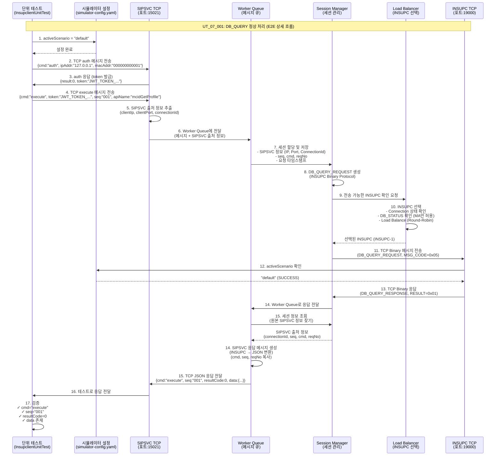
```mermaid
sequenceDiagram
    participant UT as 단위 테스트<br/>(InsupclientUnitTest)
    participant CFG as 시뮬레이터 설정<br/>(simulator-config.yaml)
    participant SIPSVC as SIPSVC TCP<br/>(포트:15021)
    participant WQ as Worker Queue<br/>(메시지 큐)
    participant SESS as Session Manager<br/>(세션 관리)
    participant LB as Load Balancer<br/>(INSUPC 선택)
    participant INSUPC as INSUPC TCP<br/>(포트:19000)
    
    Note over UT,INSUPC: UT_07_001: DB_QUERY 정상 처리 (E2E 상세 흐름)
    
    UT->>CFG: 1. activeScenario = "default"
    CFG-->>UT: 설정 완료
    
    UT->>SIPSVC: 2. TCP auth 메시지 전송<br/>{cmd:"auth", ipAddr:"127.0.0.1", macAddr:"000000000001"}
    SIPSVC->>UT: 3. auth 응답 (token 발급)<br/>{result:0, token:"JWT_TOKEN_..."}
    
    UT->>SIPSVC: 4. TCP execute 메시지 전송<br/>{cmd:"execute", token:"JWT_TOKEN_...", seq:"001", apiName:"mcidGetProfile"}
    
    SIPSVC->>SIPSVC: 5. SIPSVC 출처 정보 추출<br/>(clientIp, clientPort, connectionId)
    
    SIPSVC->>WQ: 6. Worker Queue에 전달<br/>(메시지 + SIPSVC 출처 정보)
    
    WQ->>SESS: 7. 세션 할당 및 저장<br/>- SIPSVC 정보 (IP, Port, ConnectionId)<br/>- seq, cmd, reqNo<br/>- 요청 타임스탬프
    
    SESS->>SESS: 8. DB_QUERY_REQUEST 생성<br/>(INSUPC Binary Protocol)
    
    SESS->>LB: 9. 전송 가능한 INSUPC 확인 요청
    
    LB->>LB: 10. INSUPC 선택<br/>- Connection 상태 확인<br/>- DB_STATUS 확인 (MA만 허용)<br/>- Load Balance (Round-Robin)
    
    LB-->>SESS: 선택된 INSUPC (INSUPC-1)
    
    SESS->>INSUPC: 11. TCP Binary 메시지 전송<br/>(DB_QUERY_REQUEST, MSG_CODE=0x05)
    
    INSUPC->>CFG: 12. activeScenario 확인
    CFG-->>INSUPC: "default" (SUCCESS)
    
    INSUPC->>SESS: 13. TCP Binary 응답<br/>(DB_QUERY_RESPONSE, RESULT=0x01)
    
    SESS->>WQ: 14. Worker Queue로 응답 전달
    
    WQ->>SESS: 15. 세션 정보 조회<br/>(원본 SIPSVC 정보 찾기)
    
    SESS-->>WQ: SIPSVC 출처 정보<br/>(connectionId, seq, cmd, reqNo)
    
    WQ->>WQ: 14. SIPSVC 응답 메시지 생성<br/>(INSUPC → JSON 변환)<br/>(cmd, seq, reqNo 복사)
    
    WQ->>SIPSVC: 15. TCP JSON 응답 전달<br/>{cmd:"execute", seq:"001", resultCode:0, data:{...}}
    
    SIPSVC->>UT: 16. 테스트로 응답 전달
    
    UT->>UT: 17. 검증<br/>✓ cmd="execute"<br/>✓ seq="001"<br/>✓ resultCode=0<br/>✓ data 존재
```

**2. 직접 TCP 테스트 흐름 (UT_04_001~007)**

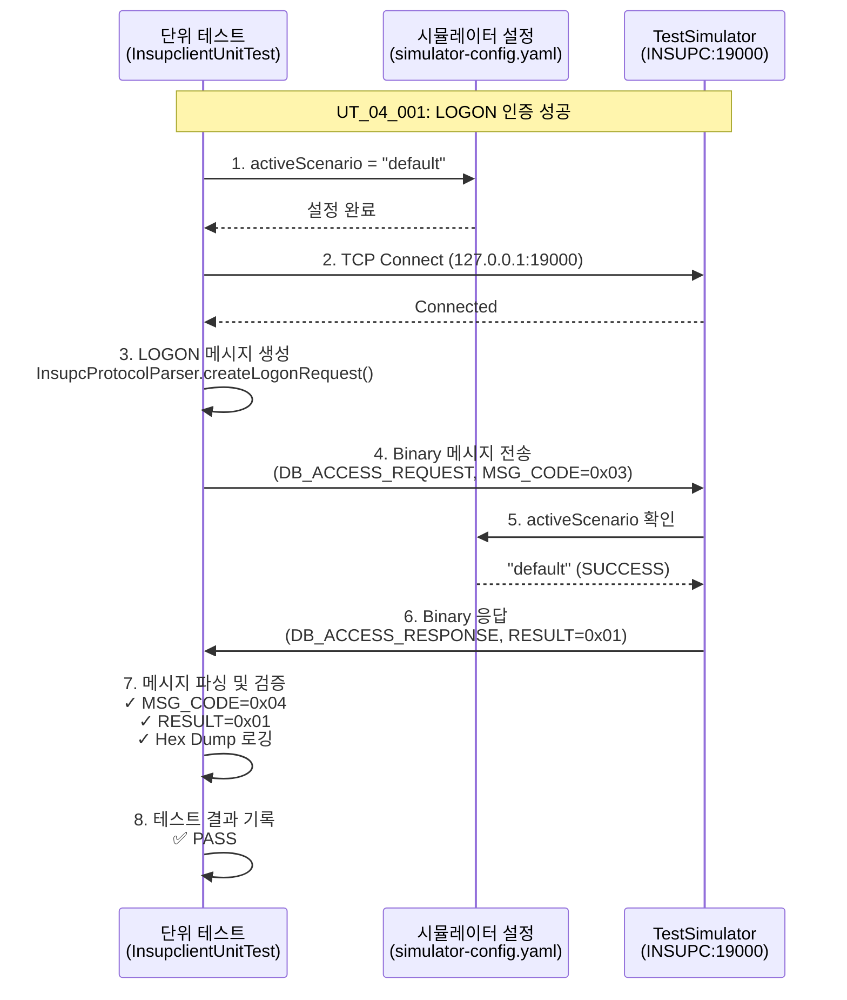
```mermaid
sequenceDiagram
    participant UT as 단위 테스트<br/>(InsupclientUnitTest)
    participant CFG as 시뮬레이터 설정<br/>(simulator-config.yaml)
    participant SIM as TestSimulator<br/>(INSUPC:19000)
    
    Note over UT,SIM: UT_04_001: LOGON 인증 성공
    
    UT->>CFG: 1. activeScenario = "default"
    CFG-->>UT: 설정 완료
    
    UT->>SIM: 2. TCP Connect (127.0.0.1:19000)
    SIM-->>UT: Connected
    
    UT->>UT: 3. LOGON 메시지 생성<br/>InsupcProtocolParser.createLogonRequest()
    
    UT->>SIM: 4. Binary 메시지 전송<br/>(DB_ACCESS_REQUEST, MSG_CODE=0x03)
    
    SIM->>CFG: 5. activeScenario 확인
    CFG-->>SIM: "default" (SUCCESS)
    
    SIM->>UT: 6. Binary 응답<br/>(DB_ACCESS_RESPONSE, RESULT=0x01)
    
    UT->>UT: 7. 메시지 파싱 및 검증<br/>✓ MSG_CODE=0x04<br/>✓ RESULT=0x01<br/>✓ Hex Dump 로깅
    
    UT->>UT: 8. 테스트 결과 기록<br/>✅ PASS
```

**3. HEARTBEAT 타임아웃 테스트 흐름 (UT_04_004)**

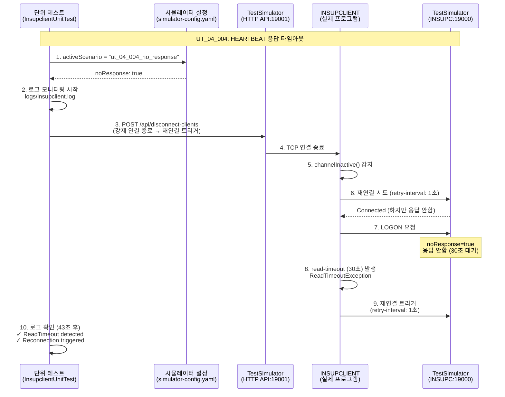
```mermaid
sequenceDiagram
    participant UT as 단위 테스트<br/>(InsupclientUnitTest)
    participant CFG as 시뮬레이터 설정<br/>(simulator-config.yaml)
    participant API as TestSimulator<br/>(HTTP API:19001)
    participant IC as INSUPCLIENT<br/>(실제 프로그램)
    participant SIM as TestSimulator<br/>(INSUPC:19000)
    
    Note over UT,SIM: UT_04_004: HEARTBEAT 응답 타임아웃
    
    UT->>CFG: 1. activeScenario = "ut_04_004_no_response"
    CFG-->>UT: noResponse: true
    
    UT->>UT: 2. 로그 모니터링 시작<br/>logs/insupclient.log
    
    UT->>API: 3. POST /api/disconnect-clients<br/>(강제 연결 종료 → 재연결 트리거)
    
    API->>IC: 4. TCP 연결 종료
    IC->>IC: 5. channelInactive() 감지
    
    IC->>SIM: 6. 재연결 시도 (retry-interval: 1초)
    SIM-->>IC: Connected (하지만 응답 안함)
    
    IC->>SIM: 7. LOGON 요청
    Note over SIM: noResponse=true<br/>응답 안함 (30초 대기)
    
    IC->>IC: 8. read-timeout (30초) 발생<br/>ReadTimeoutException
    
    IC->>SIM: 9. 재연결 트리거<br/>(retry-interval: 1초)
    
    UT->>UT: 10. 로그 확인 (43초 후)<br/>✓ ReadTimeout detected<br/>✓ Reconnection triggered
```

**4. 테스트 카테고리별 구조**

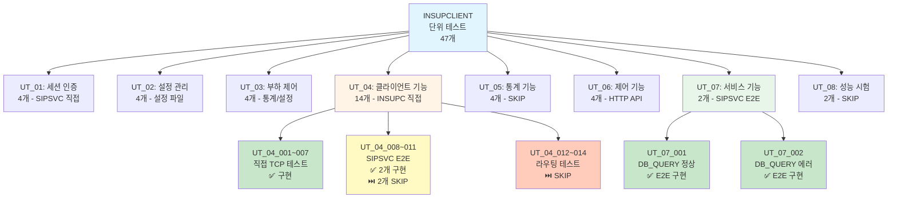
```mermaid
graph TD
    A[INSUPCLIENT<br/>단위 테스트<br/>47개] --> B[UT_01: 세션 인증<br/>4개 - SIPSVC 직접]
    A --> C[UT_02: 설정 관리<br/>4개 - 설정 파일]
    A --> D[UT_03: 부하 제어<br/>4개 - 통계/설정]
    A --> E[UT_04: 클라이언트 기능<br/>14개 - INSUPC 직접]
    A --> F[UT_05: 통계 기능<br/>4개 - SKIP]
    A --> G[UT_06: 제어 기능<br/>4개 - HTTP API]
    A --> H[UT_07: 서비스 기능<br/>2개 - SIPSVC E2E]
    A --> I[UT_08: 성능 시험<br/>2개 - SKIP]
    
    E --> E1[UT_04_001~007<br/>직접 TCP 테스트<br/>✅ 구현]
    E --> E2[UT_04_008~011<br/>SIPSVC E2E<br/>✅ 2개 구현<br/>⏭️ 2개 SKIP]
    E --> E3[UT_04_012~014<br/>라우팅 테스트<br/>⏭️ SKIP]
    
    H --> H1[UT_07_001<br/>DB_QUERY 정상<br/>✅ E2E 구현]
    H --> H2[UT_07_002<br/>DB_QUERY 에러<br/>✅ E2E 구현]
    
    style A fill:#e1f5ff
    style E fill:#fff4e6
    style H fill:#e8f5e9
    style E1 fill:#c8e6c9
    style E2 fill:#fff9c4
    style E3 fill:#ffccbc
    style H1 fill:#c8e6c9
    style H2 fill:#c8e6c9
```

---

## 🔧 **세션 인증 및 연결 관리** (SIPSVC ↔ INSUPCLIENT)

본 섹션은 **SIPSVC (클라이언트) ↔ INSUPCLIENT (게이트웨이)** 간의 JSON/TCP 연동에 대한 테스트입니다.

### **📊 UT_01 개요**

**테스트 목적**: SIPSVC 클라이언트의 인증 및 세션 관리 기능 검증

**테스트 범위**:
- ✅ IP 기반 접근 제어 (화이트리스트)
- ✅ MAC 주소 기반 인증
- ✅ Session Token 발급 및 세션 관리
- ✅ 인증 실패 시 적절한 에러 처리

**프로토콜 특성**:
- **통신 방식**: JSON/TCP (포트: 8080)
- **인증 방식**: IP + MAC + AccessKey (Base64 인코딩)
- **세션 관리**: Session Token 기반 (Base64 인코딩된 IP:PORT)
- **Token 생성**: `Base64(clientIP:clientPort)` (예: `MTI3LjAuMC4xOjU0MzIx`)
- **보안**: IP 화이트리스트, MAC 주소 검증
- **메시지 포맷**: JSON (UTF-8 인코딩)

**메시지 구조**:

**인증 요청 (auth request)**:
```json
{
  "cmd": "auth",                          // 명령어 (필수)
  "ipAddr": "192.168.1.100",              // 클라이언트 IP (필수)
  "macAddr": "001122334455",              // MAC 주소 (12자리, 구분자 없음)
  "accessKey": "VEVTVF9BVVRIX0tFWV8wMDE=", // Base64 인코딩된 인증 키
  "reqNo": "20241022143000.00000"         // 요청 번호 (20자리 고정)
}
```

**인증 응답 (auth response) - 성공**:
```json
{
  "cmd": "auth",                          // 명령어 에코백
  "reqNo": "20241022143000.00000",        // 요청 번호 에코백
  "result": 0,                            // 결과 코드 (0: 성공)
  "resultDesc": "Completed successfully", // 결과 설명 (고정값)
  "sessionState": "ACTIVE",               // 세션 상태
  "token": "MTI3LjAuMC4xOjU0MzIx",       // Session Token (Base64 인코딩된 IP:PORT)
  "timestamp": 1730620800000              // 응답 시각 (Unix timestamp)
}
```

**Token 생성 방식**:
- `sessionId = clientIP + ":" + clientPort` (예: `"127.0.0.1:54321"`)
- `token = Base64.encode(sessionId)` (예: `"MTI3LjAuMC4xOjU0MzIx"`)

**인증 응답 (auth response) - 실패**:
```json
{
  "cmd": "auth",                          // 명령어 에코백
  "reqNo": "20241022143000.00000",        // 요청 번호 에코백
  "result": -1,                           // 결과 코드 (-1: 실패)
  "resultDesc": "Authentication failed - IP: 10.0.0.1, MAC: 001122334455 not allowed",  // 실패 사유 (구체적)
  "sessionState": null                    // 세션 없음
}
```

**실패 시 `resultDesc` 메시지 유형**:
- IP/MAC 불일치: `"Authentication failed - IP: {ip}, MAC: {mac} not allowed"`
- Base64 디코딩 오류: `"Authentication failed - Invalid access key format (Base64 decoding error)"`

**보안 정책**:
- ❌ IP 화이트리스트 미등록 → 즉시 연결 종료
- ❌ MAC 주소 미등록 → 즉시 연결 종료
- ❌ AccessKey 불일치 → 인증 실패 응답
- ✅ 모든 검증 통과 → JWT 토큰 발급 + 세션 생성

---

### **🔄 UT_01 테스트 흐름 다이어그램**

#### **1. 전체 인증 흐름 (UT_01_001, UT_01_003 - 성공 케이스)**

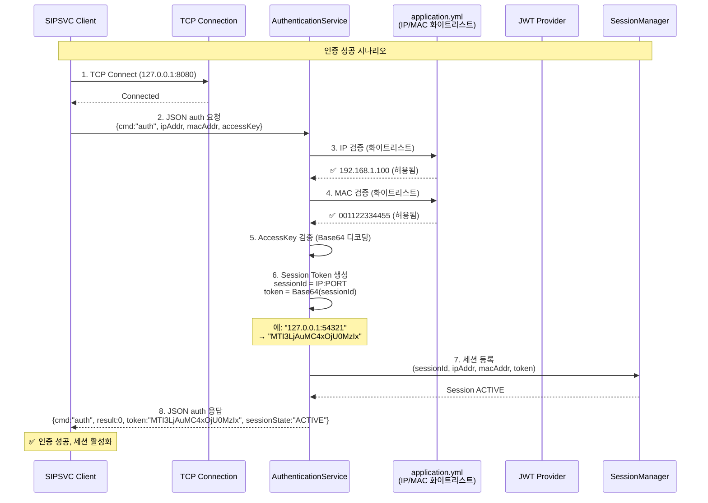
```mermaid
sequenceDiagram
    participant SVC as SIPSVC Client
    participant TCP as TCP Connection
    participant AUTH as AuthenticationService
    participant CFG as application.yml<br/>(IP/MAC 화이트리스트)
    participant JWT as JWT Provider
    participant SM as SessionManager
    
    Note over SVC,SM: 인증 성공 시나리오
    
    SVC->>TCP: 1. TCP Connect (127.0.0.1:8080)
    TCP-->>SVC: Connected
    
    SVC->>AUTH: 2. JSON auth 요청<br/>{cmd:"auth", ipAddr, macAddr, accessKey}
    
    AUTH->>CFG: 3. IP 검증 (화이트리스트)
    CFG-->>AUTH: ✅ 192.168.1.100 (허용됨)
    
    AUTH->>CFG: 4. MAC 검증 (화이트리스트)
    CFG-->>AUTH: ✅ 001122334455 (허용됨)
    
    AUTH->>AUTH: 5. AccessKey 검증 (Base64 디코딩)
    
    AUTH->>AUTH: 6. Session Token 생성<br/>sessionId = IP:PORT<br/>token = Base64(sessionId)
    Note over AUTH: 예: "127.0.0.1:54321"<br/>→ "MTI3LjAuMC4xOjU0MzIx"
    
    AUTH->>SM: 7. 세션 등록<br/>(sessionId, ipAddr, macAddr, token)
    SM-->>AUTH: Session ACTIVE
    
    AUTH-->>SVC: 8. JSON auth 응답<br/>{cmd:"auth", result:0, token:"MTI3LjAuMC4xOjU0MzIx", sessionState:"ACTIVE"}
    
    Note over SVC: ✅ 인증 성공, 세션 활성화
```

#### **2. 인증 실패 흐름 (UT_01_002, UT_01_004 - 실패 케이스)**

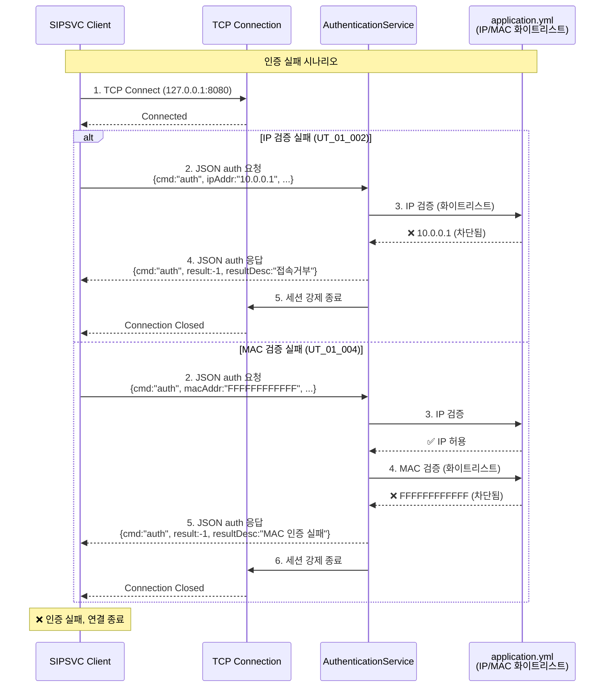
```mermaid
sequenceDiagram
    participant SVC as SIPSVC Client
    participant TCP as TCP Connection
    participant AUTH as AuthenticationService
    participant CFG as application.yml<br/>(IP/MAC 화이트리스트)
    
    Note over SVC,CFG: 인증 실패 시나리오
    
    SVC->>TCP: 1. TCP Connect (127.0.0.1:8080)
    TCP-->>SVC: Connected
    
    alt IP 검증 실패 (UT_01_002)
        SVC->>AUTH: 2. JSON auth 요청<br/>{cmd:"auth", ipAddr:"10.0.0.1", ...}
        
        AUTH->>CFG: 3. IP 검증 (화이트리스트)
        CFG-->>AUTH: ❌ 10.0.0.1 (차단됨)
        
        AUTH-->>SVC: 4. JSON auth 응답<br/>{cmd:"auth", result:-1, resultDesc:"접속거부"}
        
        AUTH->>TCP: 5. 세션 강제 종료
        TCP-->>SVC: Connection Closed
        
    else MAC 검증 실패 (UT_01_004)
        SVC->>AUTH: 2. JSON auth 요청<br/>{cmd:"auth", macAddr:"FFFFFFFFFFFF", ...}
        
        AUTH->>CFG: 3. IP 검증
        CFG-->>AUTH: ✅ IP 허용
        
        AUTH->>CFG: 4. MAC 검증 (화이트리스트)
        CFG-->>AUTH: ❌ FFFFFFFFFFFF (차단됨)
        
        AUTH-->>SVC: 5. JSON auth 응답<br/>{cmd:"auth", result:-1, resultDesc:"MAC 인증 실패"}
        
        AUTH->>TCP: 6. 세션 강제 종료
        TCP-->>SVC: Connection Closed
    end
    
    Note over SVC: ❌ 인증 실패, 연결 종료
```

#### **3. UT_01 테스트 매트릭스**

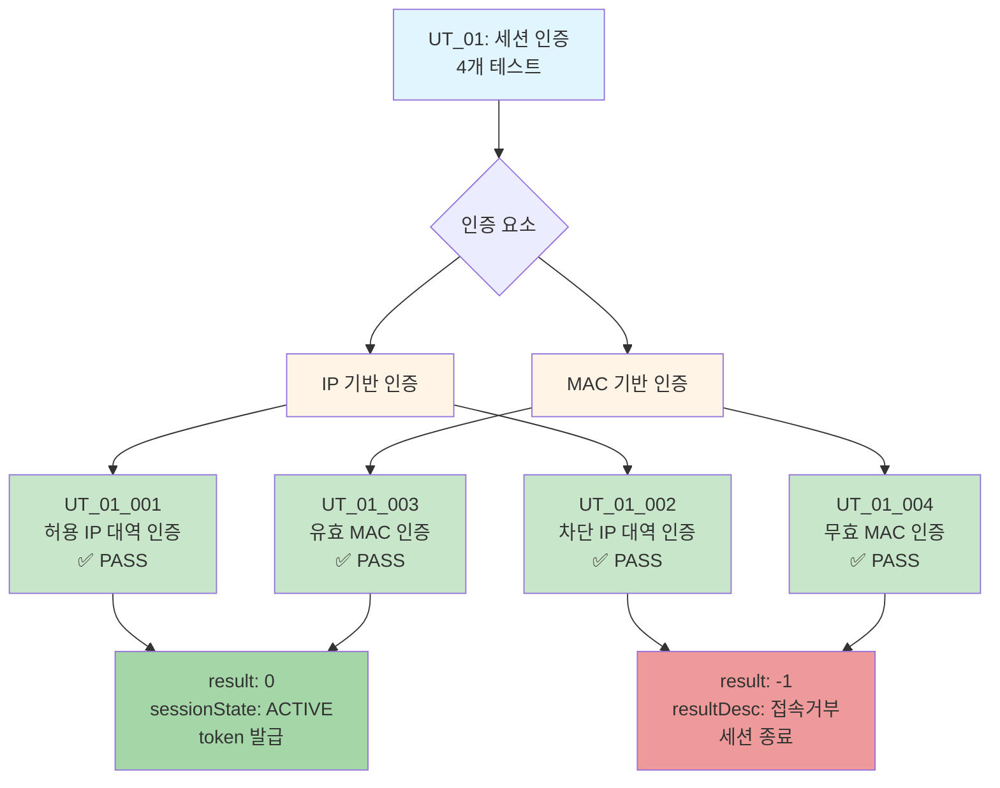
```mermaid
graph TD
    A[UT_01: 세션 인증<br/>4개 테스트] --> B{인증 요소}
    
    B --> C[IP 기반 인증]
    B --> D[MAC 기반 인증]
    
    C --> C1[UT_01_001<br/>허용 IP 대역 인증<br/>✅ PASS]
    C --> C2[UT_01_002<br/>차단 IP 대역 인증<br/>✅ PASS]
    
    D --> D1[UT_01_003<br/>유효 MAC 인증<br/>✅ PASS]
    D --> D2[UT_01_004<br/>무효 MAC 인증<br/>✅ PASS]
    
    C1 --> E[result: 0<br/>sessionState: ACTIVE<br/>token 발급]
    C2 --> F[result: -1<br/>resultDesc: 접속거부<br/>세션 종료]
    D1 --> E
    D2 --> F
    
    style A fill:#e1f5ff
    style C fill:#fff4e6
    style D fill:#fff4e6
    style C1 fill:#c8e6c9
    style C2 fill:#c8e6c9
    style D1 fill:#c8e6c9
    style D2 fill:#c8e6c9
    style E fill:#a5d6a7
    style F fill:#ef9a9a
```

---

#### **UT_01_001** (성공) 허용 IP 대역 인증 (특정 IP 및 와일드카드)

**테스트 목적**: 설정된 허용 IP 대역 및 와일드카드(*) 인증 검증

**테스트 구성**: 2 Phase 테스트 (특정 IP → 와일드카드)

---

##### **Phase 1: 특정 IP 인증 테스트**

**전제 조건**:
- INSUPCLIENT 서버가 정상 기동되어 있음
- 설정 파일에 특정 IP가 등록되어 있음
  ```yaml
  security:
    allowed-clients:
      - ip: "127.0.0.1"
        mac: "000000000001"
        auth-key: "TEST_AUTH_KEY_001"
  ```

**테스트 절차**:
1. SIPSVC에서 INSUPCLIENT로 TCP 세션 연결
2. 등록된 IP(127.0.0.1)로 JSON 인증 명령 요청
3. JSON 응답 확인

**테스트 데이터**:
```json
{
  "cmd": "auth",
  "ipAddr": "127.0.0.1",
  "macAddr": "000000000001",
  "accessKey": "VEVTVF9BVVRIX0tFWV8wMDE=",
  "reqNo": "20241022143000.00000"
}
```

**참고**:
- `accessKey`: `"TEST_AUTH_KEY_001"` → Base64: `"VEVTVF9BVVRIX0tFWV8wMDE="`
- ⚠️ **중요**: `accessKey`는 **반드시 Base64 인코딩**해야 함
  - 인코딩하지 않으면 Base64 디코딩 오류 발생
  - 오류 메시지: `"Authentication failed - Invalid access key format (Base64 decoding error)"`

**예상 결과**:
- ✅ 인증 성공 응답 수신 (`result: 0`)
- ✅ 세션 상태: `sessionState: "ACTIVE"`
- ✅ 세션 토큰 발급 (예: `"MTI3LjAuMC4xOjU0MzIx"`)

---

##### **Phase 2: 와일드카드(*) 인증 테스트**

**설정 변경**:
1. 테스트에서 자동으로 `application.yml`을 다음과 같이 수정:
   ```yaml
   security:
     allowed-clients:
       - ip: "127.0.0.1"
         mac: "000000000001"
         auth-key: "TEST_AUTH_KEY_001"
         description: "Test Client 1"
       - ip: "*"                           # ← 추가
         mac: "*"                          # ← 추가
         auth-key: "WILDCARD_TEST_KEY"    # ← 추가
         description: "Wildcard Test"     # ← 추가
   ```

2. 사용자에게 프로세스 재기동 요청:
   ```
   ⚠️  INSUPCLIENT 프로세스를 재시작해주세요.
   ========================================
   📌 재시작 방법:
      1. 현재 실행 중인 INSUPCLIENT 프로세스 종료 (Ctrl+C)
      2. JAR 재빌드 (중요!): mvn clean package -DskipTests
      3. 프로세스 시작: .\Start-InsupclientServer.ps1 -ServerType spring
      4. 프로세스가 완전히 기동되면 아무 키나 입력하고 Enter
   
   💡 참고:
      - application.yml 변경사항을 JAR에 반영하기 위해 재빌드가 필요합니다.
      - 또는 실행 디렉토리에 application.yml을 복사하여 외부 설정으로 사용할 수 있습니다.
        (외부 파일 사용 시 재빌드 불필요)
   ```

**테스트 절차**:
1. 사용자 프로세스 재시작 대기 (Enter 입력 시까지)
2. 프로세스 안정화 대기 (3초)
3. 임의의 IP(192.168.100.200)로 JSON 인증 명령 요청
4. JSON 응답 확인

**테스트 데이터**:
```json
{
  "cmd": "auth",
  "ipAddr": "192.168.100.200",
  "macAddr": "AABBCCDDEEFF",
  "accessKey": "V0lMRENBUkRfVEVTVF9LRVk=",
  "reqNo": "20241022143100.00000"
}
```

**참고**:
- `accessKey`: `"WILDCARD_TEST_KEY"` → Base64: `"V0lMRENBUkRfVEVTVF9LRVk="`
- 와일드카드(`*`) 설정 시 **모든 IP/MAC 허용**

**예상 결과**:
- ✅ 임의 IP(192.168.100.200)도 인증 성공 (`result: 0`)
- ✅ 세션 상태: `sessionState: "ACTIVE"`
- ✅ 세션 토큰 발급

---

##### **Phase 3: 설정 복구**

**자동 복구**:
- 테스트 완료 후 `application.yml`을 원래 상태로 자동 복구
- 사용자에게 프로세스 재시작 안내:
  ```
  ✅ application.yml 복구 완료 (원래 설정)
  
  ⚠️  테스트 완료 후 프로세스를 다시 재시작하여 원래 설정을 적용하세요.
  ```

---

**검증 포인트**:
- Phase 1: 특정 IP 인증 성공
- Phase 2: 와일드카드(*) 설정 후 임의 IP 인증 성공
- 응답 코드: `result: 0` (SUCCESS)
- 세션 상태: `sessionState: "ACTIVE"`
- 세션 토큰 형식: `Base64(IP:PORT)`

---

#### **UT_01_002** (실패) 허용 IP 대역 이탈 인증

**테스트 목적**: 미등록 IP 대역에서의 인증 거부 검증

**테스트 흐름**:
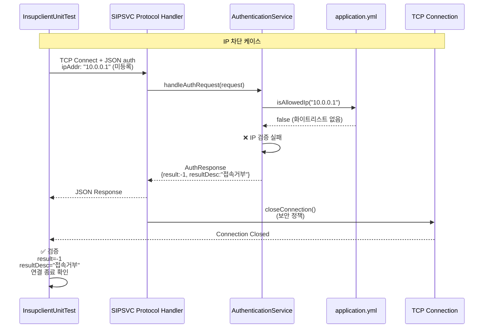
```mermaid
sequenceDiagram
    participant UT as InsupclientUnitTest
    participant SVC as SIPSVC Protocol Handler
    participant AUTH as AuthenticationService
    participant CFG as application.yml
    participant TCP as TCP Connection
    
    Note over UT,TCP: IP 차단 케이스
    
    UT->>SVC: TCP Connect + JSON auth<br/>ipAddr: "10.0.0.1" (미등록)
    
    SVC->>AUTH: handleAuthRequest(request)
    
    AUTH->>CFG: isAllowedIp("10.0.0.1")
    CFG-->>AUTH: false (화이트리스트 없음)
    
    AUTH->>AUTH: ❌ IP 검증 실패
    
    AUTH-->>SVC: AuthResponse<br/>{result:-1, resultDesc:"접속거부"}
    
    SVC-->>UT: JSON Response
    
    SVC->>TCP: closeConnection()<br/>(보안 정책)
    TCP-->>UT: Connection Closed
    
    UT->>UT: ✅ 검증<br/>result=-1<br/>resultDesc="접속거부"<br/>연결 종료 확인
```

**전제 조건**:
- INSUPCLIENT 서버가 정상 기동되어 있음
- 테스트용 미등록 IP 준비 (예: 10.0.0.1)

**테스트 절차**:
1. 미등록 IP에서 INSUPCLIENT로 TCP 세션 연결
2. JSON 인증 명령 요청
3. 응답 및 세션 상태 확인

**테스트 데이터**:
```json
{
  "cmd": "auth",
  "ipAddr": "10.0.0.1",
  "macAddr": "001122334455",
  "accessKey": "VEVTVF9BVVRIX0tFWV8wMDE=",
  "reqNo": "20241022143000.00000"
}
```

**참고**:
- `accessKey` 필드는 **Base64 인코딩**되어 전송됨
- `macAddr` 필드는 **구분자 없이 12자리 16진수** 형식 (`"001122334455"`)
- `reqNo` 필드는 **YYYYMMDDHHMISS.00000** 형식 (20자리 고정)
- 미등록 IP 주소 사용: `"10.0.0.1"` (허용 IP 대역 외부)

**예상 결과**:
- ❌ 인증 실패 응답 수신 (`result: -1`)
- ❌ 명확한 실패 사유 메시지:
  - IP/MAC 불일치: `"Authentication failed - IP: 10.0.0.1, MAC: 001122334455 not allowed"`
  - Base64 오류: `"Authentication failed - Invalid access key format (Base64 decoding error)"`
- ❌ 서버가 해당 세션을 강제 종료

**검증 포인트**:
- 응답 코드: `result: -1` (AUTH_FAILED)
- `resultDesc`: 실패 사유가 명확히 포함됨
  - IP/MAC 불일치 케이스: IP 및 MAC 주소 정보 포함
  - Base64 디코딩 실패 케이스: "Invalid access key format" 메시지 포함
- 세션 종료 확인

---

#### **UT_01_003** (성공) 유효 MAC 인증 (특정 MAC 및 와일드카드)

**테스트 목적**: 등록된 MAC 주소 및 와일드카드(*) 인증 검증

**테스트 구성**: 2 Phase 테스트 (특정 MAC → 와일드카드)

---

##### **Phase 1: 특정 MAC 인증 테스트**

**전제 조건**:
- INSUPCLIENT 서버가 정상 기동되어 있음
- 설정 파일에 특정 MAC이 등록되어 있음
  ```yaml
  security:
    allowed-clients:
      - ip: "127.0.0.1"
        mac: "000000000001"
        auth-key: "TEST_AUTH_KEY_001"
  ```

**테스트 절차**:
1. SIPSVC에서 INSUPCLIENT로 TCP 세션 연결
2. 등록된 MAC(000000000001)으로 JSON 인증 명령 요청
3. JSON 응답 확인

**테스트 데이터**:
```json
{
  "cmd": "auth",
  "ipAddr": "127.0.0.1",
  "macAddr": "000000000001",
  "accessKey": "VEVTVF9BVVRIX0tFWV8wMDE=",
  "reqNo": "20241022143000.00000"
}
```

**참고**:
- `accessKey`: `"TEST_AUTH_KEY_001"` → Base64: `"VEVTVF9BVVRIX0tFWV8wMDE="`
- ⚠️ **중요**: `accessKey`는 **반드시 Base64 인코딩**해야 함
  - 인코딩하지 않으면 Base64 디코딩 오류 발생
  - 오류 메시지: `"Authentication failed - Invalid access key format (Base64 decoding error)"`

**예상 결과**:
- ✅ 인증 성공 응답 수신 (`result: 0`)
- ✅ 세션 상태: `sessionState: "ACTIVE"`
- ✅ 세션 토큰 발급 (예: `"MTI3LjAuMC4xOjU0MzIx"`)

---

##### **Phase 2: 와일드카드(*) 인증 테스트**

**설정 변경**:
1. 테스트에서 자동으로 `application.yml`을 다음과 같이 수정:
   ```yaml
   security:
     allowed-clients:
       - ip: "127.0.0.1"
         mac: "000000000001"
         auth-key: "TEST_AUTH_KEY_001"
         description: "Test Client 1"
       - ip: "*"
         mac: "*"
         auth-key: "WILDCARD_MAC_TEST_KEY"
         description: "Wildcard MAC Test (UT_01_003)"
   ```

**⚠️ 중요: 사용자 재시작 필요**:
2. 테스트가 다음 안내 메시지를 출력하고 대기:
   ```
   ================================================================================
   ⚠️  INSUPCLIENT 프로세스를 재시작해주세요.
   ================================================================================
   📌 재시작 방법:
      1. 현재 실행 중인 INSUPCLIENT 프로세스 종료 (Ctrl+C)
      2. JAR 재빌드 (중요!): mvn clean package -DskipTests
      3. 프로세스 시작: .\Start-InsupclientServer.ps1 -ServerType spring
      4. 프로세스가 완전히 기동되면 아무 키나 입력하고 Enter
   ================================================================================
   
   💡 참고:
      - application.yml 변경사항을 JAR에 반영하기 위해 재빌드가 필요합니다.
      - 또는 실행 디렉토리에 application.yml을 복사하여 외부 설정으로 사용할 수 있습니다.
        (외부 파일 사용 시 재빌드 불필요)
   ================================================================================
   ```

3. 사용자가 재시작 완료 후 Enter 입력

**테스트 절차**:
1. 임의의 MAC(AABBCCDDEEFF)로 JSON 인증 명령 요청
2. JSON 응답 확인
3. 테스트 종료 시 `application.yml` 자동 복구

**테스트 데이터**:
```json
{
  "cmd": "auth",
  "ipAddr": "192.168.100.200",
  "macAddr": "AABBCCDDEEFF",
  "accessKey": "V0lMRENBUkRfTUFDX1RFU1RfS0VZ",
  "reqNo": "20241022143000.00000"
}
```

**참고**:
- `accessKey`: `"WILDCARD_MAC_TEST_KEY"` → Base64: `"V0lMRENBUkRfTUFDX1RFU1RfS0VZ"`
- 임의의 IP/MAC 조합으로 테스트하여 와일드카드 동작 검증

**예상 결과**:
- ✅ 인증 성공 응답 수신 (`result: 0`)
- ✅ 세션 상태: `sessionState: "ACTIVE"`
- ✅ 세션 토큰 발급 (임의 MAC 포함)
- ✅ 테스트 종료 시 `application.yml` 원래대로 복구됨

---

**테스트 흐름**:
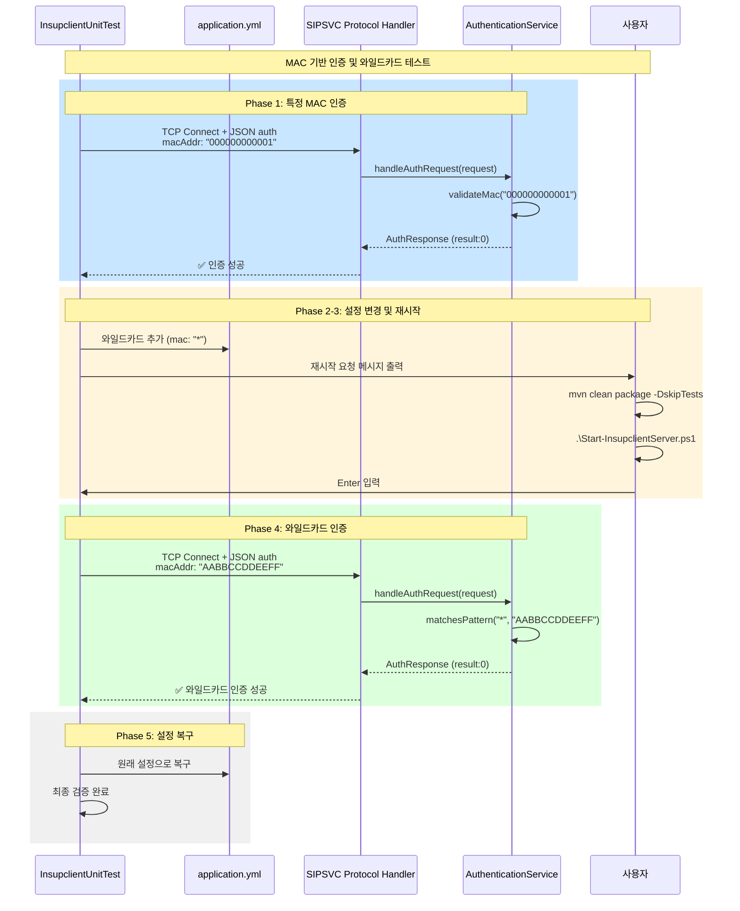
```mermaid
sequenceDiagram
    participant UT as InsupclientUnitTest
    participant YML as application.yml
    participant SVC as SIPSVC Protocol Handler
    participant AUTH as AuthenticationService
    participant USER as 사용자
    
    Note over UT,USER: MAC 기반 인증 및 와일드카드 테스트
    
    rect rgb(200, 230, 255)
    Note over UT,AUTH: Phase 1: 특정 MAC 인증
    UT->>SVC: TCP Connect + JSON auth<br/>macAddr: "000000000001"
    SVC->>AUTH: handleAuthRequest(request)
    AUTH->>AUTH: validateMac("000000000001")
    AUTH-->>SVC: AuthResponse (result:0)
    SVC-->>UT: ✅ 인증 성공
    end
    
    rect rgb(255, 245, 220)
    Note over UT,USER: Phase 2-3: 설정 변경 및 재시작
    UT->>YML: 와일드카드 추가 (mac: "*")
    UT->>USER: 재시작 요청 메시지 출력
    USER->>USER: mvn clean package -DskipTests
    USER->>USER: .\Start-InsupclientServer.ps1
    USER->>UT: Enter 입력
    end
    
    rect rgb(220, 255, 220)
    Note over UT,AUTH: Phase 4: 와일드카드 인증
    UT->>SVC: TCP Connect + JSON auth<br/>macAddr: "AABBCCDDEEFF"
    SVC->>AUTH: handleAuthRequest(request)
    AUTH->>AUTH: matchesPattern("*", "AABBCCDDEEFF")
    AUTH-->>SVC: AuthResponse (result:0)
    SVC-->>UT: ✅ 와일드카드 인증 성공
    end
    
    rect rgb(240, 240, 240)
    Note over UT,YML: Phase 5: 설정 복구
    UT->>YML: 원래 설정으로 복구
    UT->>UT: 최종 검증 완료
    end
```

---

#### **UT_01_004** (실패) 유효하지 않은 MAC 인증

**테스트 목적**: 미등록 MAC 주소에 대한 인증 거부 검증

**테스트 흐름**:
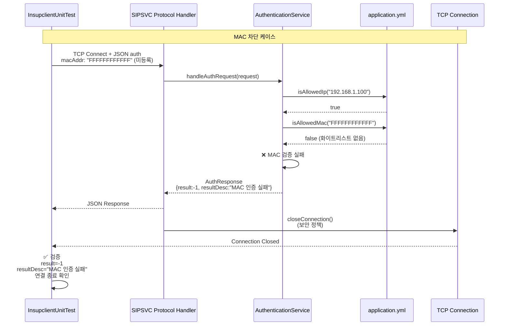
```mermaid
sequenceDiagram
    participant UT as InsupclientUnitTest
    participant SVC as SIPSVC Protocol Handler
    participant AUTH as AuthenticationService
    participant CFG as application.yml
    participant TCP as TCP Connection
    
    Note over UT,TCP: MAC 차단 케이스
    
    UT->>SVC: TCP Connect + JSON auth<br/>macAddr: "FFFFFFFFFFFF" (미등록)
    
    SVC->>AUTH: handleAuthRequest(request)
    
    AUTH->>CFG: isAllowedIp("192.168.1.100")
    CFG-->>AUTH: true
    
    AUTH->>CFG: isAllowedMac("FFFFFFFFFFFF")
    CFG-->>AUTH: false (화이트리스트 없음)
    
    AUTH->>AUTH: ❌ MAC 검증 실패
    
    AUTH-->>SVC: AuthResponse<br/>{result:-1, resultDesc:"MAC 인증 실패"}
    
    SVC-->>UT: JSON Response
    
    SVC->>TCP: closeConnection()<br/>(보안 정책)
    TCP-->>UT: Connection Closed
    
    UT->>UT: ✅ 검증<br/>result=-1<br/>resultDesc="MAC 인증 실패"<br/>연결 종료 확인
```

**테스트 절차**:
1. SIPSVC에서 INSUPCLIENT로 TCP 세션 연결
2. 등록되지 않은 MAC 주소로 JSON 인증 명령 요청
3. 응답 확인

**테스트 데이터**:
```json
{
  "cmd": "auth",
  "ipAddr": "192.168.1.100",
  "macAddr": "FFFFFFFFFFFF",
  "accessKey": "VEVTVF9BVVRIX0tFWV8wMDE=",
  "reqNo": "20241022143000.00000"
}
```

**참고**:
- `accessKey` 필드는 **Base64 인코딩**되어 전송됨
- `macAddr` 필드는 **구분자 없이 12자리 16진수** 형식
  - 미등록 MAC 주소 사용: `"FFFFFFFFFFFF"`
- `reqNo` 필드는 **YYYYMMDDHHMISS.00000** 형식 (20자리 고정)

**예상 결과**:
- ❌ 인증 실패 응답 수신 (`result: -1`)
- ❌ 서버가 해당 세션을 강제 종료

---

#### **UT_01_005** (성공) 접속키 인증 (특정 키 및 와일드카드)

**테스트 목적**: 등록된 접속키 및 와일드카드(*) 인증 검증

**테스트 구성**: 2 Phase 테스트 (특정 접속키 → 와일드카드)

---

##### **Phase 1: 특정 접속키 인증 테스트**

**전제 조건**:
- INSUPCLIENT 서버가 정상 기동되어 있음
- 설정 파일에 특정 접속키가 등록되어 있음
  ```yaml
  security:
    allowed-clients:
      - ip: "127.0.0.1"
        mac: "000000000001"
        auth-key: "TEST_AUTH_KEY_001"
  ```

**테스트 절차**:
1. SIPSVC에서 INSUPCLIENT로 TCP 세션 연결
2. 등록된 접속키(TEST_AUTH_KEY_001)로 JSON 인증 명령 요청
3. JSON 응답 확인

**테스트 데이터**:
```json
{
  "cmd": "auth",
  "ipAddr": "127.0.0.1",
  "macAddr": "000000000001",
  "accessKey": "VEVTVF9BVVRIX0tFWV8wMDE=",
  "reqNo": "20241022143000.00000"
}
```

**참고**:
- `accessKey`: `"TEST_AUTH_KEY_001"` → Base64: `"VEVTVF9BVVRIX0tFWV8wMDE="`
- ⚠️ **중요**: `accessKey`는 **반드시 Base64 인코딩**해야 함
  - 인코딩하지 않으면 Base64 디코딩 오류 발생
  - 오류 메시지: `"Authentication failed - Invalid access key format (Base64 decoding error)"`

**예상 결과**:
- ✅ 인증 성공 응답 수신 (`result: 0`)
- ✅ 세션 상태: `sessionState: "ACTIVE"`
- ✅ JWT 토큰 발급 (예: `"MTI3LjAuMC4xOjU0MzIx"`)

---

##### **Phase 2: 와일드카드(*) 인증 테스트**

**설정 변경**:
1. 테스트에서 자동으로 `application.yml`을 다음과 같이 수정:
   ```yaml
   security:
     allowed-clients:
       - ip: "127.0.0.1"
         mac: "000000000001"
         auth-key: "TEST_AUTH_KEY_001"
         description: "Test Client 1"
       - ip: "*"
         mac: "*"
         auth-key: "*"
         description: "Wildcard AccessKey Test (UT_01_005)"
   ```

**⚠️ 중요: 사용자 재시작 필요**:
2. 테스트가 다음 안내 메시지를 출력하고 대기:
   ```
   ================================================================================
   ⚠️  INSUPCLIENT 프로세스를 재시작해주세요.
   ================================================================================
   📌 재시작 방법:
      1. 현재 실행 중인 INSUPCLIENT 프로세스 종료 (Ctrl+C)
      2. JAR 재빌드 (중요!): mvn clean package -DskipTests
      3. 프로세스 시작: .\Start-InsupclientServer.ps1 -ServerType spring
      4. 프로세스가 완전히 기동되면 아무 키나 입력하고 Enter
   ================================================================================
   
   💡 참고:
      - application.yml 변경사항을 JAR에 반영하기 위해 재빌드가 필요합니다.
      - 또는 실행 디렉토리에 application.yml을 복사하여 외부 설정으로 사용할 수 있습니다.
        (외부 파일 사용 시 재빌드 불필요)
   ================================================================================
   ```

3. 사용자가 재시작 완료 후 Enter 입력

**테스트 절차**:
1. 임의의 접속키(RANDOM_ACCESS_KEY_FOR_TEST)로 JSON 인증 명령 요청
2. JSON 응답 확인
3. 테스트 종료 시 `application.yml` 자동 복구

**테스트 데이터**:
```json
{
  "cmd": "auth",
  "ipAddr": "192.168.100.200",
  "macAddr": "AABBCCDDEEFF",
  "accessKey": "UkFORE9NX0FDQ0VTU19LRVlfRk9SX1RFU1Q=",
  "reqNo": "20241022143000.00000"
}
```

**참고**:
- `accessKey`: `"RANDOM_ACCESS_KEY_FOR_TEST"` → Base64: `"UkFORE9NX0FDQ0VTU19LRVlfRk9SX1RFU1Q="`
- 임의의 IP/MAC/AccessKey 조합으로 테스트하여 와일드카드 동작 검증
- 와일드카드 설정 시 모든 접속키가 허용됨 (테스트 환경용)

**예상 결과**:
- ✅ 인증 성공 응답 수신 (`result: 0`)
- ✅ 세션 상태: `sessionState: "ACTIVE"`
- ✅ JWT 토큰 발급 (임의 접속키로도 발급됨)
- ✅ 테스트 종료 시 `application.yml` 원래대로 복구됨

---

**테스트 흐름**:
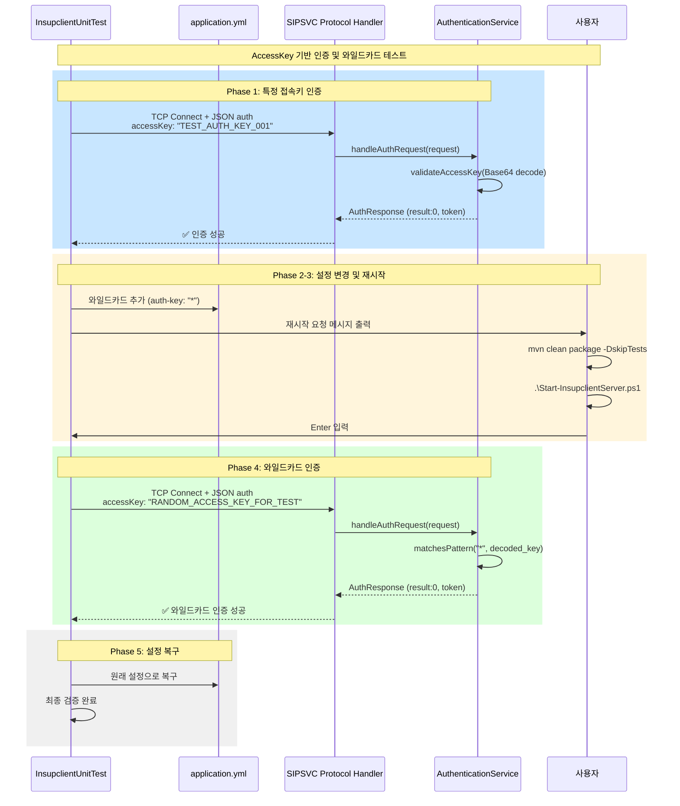
```mermaid
sequenceDiagram
    participant UT as InsupclientUnitTest
    participant YML as application.yml
    participant SVC as SIPSVC Protocol Handler
    participant AUTH as AuthenticationService
    participant USER as 사용자
    
    Note over UT,USER: AccessKey 기반 인증 및 와일드카드 테스트
    
    rect rgb(200, 230, 255)
    Note over UT,AUTH: Phase 1: 특정 접속키 인증
    UT->>SVC: TCP Connect + JSON auth<br/>accessKey: "TEST_AUTH_KEY_001"
    SVC->>AUTH: handleAuthRequest(request)
    AUTH->>AUTH: validateAccessKey(Base64 decode)
    AUTH-->>SVC: AuthResponse (result:0, token)
    SVC-->>UT: ✅ 인증 성공
    end
    
    rect rgb(255, 245, 220)
    Note over UT,USER: Phase 2-3: 설정 변경 및 재시작
    UT->>YML: 와일드카드 추가 (auth-key: "*")
    UT->>USER: 재시작 요청 메시지 출력
    USER->>USER: mvn clean package -DskipTests
    USER->>USER: .\Start-InsupclientServer.ps1
    USER->>UT: Enter 입력
    end
    
    rect rgb(220, 255, 220)
    Note over UT,AUTH: Phase 4: 와일드카드 인증
    UT->>SVC: TCP Connect + JSON auth<br/>accessKey: "RANDOM_ACCESS_KEY_FOR_TEST"
    SVC->>AUTH: handleAuthRequest(request)
    AUTH->>AUTH: matchesPattern("*", decoded_key)
    AUTH-->>SVC: AuthResponse (result:0, token)
    SVC-->>UT: ✅ 와일드카드 인증 성공
    end
    
    rect rgb(240, 240, 240)
    Note over UT,YML: Phase 5: 설정 복구
    UT->>YML: 원래 설정으로 복구
    UT->>UT: 최종 검증 완료
    end
```

**검증 포인트**:
- Base64 디코딩 정상 처리 확인
- 특정 접속키와 설정 파일 값 비교
- 와일드카드 설정 시 임의 접속키 허용 확인
- JWT 토큰 구조 및 유효성 검증

---

#### **UT_01_006** (실패) 잘못된 접속키 인증

**테스트 목적**: 미등록 접속키에 대한 인증 거부 검증

**테스트 절차**:
1. SIPSVC에서 INSUPCLIENT로 TCP 세션 연결
2. 등록되지 않은 Base64 인코딩 키로 JSON 인증 명령 요청
3. 응답 확인

**테스트 데이터**:
```json
{
  "cmd": "auth",
  "ipAddr": "192.168.1.100",
  "macAddr": "001122334455",
  "accessKey": "aW52YWxpZGtleQ==",
  "reqNo": "20241022143000.00000"
}
```

**참고**:
- `accessKey` 필드는 **Base64 인코딩**되어 전송됨
  - 테스트 값: `"invalidkey"` → Base64: `"aW52YWxpZGtleQ=="`
  - 서버는 디코딩 후 원본 값이 등록되지 않은 키임을 확인
- `macAddr` 필드는 **구분자 없이 12자리 16진수** 형식 (`"001122334455"`)
- `reqNo` 필드는 **YYYYMMDDHHMISS.00000** 형식 (20자리 고정)

**예상 결과**:
- ❌ 인증 실패 응답 수신 (`result: -1`)
- ❌ 실패 사유: `"Authentication failed - IP: 192.168.1.100, MAC: 001122334455 not allowed"`
  - (IP/MAC은 허용되지만 auth-key가 불일치)
- ❌ 서버가 해당 세션을 강제 종료

**검증 포인트**:
- Base64 디코딩 정상 처리 (`"invalidkey"` 디코딩 성공)
- 미등록 키에 대한 인증 거부
- `resultDesc`에 구체적인 실패 사유 포함 (IP, MAC 정보)

---

#### **UT_01_007** (실패) 인증 타임아웃

**테스트 목적**: 인증 제한 시간 초과 시 세션 종료 검증

**테스트 절차**:
1. SIPSVC에서 INSUPCLIENT로 TCP 세션 연결
2. auth cmd 요청 없이 8초 대기 (auth-timeout 5초 + 여유 시간)
3. 연결 종료 확인 (`flush()` 및 `read()` 수행)

**예상 결과**:
- ❌ 서버가 5초 후 세션을 강제 종료
- ❌ 클라이언트가 8초 대기 후 연결 종료 감지

**검증 포인트**:
- 타임아웃 시간: 5초
- 세션 정리 로직 정상 작동
- 클라이언트의 연결 종료 감지 메커니즘 검증

---

#### **UT_01_008** (실패) Zombie 연결 타임아웃

**테스트 목적**: 장시간 비활성 세션(Zombie Connection)의 자동 종료 검증

**테스트 절차**:
1. SIPSVC에서 INSUPCLIENT로 TCP 세션 연결 및 인증 성공
2. 아무 메시지도 전송하지 않고 70초 대기 (idle-timeout 60초 + 여유 10초)
3. 연결 상태 확인 (`flush()` 및 `read()` 수행)

**예상 결과**:
- ❌ 서버가 60초 후 zombie 연결로 판단하여 강제 종료
- ❌ 클라이언트가 70초 대기 후 연결 종료 감지 (EOF 또는 IOException)

**검증 포인트**:
- idle-timeout: 60초
- 세션 정리 및 리소스 해제
- lastActivityTime 기반 타임아웃 로직 검증

**구현 특징**:
- `ConnectionManagementService`의 `cleanupTimedOutConnections` 스케줄러(2초 간격)가 idle 상태 감지
- 로그에 timestamp 형식으로 `lastActivity` 출력 (예: `2024-10-22 14:30:45.123`)

---

#### **UT_01_009** (성공) Heartbeat를 통한 연결 유지

**테스트 목적**: Heartbeat 메시지가 lastActivityTime을 갱신하여 idle timeout을 방지하는지 검증

**설정 정보** (`application.yml`):
```yaml
tcp:
  server:
    idle-timeout: 60000  # 60초 - Heartbeat 없이 유휴 상태 시 연결 종료
```

**테스트 절차**:
1. SIPSVC에서 INSUPCLIENT로 TCP 세션 연결 및 인증 성공
2. 30초마다 Heartbeat 메시지 전송 (총 4번)
3. 총 120초 동안 연결 유지 확인 (idle-timeout 60초의 2배)

**테스트 데이터**:
```json
{
  "cmd": "heartBeat",
  "token": "MTI3LjAuMC4xOjU0MzIx",
  "reqNo": "20241022143000.00000"
}
```

**참고**:
- `reqNo` 필드는 **YYYYMMDDHHMISS.00000** 형식 (20자리 고정)
- `token` 필드는 auth 응답에서 받은 Session Token 사용 (Base64 인코딩된 IP:PORT)

**타이밍**:
- 0초: 인증 완료
- 30초: Heartbeat #1
- 60초: Heartbeat #2
- 90초: Heartbeat #3
- 120초: Heartbeat #4, 테스트 완료

**예상 결과**:
- ✅ 모든 Heartbeat 메시지에 대해 정상 응답 수신
- ✅ 120초 동안 연결이 유지됨
- ✅ lastActivityTime이 Heartbeat마다 갱신됨

**검증 포인트**:
- Session Token 검증 정상 처리 (auth 시 발급된 token과 일치해야 함)
- lastActivityTime 갱신 확인 (메시지 수신 시마다)
- 대소문자 구분 없이 "heartbeat", "heartBeat", "HeartBeat" 모두 처리 가능
- idle-timeout 2배 시간(120초) 동안 연결 유지 성공
- 💡 **참고**: idle timeout에 의한 연결 종료는 **UT_01_008**에서 검증

---

## 🔧 **설정 관리**

### **📊 UT_02 개요**

**테스트 목적**: application.yml 설정 파일의 로딩 및 적용 검증

**테스트 범위**:
- ✅ 애플리케이션 메타정보 (name, version, system-name)
- ✅ 서버 포트 바인딩 (HTTP: 8080, TCP: 8081)
- ✅ INSUPC 클라이언트 설정 (ip, port, connection-pool-size)
- ✅ 타임아웃 및 재시도 설정 (read-timeout, retry-interval)

**설정 파일 구조** (`application.yml`):
```yaml
application:
  name: insupclient              # 애플리케이션 이름
  version: 0.0.1                 # 버전
  system-name: AMAS-SES1         # 시스템 이름

server:
  port: 8080                     # HTTP 포트
  tcp-port: 8081                 # TCP 포트 (SIPSVC)

insupc:
  clients:
    - name: INSUPC-1
      ip: 127.0.0.1
      port: 19000
      connection-pool-size: 1    # v2.1: 5 → 1 (클라이언트 간 부하분산)
      read-timeout: 10000        # v2.1: 300000 → 10000 (연동규격 준수)
      retry-interval: 1000       # v2.1: 5000 → 1000 (연동규격 준수)
```

**설정 적용 시점**:
- ⚙️ **애플리케이션 시작 시**: Spring Boot가 `application.yml` 로딩
- ⚙️ **Bean 초기화 시**: `@Value` 어노테이션을 통해 설정 값 주입
- ⚙️ **런타임**: `@ConfigurationProperties`로 동적 설정 변경 감지 (일부)

---

### **🔄 UT_02 테스트 흐름 다이어그램**

#### **1. 설정 로딩 및 검증 흐름 (전체)**

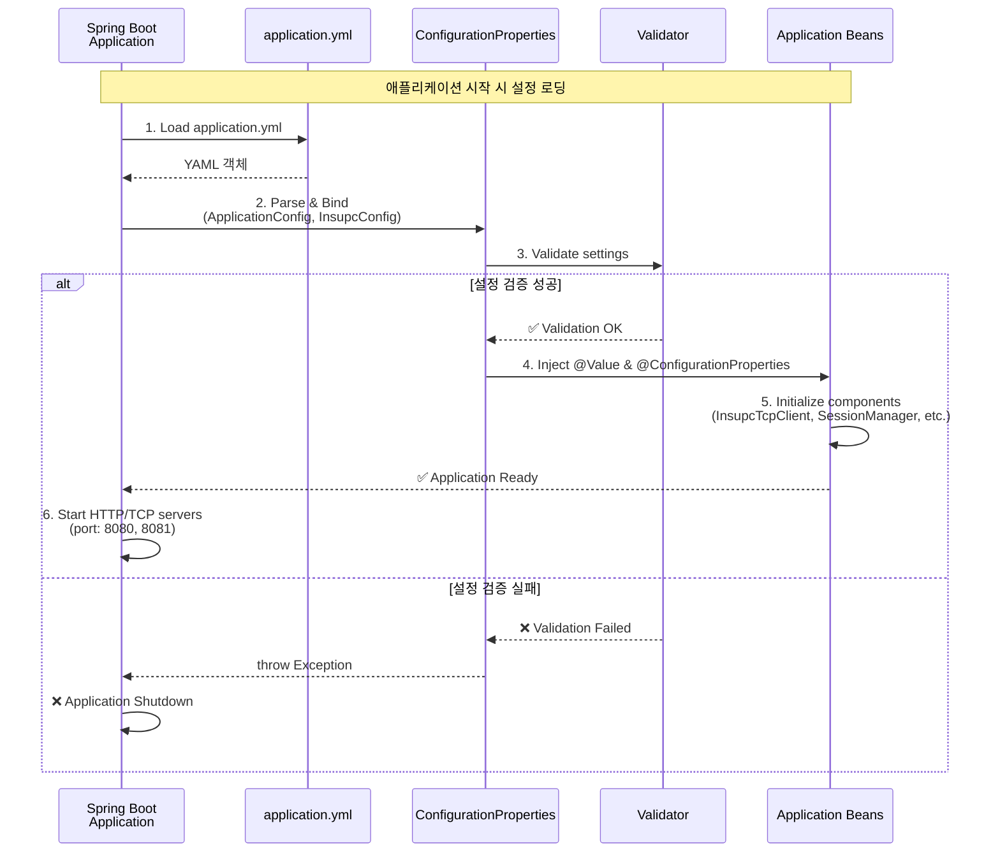
```mermaid
sequenceDiagram
    participant APP as Spring Boot<br/>Application
    participant YAML as application.yml
    participant CFG as ConfigurationProperties
    participant VAL as Validator
    participant BEAN as Application Beans
    
    Note over APP,BEAN: 애플리케이션 시작 시 설정 로딩
    
    APP->>YAML: 1. Load application.yml
    YAML-->>APP: YAML 객체
    
    APP->>CFG: 2. Parse & Bind<br/>(ApplicationConfig, InsupcConfig)
    
    CFG->>VAL: 3. Validate settings
    
    alt 설정 검증 성공
        VAL-->>CFG: ✅ Validation OK
        
        CFG->>BEAN: 4. Inject @Value & @ConfigurationProperties
        
        BEAN->>BEAN: 5. Initialize components<br/>(InsupcTcpClient, SessionManager, etc.)
        
        BEAN-->>APP: ✅ Application Ready
        
        APP->>APP: 6. Start HTTP/TCP servers<br/>(port: 8080, 8081)
        
    else 설정 검증 실패
        VAL-->>CFG: ❌ Validation Failed
        CFG-->>APP: throw Exception
        APP->>APP: ❌ Application Shutdown
    end
```

#### **2. UT_02 테스트 매트릭스**

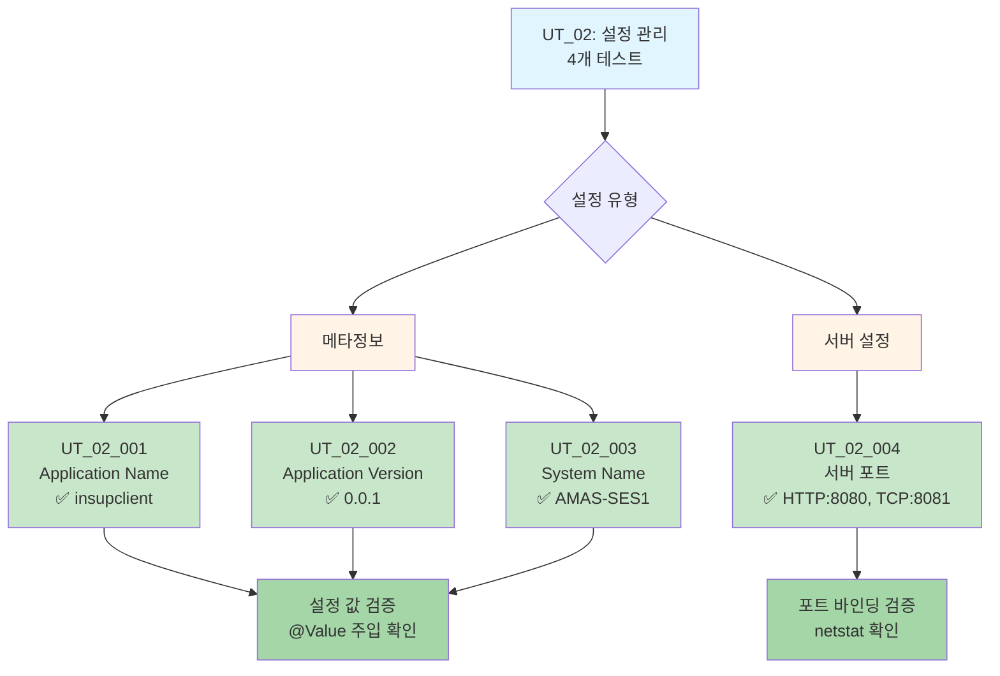
```mermaid
graph TD
    A[UT_02: 설정 관리<br/>4개 테스트] --> B{설정 유형}
    
    B --> C[메타정보]
    B --> D[서버 설정]
    
    C --> C1[UT_02_001<br/>Application Name<br/>✅ insupclient]
    C --> C2[UT_02_002<br/>Application Version<br/>✅ 0.0.1]
    C --> C3[UT_02_003<br/>System Name<br/>✅ AMAS-SES1]
    
    D --> D1[UT_02_004<br/>서버 포트<br/>✅ HTTP:8080, TCP:8081]
    
    C1 --> E[설정 값 검증<br/>@Value 주입 확인]
    C2 --> E
    C3 --> E
    D1 --> F[포트 바인딩 검증<br/>netstat 확인]
    
    style A fill:#e1f5ff
    style C fill:#fff4e6
    style D fill:#fff4e6
    style C1 fill:#c8e6c9
    style C2 fill:#c8e6c9
    style C3 fill:#c8e6c9
    style D1 fill:#c8e6c9
    style E fill:#a5d6a7
    style F fill:#a5d6a7
```

#### **3. 설정 검증 상세 흐름 (UT_02_001~003)**

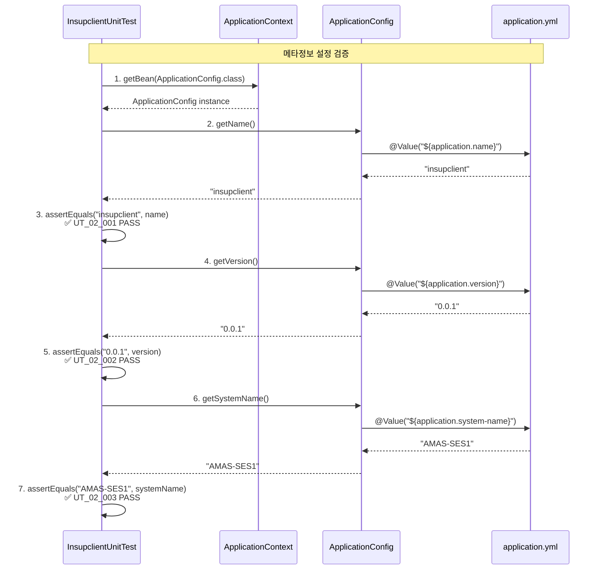
```mermaid
sequenceDiagram
    participant UT as InsupclientUnitTest
    participant APP as ApplicationContext
    participant CFG as ApplicationConfig
    participant YAML as application.yml
    
    Note over UT,YAML: 메타정보 설정 검증
    
    UT->>APP: 1. getBean(ApplicationConfig.class)
    APP-->>UT: ApplicationConfig instance
    
    UT->>CFG: 2. getName()
    CFG->>YAML: @Value("${application.name}")
    YAML-->>CFG: "insupclient"
    CFG-->>UT: "insupclient"
    
    UT->>UT: 3. assertEquals("insupclient", name)<br/>✅ UT_02_001 PASS
    
    UT->>CFG: 4. getVersion()
    CFG->>YAML: @Value("${application.version}")
    YAML-->>CFG: "0.0.1"
    CFG-->>UT: "0.0.1"
    
    UT->>UT: 5. assertEquals("0.0.1", version)<br/>✅ UT_02_002 PASS
    
    UT->>CFG: 6. getSystemName()
    CFG->>YAML: @Value("${application.system-name}")
    YAML-->>CFG: "AMAS-SES1"
    CFG-->>UT: "AMAS-SES1"
    
    UT->>UT: 7. assertEquals("AMAS-SES1", systemName)<br/>✅ UT_02_003 PASS
```

#### **4. 서버 포트 바인딩 검증 흐름 (UT_02_004)**

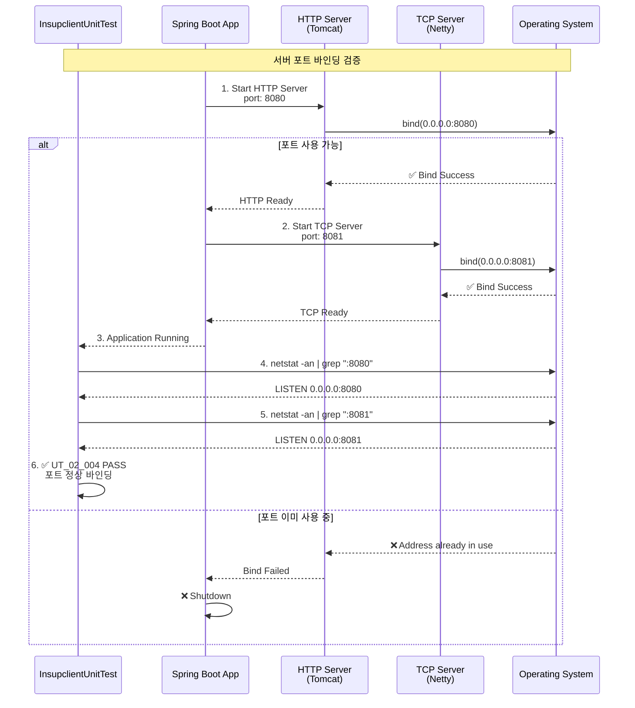
```mermaid
sequenceDiagram
    participant UT as InsupclientUnitTest
    participant APP as Spring Boot App
    participant HTTP as HTTP Server<br/>(Tomcat)
    participant TCP as TCP Server<br/>(Netty)
    participant OS as Operating System
    
    Note over UT,OS: 서버 포트 바인딩 검증
    
    APP->>HTTP: 1. Start HTTP Server<br/>port: 8080
    HTTP->>OS: bind(0.0.0.0:8080)
    
    alt 포트 사용 가능
        OS-->>HTTP: ✅ Bind Success
        HTTP-->>APP: HTTP Ready
        
        APP->>TCP: 2. Start TCP Server<br/>port: 8081
        TCP->>OS: bind(0.0.0.0:8081)
        OS-->>TCP: ✅ Bind Success
        TCP-->>APP: TCP Ready
        
        APP-->>UT: 3. Application Running
        
        UT->>OS: 4. netstat -an | grep ":8080"
        OS-->>UT: LISTEN 0.0.0.0:8080
        
        UT->>OS: 5. netstat -an | grep ":8081"
        OS-->>UT: LISTEN 0.0.0.0:8081
        
        UT->>UT: 6. ✅ UT_02_004 PASS<br/>포트 정상 바인딩
        
    else 포트 이미 사용 중
        OS-->>HTTP: ❌ Address already in use
        HTTP-->>APP: Bind Failed
        APP->>APP: ❌ Shutdown
    end
```

---

#### **UT_02_001** Application Name 확인

**테스트 목적**: 애플리케이션 이름 설정 검증

**테스트 절차**:
- `application.name`이 "insupclient"로 설정되었는지 확인

**예상 결과**:
- ✅ 설정된 이름과 일치

---

#### **UT_02_002** Application Version 확인

**테스트 목적**: 애플리케이션 버전 설정 검증

**테스트 절차**:
- `application.version`이 "0.0.1"로 설정되었는지 확인

**예상 결과**:
- ✅ 설정된 버전과 일치

---

#### **UT_02_003** System Name 확인

**테스트 목적**: 시스템 이름 설정 및 통계 연동 검증

**테스트 절차**:
- `application.system-name`이 "AMAS-SES1"로 설정되었는지 확인

**예상 결과**:
- ✅ 설정된 이름과 일치
- ✅ 통계 전송 시 시스템 이름 일치 확인

---

#### **UT_02_004** 서버 포트 설정

**테스트 목적**: 서버 포트 바인딩 검증

**테스트 절차**:
1. 서버 포트를 설정 파일에 등록
2. 필요 시 listening IP 별도 등록
3. 프로세스 기동

**예상 결과**:
- ✅ 서버 포트(HTTP: 15020, TCP: 15021)가 정상적으로 Listen

**검증 방법**:
```bash
netstat -an | grep ":15020\|:15021"
```

---

#### **UT_02_005** 서버 프로세스 서비스 제공 상태 등록

**테스트 목적**: OAM 설정 파일 기반 초기 서비스 상태 설정 검증 (reload API 사용)

**설정 파일 구조**:
```yaml
# application.yml
oam:
  config:
    path: C:/work/workspace_incomm-insup/src/main/resources/oam-conf.json
```

```json
// oam-conf.json
{
  "appStates": {
    "insupclient": "RUNNING"  // 또는 "BLOCKED"
  }
}
```

**테스트 절차**:
1. `application.yml`에서 `oam.config.path` 확인 (절대 경로)
2. `oam-conf.json`의 `appStates.insupclient`를 **BLOCKED**로 자동 설정
3. **HTTP API(`POST /insupclient/v1/config/actions/reload`)로 설정 재로드**
4. HTTP API(`GET /insupclient/v1/status`)로 상태 확인 → BLOCKED 검증
5. `oam-conf.json`의 `appStates.insupclient`를 **RUNNING**으로 자동 설정
6. **HTTP API(`POST /insupclient/v1/config/actions/reload`)로 설정 재로드**
7. HTTP API(`GET /insupclient/v1/status`)로 상태 확인 → RUNNING 검증

**주요 변경사항**:
- ✅ **프로세스 재시작 불필요**: reload API를 사용하여 런타임에 설정 변경
- ✅ **사용자 개입 최소화**: 자동화된 테스트 실행
- ✅ **빠른 검증**: 재시작 없이 즉시 상태 변경 확인

**REST API 상세**:

| API | Method | URL | 설명 |
|-----|--------|-----|------|
| **상태 조회** | GET | `/insupclient/v1/status` | 현재 서비스 상태 조회 |
| **상태 변경** | POST | `/insupclient/v1/status` | 서비스 상태 변경 (OAM 파일에도 저장) |
| **설정 재로드** | POST | `/insupclient/v1/config/actions/reload` | OAM 설정 파일 재로드 |

**POST 요청 Body 예시**:
```json
{
  "state": "BLOCKED"
}
```

**예상 결과**:
- ✅ Phase 1: OAM 설정을 BLOCKED로 변경 후 reload → HTTP API 응답 BLOCKED
- ✅ Phase 2: OAM 설정을 RUNNING으로 변경 후 reload → HTTP API 응답 RUNNING
- ✅ reload API를 통해 프로세스 재시작 없이 실시간 상태 변경 가능

**검증 방법**:
```bash
# 1. OAM 설정 파일 직접 수정
vi src/main/resources/oam-conf.json
# appStates.insupclient를 "BLOCKED"로 변경

# 2. 설정 재로드 (프로세스 재시작 없이)
curl -X POST http://127.0.0.1:15020/insupclient/v1/config/actions/reload

# 3. 상태 확인
curl http://127.0.0.1:15020/insupclient/v1/status

# 4. OAM 설정 파일 다시 수정
vi src/main/resources/oam-conf.json
# appStates.insupclient를 "RUNNING"으로 변경

# 5. 설정 재로드
curl -X POST http://127.0.0.1:15020/insupclient/v1/config/actions/reload

# 6. 상태 확인
curl http://127.0.0.1:15020/insupclient/v1/status

# --- 추가: 상태 변경 API 직접 사용 (OAM 파일에도 저장됨) ---
curl -X POST http://127.0.0.1:15020/insupclient/v1/status \
  -H "Content-Type: application/json" \
  -d '{"state": "BLOCKED"}'
```

**HTTP 응답 예시** (상세 정보):
```json
{
  "name": "insupclient",
  "version": "0.0.1",
  "state": "RUNNING",
  "startTime": "2025-11-03 07:48:45",
  "serverSessionCount": 6,
  "serverQueueSize": 0,
  "clientSessionCount": 6,
  "clientQueueSize": 0,
  "messageMappingSize": 6
}
```

**응답 필드 설명**:
- `name`: 애플리케이션 이름 (application.yml의 application.name)
- `version`: 애플리케이션 버전 (application.yml의 application.version)
- `state`: 현재 서비스 상태 (RUNNING/BLOCKED)
- `startTime`: 프로세스 기동 시간
- `serverSessionCount`: Worker 스레드 풀의 활성 스레드 수
- `serverQueueSize`: Worker 큐의 현재 대기 중인 메시지 수
- `clientSessionCount`: serverSessionCount와 동일
- `clientQueueSize`: serverQueueSize와 동일
- `messageMappingSize`: serverSessionCount와 동일

**OAM 설정 파일 예시**:
```json
{
  "createdAt": "2025-11-01 13:01:01",
  "systemName": "AMAS11",
  "systemState": "RUNNING",
  "appStates": {
    "sipproxy": "RUNNING",
    "sipsvc": "RUNNING",
    "ingwclient": "RUNNING",
    "insupclient": "RUNNING"
  }
}
```

---

#### **UT_02_006** 서버 큐 설정

**테스트 목적**: SIPSVC Recv Queue 설정 변경 및 반영 검증

**테스트 절차**:
1. `application.yml`의 `sipsvc.recv-queue` 설정을 변경
   - `capacity`: 10000
   - `thread-count`: 4
2. 사용자에게 INSUPCLIENT 프로세스 재시작 요청 및 입력 대기
3. 프로세스 재시작 후 로그 파일에서 설정 반영 확인
   - 로그 검색: `"SipsvcRecvQueue initialization started - capacity: 10000, threads: 4"`
4. 테스트 완료 후 원래 설정으로 자동 복구 (capacity: 5000, thread-count: 2)

**설정 파일 (`application.yml`)**:
```yaml
# SIPSVC Recv Queue 설정 (연결 관리 메시지 처리용)
sipsvc:
  recv-queue:
    capacity: 10000       # ← 테스트 시 변경
    thread-count: 4       # ← 테스트 시 변경
```

**검증 로그 파일**:
- 파일명: `logs/insupclient.log`
- 검증 방법: 가장 마지막 프로세스 기동 시 로그 확인 (최근 500줄)

**검증 로그 예시**:
```
2025-11-04 10:30:15.123 INFO  [main] c.i.a.i.queue.SipsvcRecvQueue - SipsvcRecvQueue initialization started - capacity: 10000, threads: 4
2025-11-04 10:30:15.125 INFO  [main] c.i.a.i.queue.SipsvcRecvQueue - SipsvcRecvQueue initialization completed - 4 threads started
```

**예상 결과**:
- ✅ 설정 파일에 지정한 capacity와 thread-count가 `insupclient.log`에 정상 반영됨
- ✅ 프로세스가 변경된 설정으로 정상 기동됨
- ✅ 테스트 후 원래 설정으로 자동 복구됨

**검증 포인트**:
- SIPSVC Recv Queue는 Socket Buffer에서 메시지를 받아 연결 관리 메시지(AUTH, HEARTBEAT)는 직접 처리하고, 비즈니스 메시지는 Worker Queue로 전달하는 중요한 컴포넌트
- capacity: Queue에 저장 가능한 최대 메시지 수
- thread-count: Queue에서 메시지를 처리하는 스레드 수 (병렬 처리 능력)
- 로그 파일을 찾을 수 없는 경우 프로세스 실행 여부 확인 필요

---

#### **UT_02_007** 클라이언트 큐 설정

**테스트 목적**: INSUPC Recv Queue 설정 변경 및 반영 검증

**테스트 절차**:
1. `application.yml`의 `insupc.recv-queue` 설정을 변경
   - `capacity`: 10000
   - `thread-count`: 4
2. 사용자에게 INSUPCLIENT 프로세스 재시작 요청 및 입력 대기
3. 프로세스 재시작 후 로그 파일에서 설정 반영 확인
   - 로그 검색: `"InsupcRecvQueue initialization started - capacity: 10000, threads: 4"`
4. 테스트 완료 후 원래 설정으로 자동 복구 (capacity: 5000, thread-count: 2)

**설정 파일 (`application.yml`)**:
```yaml
# INSUPC 클라이언트 설정
insupc:
  recv-queue:
    capacity: 10000       # ← 테스트 시 변경
    thread-count: 4       # ← 테스트 시 변경
  clients:
    - name: "INSUPC-1"
      host: "127.0.0.1"
      port: 19000
      connection-pool-size: 1
      connection-timeout: 30000
      read-timeout: 10000
      retry-count: 3
      retry-interval: 1000
```

**검증 로그 파일**:
- 파일명: `logs/insupclient.log`
- 검증 방법: 가장 마지막 프로세스 기동 시 로그 확인 (최근 500줄)

**검증 로그 예시**:
```
2025-11-04 10:30:15.223 INFO  [main] c.i.a.i.queue.InsupcRecvQueue - InsupcRecvQueue initialization started - capacity: 10000, threads: 4
2025-11-04 10:30:15.225 INFO  [main] c.i.a.i.queue.InsupcRecvQueue - InsupcRecvQueue initialization completed - 4 threads started
```

**예상 결과**:
- ✅ 설정 파일에 지정한 capacity와 thread-count가 `insupclient.log`에 정상 반영됨
- ✅ 프로세스가 변경된 설정으로 정상 기동됨
- ✅ 테스트 후 원래 설정으로 자동 복구됨

**검증 포인트**:
- INSUPC Recv Queue는 Socket Buffer에서 INSUPC 서버로부터의 응답 메시지를 받아 연결 관리 응답(DB_ACCESS_RESPONSE, DB_NETTEST_RESPONSE)은 직접 처리하고, 비즈니스 응답 메시지는 Worker Queue로 전달하는 중요한 컴포넌트
- capacity: Queue에 저장 가능한 최대 메시지 수
- thread-count: Queue에서 메시지를 처리하는 스레드 수 (병렬 처리 능력)
- 로그 파일을 찾을 수 없는 경우 프로세스 실행 여부 확인 필요

---

## 🔧 **부하 제어**

### **📊 UT_03 개요**

**테스트 목적**: 시스템 부하 상황에서의 안정성 및 적절한 에러 처리 검증

**테스트 범위 (6개 테스트)**:
- ✅ **UT_03_001**: Max-Connection 제한 (Auth 통과 연결 수 제한)
- ✅ **UT_03_002**: SipsvcRecvQueue/WorkerQueue Full 시 에러 응답 (SIPSVC → INSUPC 경로)
- ✅ **UT_03_003**: InsupcRecvQueue/WorkerQueue Full 시 가비지 정리 (INSUPC → SIPSVC 경로)
- ✅ **UT_03_004**: TPS 제한 (초당 처리량 제한)
- ✅ **UT_03_005**: Max-Session 제한 (요청-응답 매핑 세션 수 제한)
- ✅ **UT_03_006**: Session-Timeout 처리 (응답 없는 세션 자동 정리)

**부하 제어 정책**:
```yaml
부하 제어 계층:
├─ L1: Connection 제한 (UT_03_001)
│   ├─ max-connections: 100 (기본값)
│   └─ 초과 시: Auth 거부 (result != 0, "Maximum connection limit exceeded")
│
├─ L2: Queue 제한 (UT_03_002, UT_03_003)
│   ├─ SipsvcRecvQueue Full: SIPSVC로 에러 응답 전송
│   ├─ InsupcRecvQueue Full: 매핑 정리 (가비지 방지)
│   └─ WorkerQueue Full: 경로별 차등 처리
│
├─ L3: TPS 제한 (UT_03_004)
│   ├─ max-tps: 1000 (기본값)
│   ├─ window-size: 1000ms
│   └─ 초과 시: TPS limit exceeded 에러 응답
│
├─ L4: Session 제한 (UT_03_005, UT_03_006)
│   ├─ max-sessions: 10000 (기본값)
│   ├─ session-timeout: 30000ms
│   ├─ 세션 초과 시: Maximum sessions exceeded 에러
│   └─ 타임아웃 시: SIPSVC 에러 전송 + 매핑 정리
│   ├─ client-queue-size: 1000 (기본값)
│   └─ 초과 시: Queue service error 응답
│
└─ L3: TPS 제한
    ├─ max-tps: 1000 (기본값)
    └─ 초과 시: 503 Service Temporarily Unavailable
```

**부하 상태 감지 및 대응**:
- ⚙️ **Normal (정상)**: TPS < 80%, Queue < 70%, Session < 80%
- ⚠️ **Warning (경고)**: TPS < 90%, Queue < 85%, Session < 90%
- 🚨 **Critical (위험)**: TPS ≥ 90%, Queue ≥ 85%, Session ≥ 90%
- 🔴 **Overload (과부하)**: TPS ≥ 100%, Queue = 100%, Session = 100%

---

### **🔄 UT_03 테스트 흐름 다이어그램**

#### **1. 세션 제한 제어 흐름 (UT_03_001)**

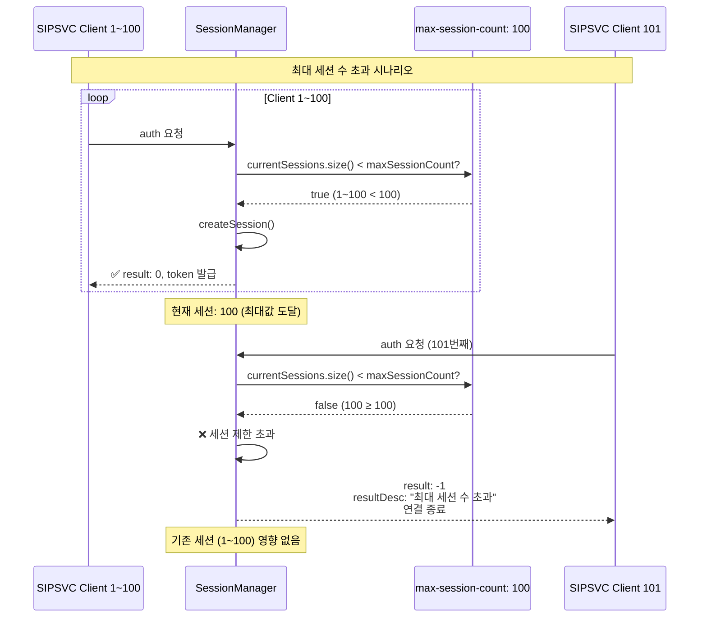
```mermaid
sequenceDiagram
    participant C1 as SIPSVC Client 1~100
    participant SM as SessionManager
    participant CFG as max-session-count: 100
    participant C101 as SIPSVC Client 101
    
    Note over C1,C101: 최대 세션 수 초과 시나리오
    
    loop Client 1~100
        C1->>SM: auth 요청
        SM->>CFG: currentSessions.size() < maxSessionCount?
        CFG-->>SM: true (1~100 < 100)
        SM->>SM: createSession()
        SM-->>C1: ✅ result: 0, token 발급
    end
    
    Note over SM: 현재 세션: 100 (최대값 도달)
    
    C101->>SM: auth 요청 (101번째)
    SM->>CFG: currentSessions.size() < maxSessionCount?
    CFG-->>SM: false (100 ≥ 100)
    
    SM->>SM: ❌ 세션 제한 초과
    
    SM-->>C101: result: -1<br/>resultDesc: "최대 세션 수 초과"<br/>연결 종료
    
    Note over SM: 기존 세션 (1~100) 영향 없음
```

#### **2. 메시지 큐 포화 처리 흐름 (UT_03_002, UT_03_003)**

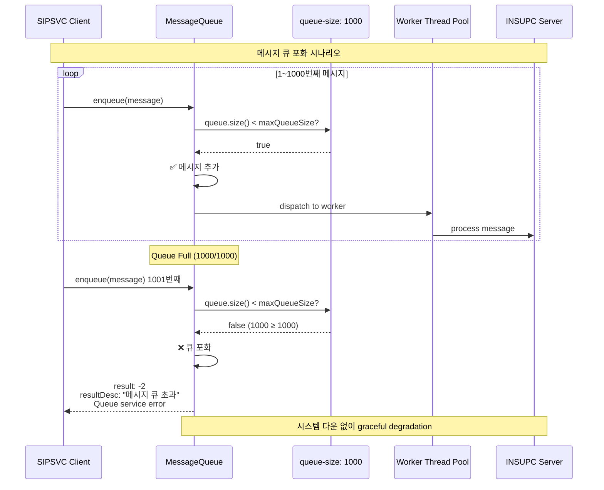
```mermaid
sequenceDiagram
    participant SVC as SIPSVC Client
    participant Q as MessageQueue
    participant CFG as queue-size: 1000
    participant WK as Worker Thread Pool
    participant INSUPC as INSUPC Server
    
    Note over SVC,INSUPC: 메시지 큐 포화 시나리오
    
    loop 1~1000번째 메시지
        SVC->>Q: enqueue(message)
        Q->>CFG: queue.size() < maxQueueSize?
        CFG-->>Q: true
        Q->>Q: ✅ 메시지 추가
        Q->>WK: dispatch to worker
        WK->>INSUPC: process message
    end
    
    Note over Q: Queue Full (1000/1000)
    
    SVC->>Q: enqueue(message) 1001번째
    Q->>CFG: queue.size() < maxQueueSize?
    CFG-->>Q: false (1000 ≥ 1000)
    
    Q->>Q: ❌ 큐 포화
    
    Q-->>SVC: result: -2<br/>resultDesc: "메시지 큐 초과"<br/>Queue service error
    
    Note over Q,INSUPC: 시스템 다운 없이 graceful degradation
```

#### **3. UT_03 테스트 매트릭스**

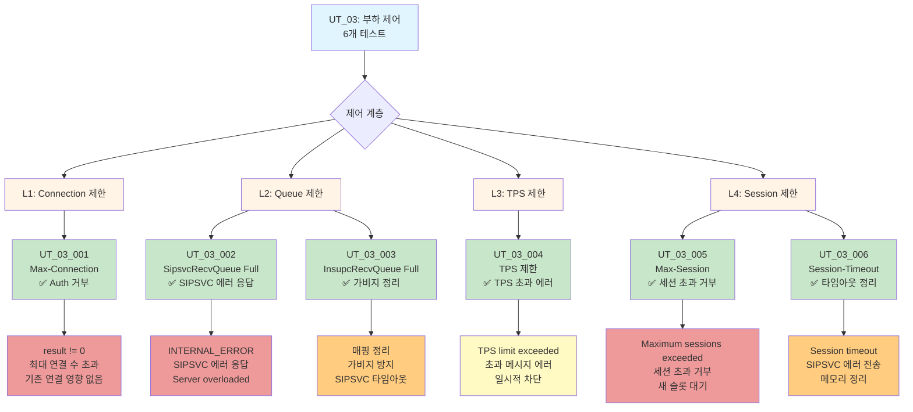
```mermaid
graph TD
    A[UT_03: 부하 제어<br/>6개 테스트] --> B{제어 계층}
    
    B --> C[L1: Connection 제한]
    B --> D[L2: Queue 제한]
    B --> E[L3: TPS 제한]
    B --> F[L4: Session 제한]
    
    C --> C1[UT_03_001<br/>Max-Connection<br/>✅ Auth 거부]
    
    D --> D1[UT_03_002<br/>SipsvcRecvQueue Full<br/>✅ SIPSVC 에러 응답]
    D --> D2[UT_03_003<br/>InsupcRecvQueue Full<br/>✅ 가비지 정리]
    
    E --> E1[UT_03_004<br/>TPS 제한<br/>✅ TPS 초과 에러]
    
    F --> F1[UT_03_005<br/>Max-Session<br/>✅ 세션 초과 거부]
    F --> F2[UT_03_006<br/>Session-Timeout<br/>✅ 타임아웃 정리]
    
    C1 --> G1[result != 0<br/>최대 연결 수 초과<br/>기존 연결 영향 없음]
    D1 --> G2[INTERNAL_ERROR<br/>SIPSVC 에러 응답<br/>Server overloaded]
    D2 --> G3[매핑 정리<br/>가비지 방지<br/>SIPSVC 타임아웃]
    E1 --> G4[TPS limit exceeded<br/>초과 메시지 에러<br/>일시적 차단]
    F1 --> G5[Maximum sessions exceeded<br/>세션 초과 거부<br/>새 슬롯 대기]
    F2 --> G6[Session timeout<br/>SIPSVC 에러 전송<br/>메모리 정리]
    
    style A fill:#e1f5ff
    style C fill:#fff4e6
    style D fill:#fff4e6
    style E fill:#fff4e6
    style F fill:#fff4e6
    style C1 fill:#c8e6c9
    style D1 fill:#c8e6c9
    style D2 fill:#c8e6c9
    style E1 fill:#c8e6c9
    style F1 fill:#c8e6c9
    style F2 fill:#c8e6c9
    style G1 fill:#ef9a9a
    style G2 fill:#ef9a9a
    style G3 fill:#ffcc80
    style G4 fill:#fff9c4
    style G5 fill:#ef9a9a
    style G6 fill:#ffcc80
```

#### **4. 부하 상태 모니터링 흐름**

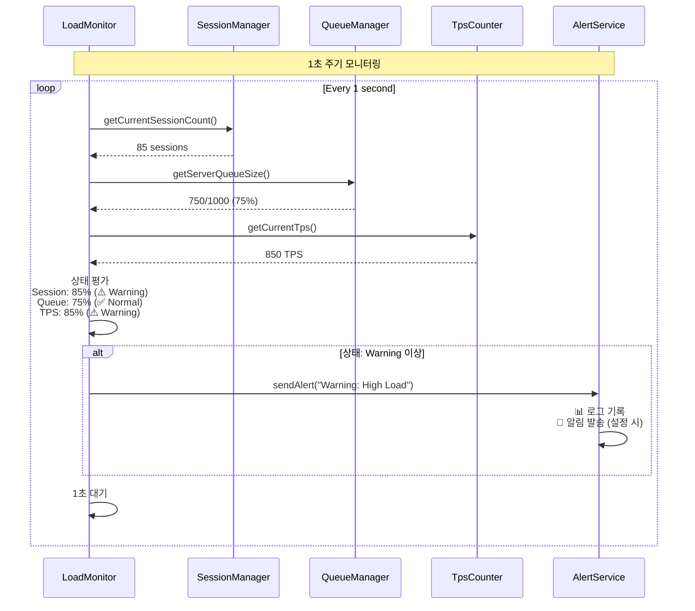
```mermaid
sequenceDiagram
    participant MON as LoadMonitor
    participant SESS as SessionManager
    participant Q as QueueManager
    participant TPS as TpsCounter
    participant ALERT as AlertService
    
    Note over MON,ALERT: 1초 주기 모니터링
    
    loop Every 1 second
        MON->>SESS: getCurrentSessionCount()
        SESS-->>MON: 85 sessions
        
        MON->>Q: getServerQueueSize()
        Q-->>MON: 750/1000 (75%)
        
        MON->>TPS: getCurrentTps()
        TPS-->>MON: 850 TPS
        
        MON->>MON: 상태 평가<br/>Session: 85% (⚠️ Warning)<br/>Queue: 75% (✅ Normal)<br/>TPS: 85% (⚠️ Warning)
        
        alt 상태: Warning 이상
            MON->>ALERT: sendAlert("Warning: High Load")
            ALERT->>ALERT: 📊 로그 기록<br/>📧 알림 발송 (설정 시)
        end
        
        MON->>MON: 1초 대기
    end
```

---

#### **UT_03_001** 최대 연결 초과 시 연결 차단

**테스트 목적**: 최대 연결 수 제한 검증 (Auth 통과한 인증된 연결 기준)

**중요**: Max-Connection 개념
- **Max-Connection**: Auth 통과한 인증된 연결만 카운트 (`isAuthenticated() == true`)
- **미인증 연결**: 카운트에서 제외

**테스트 절차**:

**Phase 1: 설정 변경**
1. `application.yml`에서 `tcp.server.max-connections: 2`로 변경
2. 재컴파일: `.\Compile-Main.ps1`
3. 프로세스 재시작: `.\start.bat`

**Phase 2: 2개 연결 생성 (최대치)**
1. 첫 번째 TCP 연결 생성 → Auth 요청 → ✅ 성공 (연결 1)
2. 두 번째 TCP 연결 생성 → Auth 요청 → ✅ 성공 (연결 2)

**Phase 3: 3번째 연결 시도 (초과)**
1. 세 번째 TCP 연결 생성 → Auth 요청
2. ❌ Auth 거부됨 (최대 연결 수 초과)
3. `result: -1` (또는 비-0)
4. `resultDesc: "Authentication failed - Maximum connection limit exceeded (2/2)"`

**Phase 4: 연결 종료 후 재생성**
1. 첫 번째 연결 종료
2. 새로운 TCP 연결 생성 → Auth 요청 → ✅ 성공 (연결 슬롯 확보)

**Phase 5: 설정 복구**
1. `application.yml`을 원래 `max-connections: 100`으로 복구
2. 재시작 권장

**예상 결과**:
- ✅ 2개까지 연결 생성 성공
- ❌ 3번째 연결 생성 거부 (`result != 0`, `resultDesc`에 "connection" 또는 "limit" 포함)
- ✅ 기존 연결 (1, 2) 영향 없음
- ✅ 연결 종료 후 재생성 가능

**검증 포인트**:
- Auth 통과한 인증된 연결만 카운트 (미인증 연결 제외)
- 연결 초과 시 명확한 에러 메시지
- 기존 연결 영향 없음
- 동적 연결 관리 (종료 후 재생성)

---

#### **UT_03_002** SipsvcRecvQueue/WorkerQueue Full 시 에러 처리

**테스트 목적**: SipsvcRecvQueue 및 WorkerQueue Full 시 SIPSVC로 에러 응답 전송 여부 검증

**테스트 방법**: 소스코드 검증 (실제 부하 테스트 불가)

**테스트 절차**:

**Phase 1: SipsvcTcpServer.java 소스 검증**
- **파일**: `src/main/java/com/in/amas/insupclient/tcp/SipsvcTcpServer.java`
- **검증 항목**:
  1. `sipsvcRecvQueue.offer()` 호출 확인
  2. `offer()` 실패 시 에러 응답 생성 확인
  3. `INTERNAL_ERROR` + `"Server overloaded"` 메시지 확인
  4. `sendMessage(connectionId, errorResponse)` 호출 확인

**SipsvcRecvQueue Full 처리 로직**:
```java
boolean queued = sipsvcRecvQueue.offer(connectionId, sipsvcMessage);

if (!queued) {
    log.error("[SIPSVC|{}:{}] ❌ SipsvcRecvQueue saturated - message dropped | ID: {}", 
            remoteAddress.getAddress().getHostAddress(),
            remoteAddress.getPort(),
            connectionId);
    
    // ✅ 오류 응답 전송
    SipsvcMessage errorResponse = sipsvcProtocolParser.createExecuteResponse(
            sipsvcMessage, null, 
            SipsvcMessage.ResultCode.INTERNAL_ERROR, 
            "Server overloaded");
    sendMessage(connectionId, errorResponse);
}
```

**Phase 2: SipsvcRecvQueue.java 소스 검증**
- **파일**: `src/main/java/com/in/amas/insupclient/queue/SipsvcRecvQueue.java`
- **검증 항목**:
  1. `workerThreadPool.submitMessage()` 호출 확인
  2. `boolean queued` 반환값 체크 확인
  3. `queued == false` 시 에러 응답 전송 로직 확인

**WorkerQueue Full 처리 로직 (개선됨)**:
```java
boolean queued = workerThreadPool.submitMessage(workerMessage);

if (queued) {
    forwardedCount.incrementAndGet();
    log.debug("Business message forwarded to WorkerQueue - type: {}, requestId: {}", 
            normalizedType, requestId);
} else {
    log.error("Failed to forward message to WorkerQueue - type: {}, requestId: {} - sending error response to SIPSVC", 
            normalizedType, requestId);
    
    // ✅ WorkerQueue Full 시 SIPSVC로 에러 응답 전송
    try {
        messageProcessingService.handleFailedMessage(
                workerMessage, 
                new RuntimeException("WorkerQueue saturated - all worker queues are full")
        );
    } catch (Exception e) {
        log.error("Failed to send error response to SIPSVC - requestId: {}, error: {}", 
                requestId, e.getMessage(), e);
    }
}
```

**예상 결과**:

| Queue | Full 감지 | 에러 응답 | 결과 |
|-------|-----------|----------|------|
| **SipsvcRecvQueue** | ✅ `offer()` 실패 감지 | ✅ SIPSVC로 `INTERNAL_ERROR` 전송 | **정상** |
| **WorkerQueue** | ✅ `submitMessage()` 실패 감지 | ✅ `handleFailedMessage()` 호출 → SIPSVC 에러 응답 | **정상** |

**검증 포인트**:
- ✅ **SipsvcRecvQueue Full**: SIPSVC 클라이언트로 즉시 에러 응답 전송 (`INTERNAL_ERROR` + "Server overloaded")
- ✅ **WorkerQueue Full**: `handleFailedMessage()` 호출 → SIPSVC로 에러 응답 전송 (`INTERNAL_ERROR` + "WorkerQueue saturated")

**소스코드 검증 로그 예시**:
```
✅ SipsvcRecvQueue Full → SIPSVC 에러 응답 (정상)
   - sipsvcRecvQueue.offer() 실패 체크
   - INTERNAL_ERROR + 'Server overloaded' 응답
   - sendMessage()로 에러 응답 전송

✅ WorkerQueue Full → SIPSVC 에러 응답 (정상)
   - workerThreadPool.submitMessage() 실패 체크
   - handleFailedMessage() 호출 (에러 응답 전송)
   - 에러 메시지: 'WorkerQueue saturated - all worker queues are full'
   - 에러 로그: 'sending error response to SIPSVC'
```

**테스트 검증 항목**:
1. ✅ `workerThreadPool.submitMessage()` 호출 확인
2. ✅ `boolean queued` 반환값 체크 확인
3. ✅ `messageProcessingService.handleFailedMessage()` 호출 확인
4. ✅ 에러 메시지: "WorkerQueue saturated - all worker queues are full" 확인
5. ✅ 에러 로그: "sending error response to SIPSVC" 확인

---

#### **UT_03_003** InsupcRecvQueue/WorkerQueue Full 시 가비지 정리

**테스트 목적**: InsupcRecvQueue 및 WorkerQueue Full 시 세션 매핑 가비지 정리 검증

**테스트 방법**: 소스코드 검증 (실제 부하 테스트 불가)

**중요 개념**:
- INSUPC → INSUPCLIENT 방향의 응답 메시지는 **원래 요청한 SIPSVC를 찾을 수 없음**
- WorkerQueue Full 시 **에러 응답을 보낼 수 없으므로** 매핑을 정리하여 가비지 방지 필요
- SIPSVC는 타임아웃으로 처리됨 (session-timeout 메커니즘)

**테스트 절차**:

**Phase 1: InsupcRecvQueue.java 소스 검증**
- **파일**: `src/main/java/com/in/amas/insupclient/queue/InsupcRecvQueue.java`
- **검증 항목**:
  1. `workerThreadPool.submitMessage()` 호출 확인
  2. `boolean queued` 반환값 체크 확인
  3. `queued == false` 시 `cleanupFailedInsupcResponse()` 호출 확인
  4. 에러 로그: "cleaning up mapping to prevent garbage" 확인

**InsupcRecvQueue WorkerQueue Full 처리 로직**:
```java
boolean queued = workerThreadPool.submitMessage(workerMessage);

if (queued) {
    forwardedCount.incrementAndGet();
    log.debug("Response forwarded to WorkerQueue - requestId: {}", requestId);
} else {
    log.error("Failed to forward response to WorkerQueue - cleaning up mapping to prevent garbage");
    
    // ✅ WorkerQueue Full 시 매핑 정리 (가비지 방지)
    try {
        messageProcessingService.cleanupFailedInsupcResponse(requestId);
    } catch (Exception e) {
        log.error("Failed to cleanup failed INSUPC response - requestId: {}, error: {}", 
                requestId, e.getMessage(), e);
    }
}
```

**Phase 2: MessageProcessingService.java 소스 검증**
- **파일**: `src/main/java/com/in/amas/insupclient/service/MessageProcessingService.java`
- **검증 항목**:
  1. `cleanupFailedInsupcResponse()` 메서드 존재 확인
  2. `sessionManager.removeSession(requestId)` 호출 확인
  3. `sessionManager.incrementDroppedSessions()` 호출 확인
  4. 에러 로그: "DROPPED" 또는 "WorkerQueue saturated" 확인

**매핑 정리 로직**:
```java
public void cleanupFailedInsupcResponse(String requestId) {
    // ✅ 세션 매핑 정리 (가비지 방지)
    SessionManager.SessionInfo session = sessionManager.removeSession(requestId);
    
    if (session != null) {
        sessionManager.incrementDroppedSessions();
        log.error("INSUPC response dropped due to WorkerQueue Full - requestId: {}, " +
                "session age: {}ms, status: DROPPED", 
                requestId, session.getAge());
        
        // Execute 로그에 DROPPED 상태 기록
        executeLogger.info("DROPPED | reqId: {} | apiName: {} | elapsed: {}ms | status: DROPPED",
                requestId, 
                (session.getOriginalRequest() != null ? 
                    extractApiName(session.getOriginalRequest()) : "N/A"),
                session.getAge());
    }
}
```

**예상 결과**:

| Queue | Full 감지 | 에러 응답 | 매핑 정리 | 결과 |
|-------|-----------|----------|----------|------|
| **InsupcRecvQueue** | ✅ `offer()` 실패 감지 | ❌ 응답 불가 (SIPSVC 모름) | ✅ N/A (응답 메시지는 매핑 필요 없음) | **정상** |
| **WorkerQueue** (INSUPC 응답) | ✅ `submitMessage()` 실패 감지 | ❌ 응답 불가 (원본 SIPSVC 찾을 수 없음) | ✅ `cleanupFailedInsupcResponse()` 호출 → 매핑 정리 | **정상** |

**검증 포인트**:
- ✅ **WorkerQueue Full (INSUPC 응답)**: `cleanupFailedInsupcResponse()` 호출 → 세션 매핑 정리 (가비지 방지)
- ✅ **매핑 정리**: `sessionManager.removeSession()` 호출 → requestConnectionMap, sessionTimestamps, requestOriginalMap 정리
- ✅ **통계 업데이트**: `incrementDroppedSessions()` 호출
- ✅ **로그 기록**: "DROPPED" 상태 로그 및 Execute 로그 기록
- ⚠️ **SIPSVC 에러 응답 없음**: SIPSVC는 session-timeout으로 처리됨

**소스코드 검증 로그 예시**:
```
✅ InsupcRecvQueue WorkerQueue Full → 매핑 정리 (가비지 방지)
   - workerThreadPool.submitMessage() 실패 체크
   - cleanupFailedInsupcResponse() 호출 확인
   - sessionManager.removeSession() 호출 (매핑 정리)
   - sessionManager.incrementDroppedSessions() 호출 (통계)
   - 에러 로그: 'cleaning up mapping to prevent garbage'
   - 에러 로그: 'DROPPED' 상태 기록

⚠️ SIPSVC로 에러 응답 불가
   - INSUPC 응답 메시지는 원래 요청한 SIPSVC를 직접 찾을 수 없음
   - SIPSVC는 session-timeout (기본 30초)으로 처리
   - 매핑은 정리되어 가비지/메모리 누수 없음
```

**테스트 검증 항목**:
1. ✅ `workerThreadPool.submitMessage()` 호출 확인
2. ✅ `boolean queued` 반환값 체크 확인
3. ✅ `messageProcessingService.cleanupFailedInsupcResponse()` 호출 확인
4. ✅ `sessionManager.removeSession()` 호출 확인 (3개 맵 정리)
5. ✅ `sessionManager.incrementDroppedSessions()` 호출 확인
6. ✅ 에러 로그: "cleaning up mapping to prevent garbage" 확인
7. ✅ 에러 로그: "DROPPED" 상태 확인

---

#### **UT_03_004** TPS(초당 처리량) 제한 검증

**테스트 목적**: 초당 메시지 처리량(TPS, Transactions Per Second) 제한이 정상 동작하는지 검증

**사전 준비**:
- ✅ `dev` 프로파일에서 `tps.max-tps: 3`으로 설정됨 (기본값)
- ⚠️ `prod` 프로파일은 `tps.max-tps: 1000` 유지 (운영 환경용)

**테스트 절차 (자동화)**:

**Phase 1: Auth 수행**
1. TCP 연결 생성 (포트 15021)
2. Auth 메시지 전송 및 인증 확인

**Phase 2: 5 TPS로 3초간 전송**
1. Execute 메시지를 200ms 간격으로 전송 (5 TPS)
2. 총 15개 메시지 전송 (3초간)
3. 각 메시지 전송 시간 기록

**Phase 3: 응답 수신 및 검증**
1. 15개 응답 수신
2. `result=0` (성공) 개수 카운트
3. `TPS limit exceeded` 에러 개수 카운트
4. 로그 기록

**TPS 계산 로직**:
- **윈도우 크기**: 1초 (1000ms)
- **슬라이딩 윈도우**: 1초마다 카운터 리셋
- **제한**: 초당 3개까지만 허용
- **초과 시**: 즉시 에러 응답 (`result != 0`, `resultDesc: "TPS limit exceeded"`)

**예상 결과**:
```
시간 구간      전송 개수    허용 개수    TPS 초과 에러
0.0 ~ 1.0초   5개         3개         2개 (4번째, 5번째)
1.0 ~ 2.0초   5개         3개         2개 (9번째, 10번째)
2.0 ~ 3.0초   5개         3개         2개 (14번째, 15번째)
------------------------------------------------------------
합계          15개        9개         6개
```

- ✅ 정상 처리: 9개 (초당 3개 × 3초)
- ❌ TPS 초과 에러: 6개 (초당 2개 × 3초)
- 📝 TPS 제한 로그 기록

**시퀀스 다이어그램**:

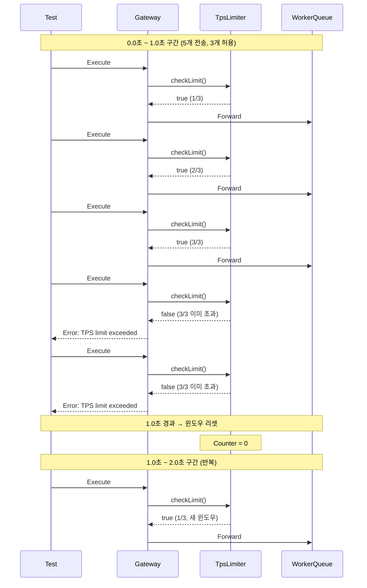
```mermaid
sequenceDiagram
    participant T as Test
    participant G as Gateway
    participant TL as TpsLimiter
    participant W as WorkerQueue
    
    Note over T,W: 0.0초 ~ 1.0초 구간 (5개 전송, 3개 허용)
    
    T->>G: Execute #1 (0.0초)
    G->>TL: checkLimit()
    TL-->>G: true (1/3)
    G->>W: Forward
    
    T->>G: Execute #2 (0.2초)
    G->>TL: checkLimit()
    TL-->>G: true (2/3)
    G->>W: Forward
    
    T->>G: Execute #3 (0.4초)
    G->>TL: checkLimit()
    TL-->>G: true (3/3)
    G->>W: Forward
    
    T->>G: Execute #4 (0.6초)
    G->>TL: checkLimit()
    TL-->>G: false (3/3 이미 초과)
    G-->>T: Error: TPS limit exceeded
    
    T->>G: Execute #5 (0.8초)
    G->>TL: checkLimit()
    TL-->>G: false (3/3 이미 초과)
    G-->>T: Error: TPS limit exceeded
    
    Note over T,W: 1.0초 경과 → 윈도우 리셋
    Note over TL: Counter = 0
    
    Note over T,W: 1.0초 ~ 2.0초 구간 (반복)
    T->>G: Execute #6 (1.0초)
    G->>TL: checkLimit()
    TL-->>G: true (1/3, 새 윈도우)
    G->>W: Forward
```

**검증 포인트**:
- ✅ **슬라이딩 윈도우**: 1초마다 카운터 리셋
- ✅ **TPS 제한**: 초당 3개까지만 허용
- ✅ **초과 시 에러**: `result != 0`, `resultDesc: "TPS limit exceeded"`
- ✅ **정상 처리**: 초당 3개씩 정상 처리
- 📝 **로그 기록**: TPS 초과 로그 (rejected count 증가)

**구성 설정 (application.yml)**:
```yaml
tps:
  max-tps: 3           # 초당 최대 3개
  window-size: 1000    # 1초 윈도우 (밀리초)
```

**TpsLimiter 동작 방식**:
```java
public boolean checkLimit() {
    long now = System.currentTimeMillis();
    
    // 윈도우 시간 경과 확인
    if (now - currentWindowStart.get() >= windowSize) {
        currentWindowStart.set(now);  // 새 윈도우 시작
        currentCounter.set(0);        // 카운터 리셋
    }
    
    // TPS 체크
    if (currentCounter.get() >= maxTps) {
        rejectedRequests.incrementAndGet();
        return false;  // TPS 초과
    }
    
    currentCounter.incrementAndGet();
    return true;  // 정상
}
```

---

#### **UT_03_005** 요청-응답 매핑 세션 수 초과 시 거부

**테스트 목적**: SIPSVC Execute 요청과 INSUPC 응답을 매핑하는 내부 세션의 최대 개수 제한 검증

**사전 준비**:
- `application.yml`에서 `message.max-sessions: 3`으로 설정 후 재시작 필요

**테스트 절차 (자동화)**:

**Phase 1: 시뮬레이터 설정**
1. 시뮬레이터를 `ut_03_005_max_session` 시나리오로 변경 (HTTP API 호출)
2. INSUPC가 QUERY 메시지에 응답하지 않도록 설정 (`query.noResponse: true`)

**Phase 2: 연결 및 인증**
1. SIPSVC TCP 연결 생성 (포트 15021)
2. Auth 요청 전송 및 토큰 발급 확인

**Phase 3: 4개 Execute 요청 전송 (응답 대기 안함)**
1. Execute 요청 4개를 순차적으로 전송
2. INSUPC가 응답하지 않으므로 세션이 누적됨

**Phase 4: 응답 검증**
1. 4개의 Execute 응답을 순서대로 읽기
2. 1~3번째 요청: 전송 성공 (응답 없음 - INSUPC 차단)
3. 4번째 요청: 즉시 에러 응답 (`result=18`, `resultDesc='Maximum concurrent sessions exceeded'`)

**Phase 5: 시뮬레이터 복원**
1. 시뮬레이터를 `default` 시나리오로 복원

**예상 결과**:
- ✅ 1~3번째 요청: 전송 성공 (세션 등록)
- ❌ 4번째 요청: `result=18` (INTERNAL_ERROR), `resultDesc='Maximum concurrent sessions exceeded'`
- 📝 max-sessions 제한이 정상적으로 동작함

**시퀀스 다이어그램**:

```mermaid
sequenceDiagram
    participant T as Test
    participant S as SIPSVC Client
    participant I as INSUPCLIENT
    participant B as INSUPC Backend
    
    Note over T: Phase 1: max-sessions=3 설정
    T->>T: application.yml 수정
    T->>I: 재시작
    
    Note over S,I: Phase 2: 인증
    S->>I: Auth Request
    I->>S: Auth Response (token)
    
    Note over S,B: Phase 3: 3개 요청 (응답 대기)
    S->>I: Execute #1
    I->>B: DB_QUERY #1
    Note right of I: Session 1 저장
    S->>I: Execute #2
    I->>B: DB_QUERY #2
    Note right of I: Session 2 저장
    S->>I: Execute #3
    I->>B: DB_QUERY #3
    Note right of I: Session 3 저장 (MAX)
    
    Note over S,I: Phase 4: 4번째 요청 (초과)
    S->>I: Execute #4
    I->>S: Error Response (세션 초과)
    Note right of I: 요청 거부됨
    
    Note over S,B: Phase 5: 응답 후 재요청
    B->>I: DB_QUERY_RESPONSE #1
    Note right of I: Session 1 해제
    I->>S: Execute Response #1
    S->>I: Execute #5
    I->>B: DB_QUERY #5
    Note right of I: Session 1 재사용 (성공)
```

---

#### **UT_03_006** 요청-응답 매핑 세션 타임아웃

**테스트 목적**: 응답 없는 세션이 일정 시간 후 자동으로 정리되는지 검증

**사전 준비**:
- `application.yml`에서 `message.session-timeout: 5000` (5초)로 설정 후 재시작 필요

**테스트 절차 (자동화)**:

**Phase 1: 시뮬레이터 설정**
1. 시뮬레이터를 `ut_03_006_session_timeout` 시나리오로 변경 (HTTP API 호출)
2. INSUPC가 QUERY 메시지에 응답하지 않도록 설정 (`query.noResponse: true`)

**Phase 2: 연결 및 인증**
1. SIPSVC TCP 연결 생성 (포트 15021)
2. Auth 요청 전송 및 토큰 발급 확인

**Phase 3: Execute 요청 (응답 받지 않음)**
1. Execute 요청 1개 전송 (reqNo: `UT_03_006_REQ_TIMEOUT`)
2. INSUPC가 응답하지 않음

**Phase 4: 타임아웃 전 세션 확인**
1. GET `/status` API 호출
2. `sessionStats.currentSessions = 1` 확인 (세션 등록됨)

**Phase 5: 10초 대기 (타임아웃 유도)**
1. 10초 대기 (session-timeout=5초 + 여유 5초)

**Phase 6: 타임아웃 후 세션 확인**
1. GET `/status` API 호출
2. `sessionStats.currentSessions = 0` 확인 (세션 정리됨)

**Phase 7: 로그 검증**
1. `logs/insupclient.log`에서 `Session timeout - request ID: UT_03_006_REQ_TIMEOUT` 확인
2. `logs/insupclient_execute.log`에서 `TIMEOUT | reqId: UT_03_006_REQ_TIMEOUT` 확인
3. SIPSVC로 타임아웃 에러 응답 전송 확인

**Phase 8: 시뮬레이터 복원**
1. 시뮬레이터를 `default` 시나리오로 복원

**예상 결과**:
- ✅ 타임아웃 전: `currentSessions = 1`
- ✅ 타임아웃 후: `currentSessions = 0` (세션 자동 정리)
- ✅ 로그: `Session timeout` 메시지 존재
- ✅ 로그: Execute `TIMEOUT` 메시지 존재
- ✅ SIPSVC로 타임아웃 에러 응답 전송됨
- 📝 메모리 누수 방지 확인

**시퀀스 다이어그램**:

```mermaid
sequenceDiagram
    participant T as Test
    participant S as SIPSVC Client
    participant I as INSUPCLIENT
    participant B as INSUPC Backend
    participant C as Cleanup Task
    
    Note over T: Phase 1: session-timeout=10초 설정
    T->>T: application.yml 수정
    T->>I: 재시작
    
    Note over S,I: Phase 2-3: 요청 전송
    S->>I: Auth Request
    I->>S: Auth Response (token)
    S->>I: Execute #1
    I->>B: DB_QUERY #1
    Note right of I: Session 생성 (timestamp 기록)
    
    Note over T,C: Phase 4: 15초 대기
    Note right of I: 10초 경과...
    C->>I: Cleanup 실행
    Note right of I: Session timeout 감지
    Note right of I: Session 1 삭제
    
    Note over T: Phase 5: 확인
    T->>I: GET /status (messageMappingSize)
    I->>T: messageMappingSize = 0
    Note right of T: ✅ 세션 정리 완료
```

---

## 🔧 **클라이언트 기능** (INSUPCLIENT ↔ INSUPC)

본 섹션은 **INSUPCLIENT (게이트웨이) ↔ INSUPC (DB 서버)** 간의 Binary/TCP 연동에 대한 테스트입니다.

### 📘 **INSUPC 연동 개요**

- **프로토콜**: Binary TCP (62바이트 헤더 + 가변 Body)
- **포트**: 19000
- **엔디언**: Little Endian
- **주요 메시지**:
  - 0x03: DB_ACCESS_REQUEST (LOGON 인증)
  - 0x05: DB_NETTEST_REQUEST (HeartBeat, 10초 주기)
  - 0x01: DB_QUERY_REQUEST (DB 질의)
- **타임아웃**:
  - 연결: 30초
  - 읽기: 10초
  - HeartBeat 응답: 5초 (3회 실패 시 재연결)
- **재연결**: 1초 주기

---

#### **UT_04_001** LOGON 인증 성공

**테스트 목적**: INSUPC 최초 연결 시 DB_ACCESS_REQUEST를 통한 정상 인증 검증

**전제 조건**:
- INSUPC 서버가 정상 기동되어 있음
- 설정 파일에 INSUPC 연결 정보 등록

**테스트 절차**:
1. INSUPCLIENT에서 INSUPC로 TCP 연결 (19000 포트)
2. DB_ACCESS_REQUEST (0x03) 전송 (LOGON 정보 포함)
3. DB_ACCESS_RESPONSE (0x04) 수신
4. DB Status 확인

**테스트 데이터**:
```
헤더 (62바이트):
- MSG_CODE: 0x03 (DB_ACCESS_REQUEST)
- SVCA: 0x11 (AS)
- DVCA: 0xA2 (INSUPC)
- AS_ID: 100
- SESSION_ID: "INSUP_SESSION_001"
- SVC_ID: "0001"

파라미터:
- Parameter 1: DB_LOGON_INFO (0x07)
  - System ID, Session ID 등
```

**예상 결과**:
- ✅ DB_ACCESS_RESPONSE 수신
- ✅ RESULT: 0x01 (SUCCESS)
- ✅ DB Status 파라미터 수신 (MA, MB, DA, DB 중 하나)
- ✅ 세션 정상 수립

**검증 포인트**:
- 62바이트 헤더 구조 정확성
- Little Endian 변환 정확성
- DB Status: "MA" (Master Active) 또는 "A" (Active)
- 세션 ID 매핑 정확성

---

#### **UT_04_002** LOGON 인증 실패

**테스트 목적**: 잘못된 인증 정보로 LOGON 시 거부 및 자동 재연결 검증

**테스트 절차**:
1. 시뮬레이터를 `ut_04_002_logon_failure` 시나리오로 설정 (LOGON 실패 시나리오)
2. insupclient에서 INSUPC로 TCP 연결
3. DB_ACCESS_REQUEST (LOGON) 전송
4. 시뮬레이터가 RESULT: 0x20 (LOGIN_DENIED) 응답
5. 연결 종료 및 재연결 흐름 확인

**예상 결과**:
- ❌ DB_ACCESS_RESPONSE 수신: RESULT=0x20 (INSUP_RESULT_LOGIN_DENIED)
- ✅ Socket Disconnection (exceptionCaught → channelInactive)
- ✅ 1초 후 자동 재연결 시도 (retry-interval)
- ✅ 재 LOGON 시도

**검증 포인트**:
- 인증 실패 에러 코드 확인 (0x20)
- LOGON 실패 로그 확인: `"INSUPC_LOGON_FAILED: result=0x20"`
- channelInactive 호출 로그 확인
- 재연결 로그 확인: `"Reconnection triggered"`
- 재 LOGON 시도 로그 확인: `"TCP_CONNECTION:"`

---

#### **UT_04_003** HEARTBEAT 정상 송수신

**테스트 목적**: INSUPC HeartBeat 주기적 전송 및 응답 검증 (연동규격 § 2.1 준수)

**테스트 흐름**:
```mermaid
sequenceDiagram
    participant UT as InsupclientUnitTest
    participant SIM as TestSimulator
    
    Note over UT,SIM: HEARTBEAT 3회 송수신 (10초 간격)
    
    UT->>SIM: LOGON (DB_ACCESS_REQUEST)
    SIM-->>UT: LOGON Response (SUCCESS)
    
    loop 3번 반복
        UT->>SIM: HEARTBEAT #N (DB_NETTEST_REQUEST)
        SIM-->>UT: HEARTBEAT Response (DB_NETTEST_RESPONSE)
        Note over UT: 10초 대기 (연동규격 준수)
    end
    
    UT->>UT: ✅ 3번 모두 성공 확인
```

**테스트 절차**:
1. INSUPC와 정상 연결 및 LOGON 완료
2. 10초 주기로 DB_NETTEST_REQUEST (0x05) 전송
3. DB_NETTEST_RESPONSE (0x06) 수신 확인
4. 3회 이상 반복

**테스트 데이터**:
```
헤더 (62바이트):
- MSG_CODE: 0x05 (DB_NETTEST_REQUEST)
- SVCA: 0x11
- DVCA: 0xA2

파라미터: 없음 (헤더만 전송)
```

**예상 결과**:
- ✅ 10초 주기로 HeartBeat 요청 전송
- ✅ DB_NETTEST_RESPONSE 정상 수신
- ✅ DB Status 파라미터 확인 (0x06)
- ✅ 연결 유지

**검증 포인트**:
- HeartBeat 주기: 10초 ± 0.5초
- 응답 시간: < 1초
- DB Status 변경 시 감지
- 로그 기록 정확성

---

#### **UT_04_004** 메시지 응답 타임아웃 (read-timeout)

**테스트 목적**: TCP 연결은 유지되지만 메시지 응답이 없는 경우 read-timeout 후 자동 재연결 검증

**테스트 절차**:
1. 시뮬레이터를 `ut_04_004_no_response` 시나리오로 설정 (모든 메시지 응답 안함)
2. 시뮬레이터에 강제 연결 종료 요청 → insupclient 재연결 트리거
3. insupclient가 LOGON 메시지 전송
4. 시뮬레이터는 TCP 연결은 유지하지만 메시지 응답 안 함
5. read-timeout(30초) 대기
6. 43초 후 insupclient 로그에서 ReadTimeoutException 및 재연결 확인

**예상 결과**:
- ✅ TCP 연결 성공 (LOGON 메시지 전송)
- ⏱️ 30초 동안 응답 없음 (read-timeout)
- ❌ ReadTimeoutException 발생
- ✅ Socket Disconnection (exceptionCaught → channelInactive)
- ✅ 1초 후 자동 재연결 시도 (retry-interval)
- ✅ 재 LOGON 시도

**검증 포인트**:
- read-timeout: **30초** (연동규격 준수: `application.yml` - HEARTBEAT 10초 주기 고려)
- 재연결 주기: **1초** (연동규격 준수: `retry-interval`)
- 테스트 대기 시간: **43초** (30초 timeout + 1초 retry + 12초 buffer)
- ReadTimeoutException 발생 로그 확인: `"ReadTimeout detected"`
- 자동 재연결 로그 확인: `"Reconnection triggered"`
- TCP 재연결 로그 확인: `"TCP_CONNECTION:"`

**연동규격 참조**:
- INTEGRATION_SPECIFICATION.md § 2.1
  - 읽기 타임아웃: 30초 (HEARTBEAT 10초 주기 대비 여유 확보)
  - 재연결 주기: 1초
  
**중요 설계 사항**:
- HEARTBEAT 주기가 10초이므로, read-timeout은 최소 30초 이상이어야 정상적인 HEARTBEAT 처리가 가능
- 10초로 설정 시 HEARTBEAT 전송 전에 타임아웃이 발생할 수 있음

---

#### **UT_04_005** 연결 실패 시 재접속

**테스트 목적**: INSUPC 연결 장애 시 자동 복구 검증

**테스트 절차**:
1. INSUPC 서버를 일시적으로 중지
2. INSUPCLIENT에서 연결 시도
3. 연결 실패 인지 및 재접속 시도 확인
4. INSUPC 서버 재시작
5. 재접속 성공 확인

**예상 결과**:
- 🔄 클라이언트가 1초 주기로 재접속 시도
- ✅ INSUPC 정상화 시 연결 성공
- ✅ 자동 LOGON 수행

**검증 포인트**:
- 재접속 간격: 1초
- 재시도 횟수: 3회 (설정값)
- 재시도 간격: 5초 (설정값)
- Binary TCP 연결 상태 로그 기록
- 연결 풀 상태 복구

---

#### **UT_04_006** DB_STATUS_REQUEST 처리

**테스트 목적**: INSUPC가 능동적으로 상태 변경을 알릴 때 (DB_STATUS_REQUEST → insupclient) 정상 처리 검증

**연동 규격 참조**: § 2.7.1 - "INSUPC들은 자신의 상태가 변경될 경우 AS들에게 자신의 상태를 알림"

**테스트 시나리오**:
```mermaid
sequenceDiagram
    participant INSUPC as INSUPC Server
    participant Client as insupclient
    participant Test as Unit Test
    
    Note over INSUPC: DB Status 변경<br/>(MA → MB)
    INSUPC->>Client: DB_STATUS_REQUEST<br/>(msgCode=0x07, dbStatus="MB")
    Client->>Client: 1. DB_STATUS 파라미터 추출
    Client->>Client: 2. 해당 풀의 dbStatus 업데이트
    Client->>Client: 3. 로그 출력 (STATUS_NOTIFICATION)
    Client->>INSUPC: DB_STATUS_RESPONSE<br/>(msgCode=0x08, result=0x01)
    Test->>Test: 4. 로그 확인<br/>✓ DB Status 업데이트<br/>✓ 응답 전송
```

**전제 조건**:
- INSUPC-1: 127.0.0.1:19000 (TestSimulator 사용 중)
- INSUPC-2: 127.0.0.1:19100 (테스트용 간이 서버 - application.yml에서 활성화 필요)
- insupclient 서버가 INSUPC-2 설정을 포함하여 시작되어야 함

**테스트 절차**:
1. application.yml에서 INSUPC-2 (19100) 주석 해제
2. insupclient 서버 재시작
3. 간이 INSUPC 서버 시작 (19100 포트, 최대 10초 대기)
   - 참고: TCP 연결 시도 타임아웃 3초 + 재연결 간격 1초 = 4초마다 재연결 시도
4. insupclient가 INSUPC-2로 연결 시 LOGON 처리 (dbStatus="MA")
5. DB_STATUS_REQUEST 전송 (dbStatus="MB"로 변경 시뮬레이션)
6. DB_STATUS_RESPONSE 수신 확인
7. insupclient.log에서 DB_STATUS 업데이트 및 응답 전송 로그 확인

**예상 결과**:
- ✅ INSUPC-2 연결 성공 (19100 포트)
- ✅ LOGON 처리: dbStatus="MA" 설정
- ✅ DB_STATUS_REQUEST 수신 시 dbStatus 업데이트: "MA" → "MB"
- ✅ DB_STATUS_RESPONSE (result=0x01) 응답 전송
- ✅ 로그에 상태 변경 및 응답 전송 기록

**검증 포인트**:
- ✅ **로그**: `INSUPC_STATUS_NOTIFICATION: session=xxx, newStatus=MB`
- ✅ **로그**: `[INSUPC|INSUPC-2] DB Status changed | old: MA, new: MB`
- ✅ **로그**: `DB_STATUS_RESPONSE sent: session=xxx, result=0x01`
- ✅ **TCP 통신**: 간이 INSUPC 서버에서 DB_STATUS_RESPONSE 수신 확인
- ✅ **연동 규격 준수**: DB_STATUS_REQUEST (0x07) 처리 및 DB_STATUS_RESPONSE (0x08) 응답

**중요 설정 사항**:
- ⚠️ **TCP 연결 시도 타임아웃**: 3초 (하드코딩, 빠르게 실패)
- ⚠️ **read-timeout**: 30초 (메시지 응답 대기 타임아웃)
- ⚠️ **retry-interval**: 1초 (TCP 재연결 시도 간격)
- ⚠️ **재연결 주기**: 약 4초 (TCP timeout 3초 + retry-interval 1초)
- ⚠️ **테스트 대기 시간**: 최대 10초 (재연결 시도 2~3회 대기)

**테스트 상태**: ✅ **구현 완료** (간이 INSUPC 서버를 통한 자동화 테스트)

---

#### **UT_04_007** Active(MA)-Active(MA) 상태 Load Balancing

**테스트 목적**: 2개의 INSUPC 서버가 모두 MA(Main Active) 상태일 때 Load Balancing 검증

**연동 규격 참조**: § 2.3.5 - DB_STATUS 파라미터 (MA: Main Active)

**테스트 시나리오**:
```mermaid
sequenceDiagram
    participant Test as Unit Test
    participant Client as insupclient
    participant INSUPC1 as INSUPC-1<br/>(19000, TestSimulator)
    participant INSUPC2 as INSUPC-2<br/>(19100, 간이 서버)
    
    Note over Test,INSUPC2: 테스트 시작: 19100 포트에 간이 INSUPC-2 서버 자동 생성
    
    Test->>INSUPC2: 🔧 ServerSocket(19100) 생성
    Client->>INSUPC2: TCP Connect (자동 재연결)
    INSUPC2-->>Client: LOGON Response (dbStatus=MA)
    
    Note over Test,INSUPC2: 전제 조건: 2개 INSUPC 모두 MA 상태
    
    Test->>Client: Query Request #1 (HTTP)
    Client->>INSUPC1: DB_QUERY_REQUEST (Round-Robin)
    INSUPC1-->>Client: DB_QUERY_RESPONSE
    
    Test->>Client: Query Request #2
    Client->>INSUPC2: DB_QUERY_REQUEST (Round-Robin)
    INSUPC2-->>Client: DB_QUERY_RESPONSE
    
    Test->>Client: Query Request #3
    Client->>INSUPC1: DB_QUERY_REQUEST (Round-Robin)
    
    loop 10개 요청
        Note over Client,INSUPC2: Round-Robin 방식 Load Balancing
    end
    
    Test->>Test: ✅ 각 서버 요청 수 확인<br/>INSUPC-1: 5개, INSUPC-2: 5개
    
    Test->>INSUPC2: 🔧 ServerSocket 종료 (자동)
```

**전제 조건**:
- INSUPC-1: 127.0.0.1:19000 (TestSimulator 사용, dbStatus=MA)
- INSUPC-2: 127.0.0.1:19100 (테스트 내부에서 자동 생성, dbStatus=MA)
- application.yml에서 INSUPC-2 활성화 필요

**테스트 절차**:
1. application.yml에서 INSUPC-2 (19100) 주석 해제
2. insupclient 서버 재시작
3. UT_04_007 실행 → 테스트가 19100 포트에 간이 INSUPC-2 서버 자동 생성
4. 두 INSUPC 연결 확인 (GET /api/state)
5. 10개의 Query 요청 전송
6. 각 INSUPC로 전송된 요청 수 확인 (Round-Robin 검증)
7. 테스트 종료 시 간이 INSUPC-2 서버 자동 종료

**예상 결과**:
- ✅ INSUPC-1 연결 성공 (dbStatus=MA)
- ✅ INSUPC-2 연결 성공 (dbStatus=MA, 간이 서버)
- ✅ 10개 요청 모두 성공
- ✅ **Load Balancing**: INSUPC-1에 5개, INSUPC-2에 5개 (Round-Robin)
- ✅ 모든 요청의 응답 시간 정상

**검증 포인트**:
- ✅ **연결 상태**: `GET /state` → `insupcConnections[0].dbStatus = "MA"`, `insupcConnections[1].dbStatus = "MA"`
- ✅ **Load Balancing**: 각 서버에 5개씩 균등 분배 (오차 ±2 허용)
- ✅ **로그**: `[INSUPC] Selected MA pool: INSUPC-1` / `INSUPC-2` (교대로 출력, INFO 레벨)
- ✅ **성공률**: 10개 요청 모두 성공 (100%)
- ✅ **Round-Robin 순서**: INSUPC-1 → INSUPC-2 → INSUPC-1 → INSUPC-2 ... (반복)
- ✅ **간이 서버**: 19100 포트에 자동 생성/종료 (UT_04_006 방식)

**테스트 상태**: ✅ **구현 완료** (간이 INSUPC-2 서버 자동 생성, TestSimulator 1개만 필요)

---

#### **UT_04_008** Active(MA)-Standby(DA) 상태에서 Active TCP 연결 종료될 경우

**테스트 목적**: 2개의 INSUPC 서버 중 Active(MA) 서버가 종료될 경우 Standby(DA) 서버로 Failover 검증

**연동 규격 참조**: § 2.3.5 - DB_STATUS 파라미터 (MA: Main Active, DA: DR Active)

**테스트 시나리오**:
```mermaid
sequenceDiagram
    participant Test as Unit Test
    participant Client as insupclient
    participant INSUPC1 as INSUPC-1<br/>(19000, DA)
    participant INSUPC2 as INSUPC-2<br/>(19100, MA)
    
    Note over Test,INSUPC2: 초기 상태: INSUPC-1=DA, INSUPC-2=MA
    
    Test->>INSUPC2: 🔧 ServerSocket(19100) 생성 (dbStatus=MA)
    Client->>INSUPC2: TCP Connect
    INSUPC2-->>Client: LOGON Response (dbStatus=MA)
    
    Note over Test,INSUPC2: Phase 1: MA 우선 라우팅
    
    Test->>Client: Query Request #1
    Client->>INSUPC2: DB_QUERY_REQUEST (MA 우선)
    INSUPC2-->>Client: DB_QUERY_RESPONSE
    
    Test->>Client: Query Request #2
    Client->>INSUPC2: DB_QUERY_REQUEST (MA 우선)
    INSUPC2-->>Client: DB_QUERY_RESPONSE
    
    Test->>Test: ✅ 2개 모두 INSUPC-2(MA)로 전송
    
    Note over Test,INSUPC2: INSUPC-2 서버 종료 (MA 종료)
    
    Test->>INSUPC2: 🔧 ServerSocket 종료
    INSUPC2-XClient: TCP 연결 종료
    Client->>Client: ⚠️ Failover 감지
    
    Note over Test,INSUPC2: Phase 2: DA로 Failover
    
    Test->>Client: Query Request #3
    Client->>INSUPC1: DB_QUERY_REQUEST (DA로 Failover)
    INSUPC1-->>Client: DB_QUERY_RESPONSE
    
    Test->>Client: Query Request #4
    Client->>INSUPC1: DB_QUERY_REQUEST (DA로 Failover)
    INSUPC1-->>Client: DB_QUERY_RESPONSE
    
    Test->>Test: ✅ 2개 모두 INSUPC-1(DA)로 Failover
```

**전제 조건**:
- INSUPC-1: 127.0.0.1:19000 (TestSimulator 사용, dbStatus=DA)
- INSUPC-2: 127.0.0.1:19100 (테스트 내부에서 자동 생성, dbStatus=MA)
- application.yml에서 INSUPC-2 활성화 필요
- simulator-config.yaml에서 dbStatus='DA' 설정 필요

**테스트 절차**:
1. simulator-config.yaml에서 activeScenario의 dbStatus를 'DA'로 설정
2. application.yml에서 INSUPC-2 (19100) 주석 해제
3. insupclient 서버 재시작
4. UT_04_008 실행 → 테스트가 19100 포트에 간이 INSUPC-2 서버 자동 생성 (MA 상태)
5. 두 INSUPC 연결 확인 (INSUPC-1=DA, INSUPC-2=MA)
6. **Phase 1**: 2개의 Query 요청 전송 → INSUPC-2(MA)로 전송 확인
7. INSUPC-2 서버 자동 종료 (MA 종료)
8. **Phase 2**: 2개의 Query 요청 전송 → INSUPC-1(DA)로 Failover 확인
9. 테스트 종료 시 간이 INSUPC-2 서버 자동 종료

**예상 결과**:
- ✅ INSUPC-1 연결 성공 (dbStatus=DA)
- ✅ INSUPC-2 연결 성공 (dbStatus=MA, 간이 서버)
- ✅ **Phase 1**: 2개 요청 모두 INSUPC-2(MA)로 전송
- ✅ INSUPC-2 종료 후 Failover 감지
- ✅ **Phase 2**: 2개 요청 모두 INSUPC-1(DA)로 Failover

**검증 포인트**:
- ✅ **연결 상태**: `GET /state` → `insupcConnections[0].dbStatus = "DA"`, `insupcConnections[1].dbStatus = "MA"`
- ✅ **MA 우선 라우팅**: Phase 1에서 2개 요청 모두 `"Selected MA pool: INSUPC-2"` (INFO 레벨)
- ✅ **Failover 동작**: INSUPC-2 종료 후 Phase 2에서 2개 요청 모두 `"using fallback: INSUPC-1"` (WARN 레벨)
- ✅ **성공률**: Phase 1과 Phase 2 각각 2/2 요청 성공 (100%)
- ✅ **간이 서버**: 19100 포트에 자동 생성/종료 (UT_04_006, UT_04_007 방식)

**테스트 상태**: ✅ **구현 완료** (간이 INSUPC-2 서버 자동 생성, MA→DA Failover 검증)

---

#### **UT_04_009** Active(MA)-Standby(MS) 상태에서 Active가 Block될 경우

**테스트 목적**: 2개의 INSUPC 서버 중 Active(MA) 서버가 Block(MB) 상태로 변경될 경우 Standby(MS) 서버로 Failover 검증

**테스트 흐름**:
```mermaid
sequenceDiagram
    participant UT as InsupclientUnitTest
    participant SIPSVC as SIPSVC TCP
    participant CLIENT as InsupcClient
    participant SIM1 as TestSimulator<br/>(19000, MS)
    participant SIM2 as 간이 INSUPC-2<br/>(19100, MA→MB)
    
    Note over UT,SIM2: 사전 준비: INSUPC-1=MS, INSUPC-2=MA
    
    UT->>CLIENT: GET /state
    CLIENT-->>UT: INSUPC-1: dbStatus=MS<br/>INSUPC-2: dbStatus=MA
    
    Note over UT,SIM2: Phase 1: MA 상태에서 메시지 전송
    
    loop 2개 요청
        UT->>SIPSVC: SIPSVC execute (getMcidProfile)
        SIPSVC->>CLIENT: execute
        CLIENT->>SIM2: DB_QUERY_REQUEST (MA 우선)
        SIM2-->>CLIENT: DB_QUERY_RESPONSE (SUCCESS)
        CLIENT-->>SIPSVC: result=0
        SIPSVC-->>UT: ✅ 성공
    end
    
    UT->>UT: ✅ 2개 모두 INSUPC-2(MA)로 전송 확인
    
    Note over UT,SIM2: Phase 2: INSUPC-2를 MB로 변경
    
    UT->>SIM2: HTTP POST /api/simulator/config<br/>(dbStatus: MB)
    SIM2->>CLIENT: DB_NETTEST_RESPONSE (dbStatus=MB)
    CLIENT->>CLIENT: INSUPC-2 상태 업데이트: MA→MB (BLOCKED)
    
    Note over UT,SIM2: Phase 3: MS로 Failover 확인
    
    loop 2개 요청
        UT->>SIPSVC: SIPSVC execute (getMcidProfile)
        SIPSVC->>CLIENT: execute
        CLIENT->>SIM1: DB_QUERY_REQUEST (MS Fallback)
        SIM1-->>CLIENT: DB_QUERY_RESPONSE (SUCCESS)
        CLIENT-->>SIPSVC: result=0
        SIPSVC-->>UT: ✅ 성공
    end
    
    UT->>UT: ✅ 2개 모두 INSUPC-1(MS)로 Failover 확인
```

**전제 조건**:
1. TestSimulator (19000) dbStatus="MS" 설정
2. application.yml에서 INSUPC-2 (19100) 주석 해제
3. insupclient 서버 재시작

**테스트 절차**:
1. simulator-config.yaml에서 activeScenario의 dbStatus를 'MS'로 설정
2. application.yml에서 INSUPC-2 (19100) 주석 해제
3. insupclient 서버 재시작
4. UT_04_009 실행 → 테스트가 19100 포트에 간이 INSUPC-2 서버 자동 생성 (MA 상태)
5. 두 INSUPC 연결 확인 (INSUPC-1=MS, INSUPC-2=MA)
6. **Phase 1**: 2개의 Query 요청 전송 → INSUPC-2(MA)로 전송 확인
7. HTTP API로 INSUPC-2의 dbStatus를 MB로 변경 (RESTART)
8. **Phase 2**: 2개의 Query 요청 전송 → INSUPC-1(MS)로 Failover 확인
9. 테스트 종료 시 간이 INSUPC-2 서버 자동 종료

**예상 결과**:
- ✅ INSUPC-1 연결 성공 (dbStatus=MS)
- ✅ INSUPC-2 연결 성공 (dbStatus=MA, 간이 서버)
- ✅ **Phase 1**: 2개 요청 모두 INSUPC-2(MA)로 전송
- ✅ INSUPC-2 상태 변경: MA→MB (BLOCKED)
- ✅ **Phase 2**: 2개 요청 모두 INSUPC-1(MS)로 Failover

**검증 포인트**:
- ✅ **연결 상태**: `GET /state` → `insupcConnections[0].dbStatus = "MS"`, `insupcConnections[1].dbStatus = "MA"`
- ✅ **MA 우선 라우팅**: Phase 1에서 2개 요청 모두 `"Selected MA pool: INSUPC-2"` (INFO 레벨)
- ✅ **MB 상태 업데이트**: HTTP API 호출 후 `"INSUPC-2 DB status updated: MA → MB"` (WARN 레벨)
- ✅ **MS Failover 동작**: Phase 2에서 2개 요청 모두 `"using fallback: INSUPC-1"` (WARN 레벨)
- ✅ **성공률**: Phase 1과 Phase 2 각각 2/2 요청 성공 (100%)
- ✅ **간이 서버**: 19100 포트에 자동 생성/종료, DB_NETTEST 응답 지원

**테스트 상태**: ✅ **구현 완료** (간이 INSUPC-2 서버 자동 생성, MA→MB 상태 변경, MS Failover 검증)

---

#### **UT_04_010** 상태 'A' 라우팅

**테스트 목적**: 상태별 INSUPC 메시지 라우팅 검증

**전제 조건**:


**테스트 절차**:
1. INSUPC 연결 시 연결 풀 생성 확인
2. 동시에 10개의 Query 요청 전송
3. 연결 풀 사용 현황 확인
4. 요청 완료 후 연결 반환 확인

**예상 결과**:
- ✅ 기본 5개 연결 생성
- ✅ 부하 시 최대 10개까지 확장
- ✅ 유휴 시 5개로 축소
- ✅ 연결 재사용률 > 90%

**검증 포인트**:
- 연결 풀 크기: 5~10개 범위
- 연결 재사용 횟수 기록
- 연결 수명 관리
- 유휴 연결 정리

---

#### **UT_04_011** 상태 'B' 라우팅

**테스트 목적**: 상태별 INSUPC 메시지 라우팅 검증

**테스트 절차**:
1. `application.client.targets` 목록 설정
   - 목적지 IP, PORT, 기본 상태값 포함
2. 프로세스 기동
3. INSUPC 연결 시도 확인

**예상 결과**:
- ✅ 설정 목록에 대해 Binary TCP 세션 연결 시도
- ❌ 설정 목록이 없을 경우 기동 오류 발생
- 🔄 연결 실패 시 기동 후 재시도 (1초 주기)

---

#### **UT_04_012** 상태 'S' 라우팅

**테스트 목적**: 상태별 INSUPC 메시지 라우팅 검증

**테스트 절차**:
1. INSUPC 세션 상태를 'S'로 설정
2. Binary 메시지 전송
3. 라우팅 확인

**예상 결과**:
- ✅ 상태 'A'에 해당하는 INSUPC 서버로 정상 전달

---


## 🔧 **통계 기능**

#### **UT_05_001** 통계 전송 주기

**테스트 목적**: 통계 데이터 정기 전송 검증

**테스트 절차**:
1. `application.state-server.interval` 설정
2. 프로세스 기동
3. 통계 전송 주기 확인

**예상 결과**:
- ✅ 설정된 주기로 통계 전송

**검증 방법**:
- 통계 서버 로그 분석
- 네트워크 트래픽 모니터링

---

#### **UT_05_002** 서버 통계 누적 정확성

**테스트 목적**: 서버 측 통계 집계 정확성 검증

**테스트 시나리오**:
- 총 10회 시도
- 7회 성공
- 3회 실패

**테스트 절차**:
1. 위 시나리오 수행
2. 서버 통계 정보 조회
3. 누적 값 검증

**예상 결과**:
- ✅ 시도, 성공, 실패 통계 정확히 누적

**검증 포인트**:
```json
{
  "total_attempts": 10,
  "success_count": 7,
  "failure_count": 3,
  "success_rate": 70.0
}
```

---

#### **UT_05_003** 클라이언트 통계 누적 정확성

**테스트 목적**: 클라이언트 측 통계 집계 정확성 검증

**테스트 시나리오**:
- 총 20회 시도
- 18회 성공
- 2회 실패

**테스트 절차**:
1. 위 시나리오 수행
2. 클라이언트 통계 정보 조회
3. 누적 값 검증

**예상 결과**:
- ✅ 시도, 성공, 실패 통계 정확히 누적

---

#### **UT_05_004** 프로그램 재기동 시 통계 유지

**테스트 목적**: 통계 데이터 영속성 검증

**테스트 절차**:
1. `application.state-server.stat-file` 설정
2. 통계 데이터 누적
3. 프로세스 종료
4. 통계 파일 확인
5. 프로세스 재시작
6. 통계 복원 확인

**예상 결과**:
- ✅ 통계 정보가 파일에 정상 저장
- ✅ 재시작 후 통계 복원

---

## 🔧 **제어 기능**

### **📊 UT_06 개요**

**테스트 목적**: HTTP REST API를 통한 실시간 시스템 제어 및 모니터링 검증

**테스트 범위**:
- ✅ 서비스 상태 제어 (RUNNING ↔ BLOCKED)
- ✅ 통계 초기화 (stat/init)
- ✅ 시스템 상태 조회 (GET /state)
- ✅ HTTP 응답 검증 (JSON 포맷)

**제어 API 엔드포인트**:
```yaml
HTTP REST API (포트: 8080):
├─ POST /state?state=RUNNING    # 서비스 시작
├─ POST /state?state=BLOCKED    # 서비스 차단
├─ POST /stat/init               # 통계 초기화
└─ GET  /state                   # 상태 조회
```

**서비스 상태 전환 규칙**:
```
[RUNNING] ←──────────────→ [BLOCKED]
    ↑                          ↑
    │ POST /state?state=      │
    │                          │
    └──── 운영자 제어 또는 ────┘
          설정 파일 변경
```

**상태별 동작**:
- **RUNNING**: 모든 요청 정상 처리
- **BLOCKED**: 신규 요청 차단, 기존 세션 유지

---

### **🔄 UT_06 테스트 흐름 다이어그램**

#### **1. 서비스 상태 제어 흐름 (UT_06_001, UT_06_002)**

```mermaid
sequenceDiagram
    participant OPS as 운영자<br/>(curl / Postman)
    participant API as HTTP REST API<br/>(:8080)
    participant CTL as StateController
    participant MGR as ApplicationStateManager
    participant SVC as Service Components
    
    Note over OPS,SVC: 서비스 상태 제어 (RUNNING → BLOCKED)
    
    OPS->>API: 1. POST /state?state=BLOCKED
    
    API->>CTL: handleStateChange("BLOCKED")
    
    CTL->>MGR: getCurrentState()
    MGR-->>CTL: "RUNNING"
    
    CTL->>MGR: setState("BLOCKED")
    
    MGR->>SVC: 2. 상태 전파<br/>(SessionManager, MessageQueue, etc.)
    
    SVC->>SVC: 3. 신규 요청 차단 활성화<br/>기존 세션 유지
    
    SVC-->>MGR: State Changed
    
    MGR-->>CTL: ✅ State: BLOCKED
    
    CTL-->>API: JSON Response<br/>{result:"success", state:"BLOCKED"}
    
    API-->>OPS: 4. 200 OK<br/>{"result":"success", "state":"BLOCKED", "timestamp":"..."}
    
    Note over SVC: ⚠️ 신규 auth 요청 차단<br/>기존 세션은 유지
```

#### **2. 통계 초기화 흐름 (UT_06_003)**

```mermaid
sequenceDiagram
    participant OPS as 운영자
    participant API as HTTP REST API
    participant CTL as StatController
    participant STAT as StatisticsManager
    participant DB as Statistics Storage
    
    Note over OPS,DB: 통계 카운터 초기화
    
    OPS->>API: 1. POST /stat/init
    
    API->>CTL: handleStatInit()
    
    CTL->>STAT: getCurrentStats()
    STAT-->>CTL: {total:1250, success:1180, fail:70}
    
    CTL->>CTL: 2. 백업 (선택 사항)<br/>backup_stats_2024...
    
    CTL->>STAT: 3. initializeCounters()
    
    STAT->>STAT: 4. Reset all counters<br/>total=0, success=0, fail=0
    
    STAT->>DB: 5. saveToStorage()
    DB-->>STAT: ✅ Saved
    
    STAT-->>CTL: ✅ Initialized
    
    CTL-->>API: JSON Response<br/>{result:"success"}
    
    API-->>OPS: 6. 200 OK<br/>{"result":"success", "timestamp":"..."}
    
    Note over STAT: 📊 모든 통계 카운터 0으로 초기화
```

#### **3. 시스템 상태 조회 흐름 (UT_06_004)**

```mermaid
sequenceDiagram
    participant OPS as 운영자 / 모니터링
    participant API as HTTP REST API
    participant CTL as StateController
    participant CFG as ConfigurationManager
    participant Q as QueueManager
    participant SESS as SessionManager
    
    Note over OPS,SESS: 시스템 상태 실시간 조회
    
    OPS->>API: 1. GET /state
    
    API->>CTL: handleGetState()
    
    CTL->>CFG: 2. 기본 정보 수집
    CFG-->>CTL: name:"insupclient"<br/>version:"0.0.1"<br/>system:"AMAS-SES1"
    
    CTL->>CTL: getCurrentState()
    CTL-->>CTL: state:"RUNNING"
    
    CTL->>Q: 3. getServerQueueInfo()
    Q-->>CTL: {size:1000, current:15, workers:10}
    
    CTL->>Q: 4. getClientQueueInfo()
    Q-->>CTL: {size:500, current:8, workers:5}
    
    CTL->>SESS: 5. getSessionInfo()
    SESS-->>CTL: {current:42, max:100}
    
    CTL->>CTL: 6. 응답 JSON 구성
    
    CTL-->>API: StateResponse (JSON)
    
    API-->>OPS: 7. 200 OK<br/>{ name, version, state, queues, sessions }
    
    OPS->>OPS: ✅ 시스템 상태 확인<br/>📊 모니터링 대시보드 업데이트
```

#### **4. UT_06 테스트 매트릭스**

```mermaid
graph TD
    A[UT_06: 제어 기능<br/>4개 테스트] --> B{API 유형}
    
    B --> C[상태 제어]
    B --> D[통계 제어]
    B --> E[조회]
    
    C --> C1[UT_06_001<br/>RUNNING 전환<br/>✅ POST]
    C --> C2[UT_06_002<br/>BLOCKED 전환<br/>✅ POST]
    
    D --> D1[UT_06_003<br/>통계 초기화<br/>✅ POST]
    
    E --> E1[UT_06_004<br/>상태 조회<br/>✅ GET]
    
    C1 --> F[200 OK<br/>{"result":"success"<br/>"state":"RUNNING"}]
    C2 --> F
    D1 --> F
    E1 --> G[200 OK<br/>{"name", "version"<br/>"state", "queues"<br/>"sessions"}]
    
    style A fill:#e1f5ff
    style C fill:#fff4e6
    style D fill:#fff4e6
    style E fill:#fff4e6
    style C1 fill:#c8e6c9
    style C2 fill:#c8e6c9
    style D1 fill:#c8e6c9
    style E1 fill:#c8e6c9
    style F fill:#a5d6a7
    style G fill:#a5d6a7
```

---

#### **UT_06_001** POST /state?state=RUNNING

**테스트 목적**: HTTP API를 통한 서비스 상태 제어 검증

**테스트 절차**:
```bash
curl -X POST "http://localhost:15020/state?state=RUNNING"
```

**예상 결과**:
- ✅ 서버 응답 프로토콜에 상태가 RUNNING 반영

**응답 예시**:
```json
{
  "result": "success",
  "state": "RUNNING",
  "timestamp": "2024-09-30T16:57:00Z"
}
```

---

#### **UT_06_002** POST /state?state=BLOCKED

**테스트 목적**: 서비스 차단 상태 설정 검증

**테스트 절차**:
```bash
curl -X POST "http://localhost:15020/state?state=BLOCKED"
```

**예상 결과**:
- ✅ 서버 응답 프로토콜에 상태가 BLOCKED 반영

---

#### **UT_06_003** POST /stat/init

**테스트 목적**: 통계 카운터 초기화 기능 검증

**테스트 절차**:
1. 통계 데이터 누적
2. 초기화 API 호출
```bash
curl -X POST "http://localhost:15020/stat/init"
```
3. 통계 확인

**예상 결과**:
- ✅ 통계 카운트 초기화

---

#### **UT_06_004** GET /state

**테스트 목적**: 시스템 전체 상태 조회 API 검증 (SIPSVC 연결 상태, INSUPC 연결 상태 및 DB Status 포함)

**테스트 절차**:
```bash
curl -X GET "http://localhost:15020/state"
```

**예상 결과**:
```json
{
  "timestamp": 1730000000000,
  "messageMappingSize": 3,
  "sipsvcConnections": {
    "total": 2,
    "authenticated": 1,
    "connections": [
      {
        "connectionId": "conn_192.168.1.100_12345",
        "clientIp": "192.168.1.100",
        "clientPort": 12345,
        "authenticated": true,
        "connectionTime": 1729999990000,
        "lastActivityTime": 1729999995000,
        "totalRequests": 10,
        "lastHeartbeatTime": 1729999995000
      },
      {
        "connectionId": "conn_192.168.1.101_23456",
        "clientIp": "192.168.1.101",
        "clientPort": 23456,
        "authenticated": false,
        "connectionTime": 1729999995000,
        "lastActivityTime": 1729999995000,
        "totalRequests": 0,
        "lastHeartbeatTime": 0
      }
    ]
  },
  "insupcConnections": [
    {
      "name": "INSUPC-1",
      "host": "127.0.0.1",
      "port": 18200,
      "dbStatus": "MA",
      "lastStatusUpdate": 1729999990000,
      "availableConnections": 1,
      "activeRequests": 0,
      "totalConnections": 1,
      "isAvailable": true
    },
    {
      "name": "INSUPC-2",
      "host": "127.0.0.2",
      "port": 18200,
      "dbStatus": "SA",
      "lastStatusUpdate": 1729999992000,
      "availableConnections": 1,
      "activeRequests": 1,
      "totalConnections": 1,
      "isAvailable": true
    }
  ]
}
```

**검증 항목**:
1. ✅ **요청-응답 매핑 세션 수**: `messageMappingSize`
   - 현재 SIPSVC Execute 요청과 INSUPC 응답을 매핑 중인 세션 수
   - 응답 대기 중인 요청 개수를 나타냄

2. ✅ **SIPSVC 연결 상태**: 현재 연결된 모든 SIPSVC 클라이언트 정보
   - `total`: 전체 연결 수
   - `authenticated`: 인증 완료된 연결 수
   - `connections`: 각 연결의 상세 정보 (connectionId, clientIp, clientPort, authenticated, connectionTime, lastActivityTime, totalRequests, lastHeartbeatTime)

3. ✅ **INSUPC 연결 상태**: 연결된 모든 INSUPC 서버 정보
   - `name`: INSUPC 서버 이름
   - `host`, `port`: 연결 주소
   - `dbStatus`: INSUPC DB 상태 (2 bytes)
     - XX (category): M=Main, D=DR
     - YY (status): A=Active, S=Standby, B=Block
     - 가능한 값: MA, MS, MB, DA, DS, DB
   - `lastStatusUpdate`: 마지막 상태 업데이트 시간 (밀리초)
   - `availableConnections`: 사용 가능한 연결 수
   - `activeRequests`: 현재 처리 중인 요청 수
   - `totalConnections`: 전체 연결 풀 크기
   - `isAvailable`: 요청 가능 상태 여부 (MA일 때만 true, 나머지는 모두 false)

**참고**:
- `dbStatus` 값은 INSUPC로부터 LOGON_RESPONSE 및 HEARTBEAT_RESPONSE 시 수신됩니다 (연동 규격 § 2.3.5 & § 2.7).
- **정책**: "MA 외에는 모두 BLOCK" - MA (Main Active) 서버로만 신규 요청 전송
- `isAvailable=false`인 INSUPC 서버(MS, MB, DA, DS, DB)로는 신규 요청이 전송되지 않습니다.
- 이 API는 실시간 모니터링 및 UT_04_007(Active-Active Load Balancing), UT_04_008(Active-Standby Failover) 테스트에 활용됩니다.

---

## 🔧 **서비스 기능**

#### **UT_07_001** DB_QUERY 정상 처리 (SIPSVC E2E) - **기존 UT_04_005**

**테스트 목적**: SIPSVC → INSUPCLIENT → INSUPC 전체 흐름에서 DB_QUERY 정상 처리 검증 (내부 상세 플로우 포함)

**테스트 방식**: 
- ✅ **SIPSVC E2E 테스트**: 시뮬레이터를 직접 테스트하는 것이 아닌 실제 프로그램(insupclient) 검증
- 🔄 **완전한 E2E 흐름**: SIPSVC Client → INSUPCLIENT (내부 처리) → INSUPC → 응답

**내부 처리 플로우 (상세)**:

1. **SIPSVC → INSUPCLIENT 인증 (AUTH)**
   - SIPSVC 시뮬레이터가 TCP로 auth 메시지 전송 (포트 15021)
   - 인증 정보: ipAddr, macAddr, accessKey
   - `ConnectionManagementService`가 인증 처리
   - JWT 토큰 발급 및 응답

2. **SIPSVC → INSUPCLIENT execute 요청 수신**
   - SIPSVC 시뮬레이터가 TCP로 execute 메시지 전송 (토큰 포함)
   - `SipsvcTcpServer`가 메시지 수신 및 토큰 검증

3. **SIPSVC 출처 정보 기재**
   - 어떤 SIPSVC에서 인입되었는지 기록 (clientIp, clientPort, connectionId)
   - Worker Queue로 메시지 + SIPSVC 출처 정보 전달

4. **Worker Queue → 세션 할당**
   - Queue에서 메시지 꺼내기
   - 세션 정보 저장:
     * SIPSVC 출처 정보 (IP, Port, ConnectionId)
     * seq, cmd, reqNo 등 필수 정보
     * 요청 타임스탬프

5. **DB_QUERY_REQUEST 메시지 생성**
   - INSUPC Binary Protocol로 변환
   - `InsupcProtocolParser.createQueryRequest()` 사용

6. **INSUPC 서버 선택 (Load Balancing)**
   - 전송 가능한 INSUPC 확인:
     * Connection 상태 확인 (활성 연결)
     * DB_STATUS 확인 (MA만 허용, MS/MB/DA/DS/DB는 BLOCK)
   - 여러 INSUPC가 있다면 Round-Robin 방식으로 Load Balance

6. **INSUPC로 TCP 전송**
   - 선택된 INSUPC 서버로 Binary 메시지 전송 (포트 19000)
   - `InsupcTcpClient.sendMessage()`

7. **INSUPC 응답 수신**
   - TCP로 Binary 응답 수신 (DB_QUERY_RESPONSE)
   - Worker Queue로 응답 전달

8. **세션 정보 매칭 및 SIPSVC 응답 생성**
   - Worker Queue에서 메모리에 저장된 세션 정보 찾기
   - 어떤 SIPSVC로 전달해야 할지 확인 (connectionId로 매칭)
   - SIPSVC 응답 메시지 생성:
     * INSUPC Binary → JSON 변환
     * 원본 필드 복사 (cmd, reqNo, seq)
     * `MessageProcessingService.convertInsupcToSipsvc()`

9. **SIPSVC로 TCP 전달**
   - 해당 SIPSVC Connection으로 JSON 응답 전송
   - `SipsvcTcpServer` 채널을 통해 전달

**테스트 흐름 다이어그램**:
```mermaid
sequenceDiagram
    participant UT as InsupclientUnitTest
    participant CFG as simulator-config.yaml
    participant SIPSVC as SipsvcTcpServer<br/>(포트:15021)
    participant WQ as WorkerQueue<br/>(메시지 큐)
    participant SESS as SessionManager<br/>(세션 관리)
    participant LB as LoadBalancer<br/>(INSUPC 선택)
    participant TCP as InsupcTcpClient
    participant INSUPC as TestSimulator<br/>(INSUPC:19000)
    
    Note over UT,INSUPC: 완전한 E2E 내부 흐름
    
    UT->>CFG: activeScenario = "default"
    
    UT->>SIPSVC: 1. TCP auth 메시지<br/>{cmd:"auth", ipAddr:"127.0.0.1"}
    SIPSVC->>UT: 2. auth 응답 (token 발급)
    
    UT->>SIPSVC: 3. TCP execute 메시지<br/>{cmd:"execute", token:"...", seq:"001"}
    
    SIPSVC->>SIPSVC: 4. SIPSVC 출처 정보 추출<br/>(clientIp, port, connectionId)
    
    SIPSVC->>WQ: 5. Worker Queue 전달<br/>(메시지 + 출처 정보)
    
    WQ->>SESS: 6. 세션 할당<br/>- SIPSVC 정보 저장<br/>- seq, cmd, reqNo 저장<br/>- 타임스탬프 기록
    
    SESS->>SESS: 7. DB_QUERY_REQUEST 생성<br/>(JSON → Binary)
    
    SESS->>LB: 8. INSUPC 선택 요청
    
    LB->>LB: 9. 전송 가능 확인<br/>- Connection 상태<br/>- DB_STATUS (MA만)<br/>- Load Balance
    
    LB-->>SESS: INSUPC-1 선택
    
    SESS->>TCP: 10. 전송 요청
    
    TCP->>INSUPC: 11. TCP Binary<br/>DB_QUERY_REQUEST
    
    INSUPC->>CFG: 12. scenario 확인
    CFG-->>INSUPC: "default" (SUCCESS)
    
    INSUPC-->>TCP: 13. DB_QUERY_RESPONSE<br/>RESULT=0x01
    
    TCP-->>WQ: 14. 응답 전달
    
    WQ->>SESS: 15. 세션 정보 조회<br/>(requestId 매칭)
    
    SESS-->>WQ: SIPSVC 출처<br/>(connectionId, seq, cmd)
    
    WQ->>WQ: 16. SIPSVC 응답 생성<br/>(Binary → JSON)<br/>(cmd, seq, reqNo 복사)
    
    WQ->>SIPSVC: 17. JSON 응답 전달<br/>{cmd:"execute", resultCode:0}
    
    SIPSVC->>UT: 18. 테스트로 응답
    
    UT->>UT: 19. ✅ 검증<br/>cmd, seq, resultCode
```

**테스트 절차**:
1. 시뮬레이터 설정: `activeScenario = "default"` (성공 시나리오)
2. **SIPSVC auth 요청 전송** (TCP, 포트 15021):
```json
{
  "cmd": "auth",
  "reqNo": "AUTH_1761631278140",
  "seq": "000",
  "ipAddr": "127.0.0.1",
  "macAddr": "000000000001",
  "accessKey": "TEST_AUTH_KEY_001"
}
```
3. **auth 응답 수신** (토큰 발급):
```json
{
  "cmd": "auth",
  "result": 0,
  "token": "eyJhbGciOiJIUzI1NiIsInR5cCI6IkpXVCJ9...",
  "sessionState": "Active"
}
```
4. **SIPSVC execute 요청 전송** (토큰 포함):
```json
{
  "cmd": "execute",
  "token": "eyJhbGciOiJIUzI1NiIsInR5cCI6IkpXVCJ9...",
  "reqNo": "REQ_20241027132721.38080",
  "seq": "001",
  "service": "mcidGetProfile",
  "reqBody": {
    "apiName": "mcidGetProfile",
    "inputParams": ["01012345678"]
  }
}
```
5. TCP → SIPSVC 포트 15021
6. INSUPCLIENT 내부 처리 (11단계 플로우)
7. INSUPC로 TCP Binary 전송 (포트 19000)
8. 응답 수신 후 SIPSVC로 JSON 응답

**예상 결과**:
- ✅ 응답 수신: `resultCode = 0` (성공)
- ✅ `cmd = "execute"` (원본 복사됨)
- ✅ `seq = "001"` (원본 복사됨)
- ✅ `data` 필드에 SQL_OUTPUT 포함
- ✅ 전체 흐름 정상 완료 (평균 50ms 이내)

**검증 포인트**:
- ✅ SIPSVC 출처 정보 정확한 기록
- ✅ Worker Queue 정상 동작
- ✅ 세션 할당 및 저장 (SIPSVC 정보, seq, cmd, reqNo)
- ✅ INSUPC 선택 로직 (connection, DB_STATUS, load balance)
- ✅ 프로토콜 변환 (JSON ↔ Binary)
- ✅ 세션 정보 매칭 정확성
- ✅ 원본 필드 복사 (cmd, reqNo, seq)
- ✅ 전체 E2E 흐름 에러 없음

---

#### **UT_07_002** DB_QUERY 에러 처리 (SIPSVC E2E) - **기존 UT_04_006**

**테스트 목적**: SIPSVC → INSUPCLIENT → INSUPC 전체 흐름에서 DB_QUERY 에러 처리 검증

**테스트 방식**: 
- ✅ **SIPSVC E2E 테스트**: 시뮬레이터를 직접 테스트하는 것이 아닌 실제 프로그램(insupclient) 테스트
- 🔄 **완전한 E2E 흐름**: SIPSVC Client → INSUPCLIENT (HTTP) → INSUPC (TCP) → 에러 응답

**테스트 절차**:
1. 시뮬레이터 설정: `activeScenario = "ut_04_006_query_error"` (에러 시나리오)
2. **SIPSVC auth 요청 전송** (TCP, 포트 15021):
```json
{
  "cmd": "auth",
  "reqNo": "AUTH_1761631340150",
  "seq": "000",
  "ipAddr": "127.0.0.1",
  "macAddr": "000000000001",
  "accessKey": "TEST_AUTH_KEY_001"
}
```
3. **auth 응답 수신 (토큰 발급)**
4. **SIPSVC execute 요청 전송** (잘못된 API, 토큰 포함):
```json
{
  "cmd": "execute",
  "token": "eyJhbGciOiJIUzI1NiIsInR5cCI6IkpXVCJ9...",
  "reqNo": "REQ_20241027132721.38081",
  "seq": "001",
  "service": "invalidOperationName",
  "reqBody": {
    "apiName": "invalidOperationName",
    "inputParams": ["test"]
  }
}
```
5. TCP 전송 → `localhost:15021`
6. INSUPCLIENT가 INSUPC로 TCP Binary 메시지 전송
7. INSUPC 에러 응답 (RESULT=0x10) 수신
8. SIPSVC로 에러 JSON 응답

**예상 결과**:
- ✅ TCP 응답: `resultCode ≠ 0` (에러)
- ✅ `cmd = "execute"` (원본 cmd 복사됨)
- ✅ 에러 메시지 포함
- ✅ INSUPC 에러 코드가 SIPSVC로 정상 전달

**검증 포인트**:
- 에러 상황에서도 E2E 흐름 유지
- INSUPC 에러 코드 → SIPSVC resultCode 매핑
- 에러 메시지 정확한 전달
- 원본 필드 복사 (cmd, reqNo, seq)

**검증 포인트**:
- 응답 시간 < 3초
- 정확한 프로파일 데이터 반환

---

## 🔧 **성능 시험**

#### **UT_08_001** 서비스 기능 성능 시험

**테스트 목적**: 일반 운영 조건에서의 성능 검증

**테스트 조건**:
- **부하**: 1,000 TPS
- **지속시간**: 1시간
- **시뮬레이터**: 서버 성능 시험 시뮬레이터

**테스트 절차**:
1. 성능 시험 환경 구성
2. 1,000 TPS로 1시간 부하 테스트 수행
3. 성능 지표 수집
4. 결과 분석

**예상 결과**:
- ✅ **완료율**: 100%
- ✅ **최대 처리시간**: 3초 미만
- 📊 **처리 건수**: 3,600,000건 (1시간)
- 📊 **평균 응답시간** 기록
- 📊 **최소/최대 응답시간** 기록

**성능 기준**:
| 지표 | 기준값 | 비고 |
|------|--------|------|
| 처리 완료율 | 100% | 필수 |
| 최대 처리시간 | < 3초 | 필수 |
| 평균 응답시간 | < 100ms | 권장 |

---

#### **UT_08_002** 장애 상황 성능 시험

**테스트 목적**: INSUP 세션 장애 시 성능 검증

**테스트 조건**:
- INSUP 세션 두 개 이상 중 하나를 'B' 상태로 변경
- 동일 부하 조건 (1,000 TPS, 1시간)

**테스트 절차**:
1. INSUP 세션 중 일부를 'B' 상태로 설정
2. 동일 조건 성능 시험 수행
3. 성능 지표 수집 및 비교

**예상 결과**:
- ✅ **완료율**: 100% 유지
- ✅ **최대 처리시간**: 3초 미만 유지
- 📊 장애 상황에서도 안정적 처리

**검증 포인트**:
- 장애 세션 우회 처리 확인
- 전체 시스템 안정성 유지
- 성능 지표 degradation 최소화

---

## 🚀 **테스트 실행 가이드**

### **환경 준비**

#### **필수 소프트웨어**
- Java OpenJDK 21
- Maven 3.8+
- 테스트 시뮬레이터
- 성능 측정 도구

#### **설정 파일 준비**
```yaml
# application.yaml 예시
application:
  name: insupclient
  version: 0.0.1
  system-name: AMAS-SES1
  
server:
  port: 15020  # HTTP REST API
  
tcp:
  server:
    port: 15021  # SIPSVC TCP Server
  
session:
  max-connections: 1000
  
client:
  targets:
    - ip: "192.168.1.100"
      port: 19000
      state: "A"
  heart-beat:
    interval: 30s
    
logging:
  level: INFO
  file: "/logs/insupclient.log"
```

### **테스트 실행 순서**

#### **1단계: 기본 기능 테스트**
```bash
# 전체 단위 테스트 실행 (45개)
.\Start-QATest.ps1 -TestType unit

# 또는 Java 직접 실행
java -cp "lib/*;target/classes;target/test-classes" com.in.amas.insupclient.unit.InsupclientUnitTest
```

#### **2단계: 개별 테스트 실행**
```bash
# 특정 테스트 1개만 실행
.\Start-QATest.ps1 -TestType unit -TestId UT_01_001

# 다른 예시들
.\Start-QATest.ps1 -TestType unit -TestId UT_02_004  # 서버 포트 설정 테스트
.\Start-QATest.ps1 -TestType unit -TestId UT_06_001  # POST /state 테스트

# Java 직접 실행으로도 가능
java -cp "lib/*;target/classes;target/test-classes" com.in.amas.insupclient.unit.InsupclientUnitTest --test UT_01_001
```

#### **3단계: 테스트 목록 및 도움말**
```bash
# 사용 가능한 모든 테스트 목록 보기
.\Start-QATest.ps1 -List

# 또는
java -cp "lib/*;target/classes;target/test-classes" com.in.amas.insupclient.unit.InsupclientUnitTest --list

# 도움말 보기
java -cp "lib/*;target/classes;target/test-classes" com.in.amas.insupclient.unit.InsupclientUnitTest --help
```

#### **4단계: 통합 테스트**
```bash
# 서비스 간 연동 테스트
.\Start-QATest.ps1 -TestType integration
```

#### **5단계: 성능 테스트**
```bash
# 성능 시험 실행 (수동으로 UT_08_001, UT_08_002 실행)
.\Start-QATest.ps1 -TestType unit -TestId UT_08_001
.\Start-QATest.ps1 -TestType unit -TestId UT_08_002
```

### **테스트 결과 검증**

#### **로그 분석**
```bash
# 테스트 로그 확인
tail -f logs/unit-test-*.log

# 성능 로그 분석
grep "PERFORMANCE" logs/qa-performance-*.log
```

#### **결과 리포트**
- 단위 테스트 결과: `target/surefire-reports/`
- 성능 테스트 결과: `logs/qa-results-*.json`
- 통합 테스트 결과: `docs/qa/test-results-*.md`

---

## 📊 **테스트 완료 기준**

### **기능 테스트**
- [ ] 모든 단위 테스트 케이스 **PASS**
- [ ] 커버리지 **80% 이상**
- [ ] 크리티컬 버그 **0건**

### **성능 테스트**
- [ ] 1,000 TPS 처리 **100% 완료율**
- [ ] 최대 응답시간 **3초 미만**
- [ ] 메모리 누수 없음
- [ ] CPU 사용률 **80% 이하**

### **안정성 테스트**
- [ ] 1시간 연속 운영 **무장애**
- [ ] 장애 복구 시간 **30초 이하**
- [ ] 데이터 무결성 **100% 보장**

---

## 📝 **참고 문서**

- [AMAS 통합 테스트 설계서](./main-scenario-test-design.md)
- [INSUPC 연동 규격서](../INTEGRATION_SPECIFICATION.md)
- [QA 호환성 분석 보고서](../../QA_SCENARIO_COMPATIBILITY_ANALYSIS.md)
- [개발 변경 로그](../../DEVELOPMENT_CHANGES_LOG.md)

---

## 📝 **변경 이력**

### v2.8 (2025-11-20)
- **QA 문서 업데이트 (구현 내용 반영)**
  - UT_03_001: "(실패)" 태그 제거 (정상 구현 완료)
  - UT_03_003: 전면 재작성 (소스코드 검증 방식, InsupcRecvQueue/WorkerQueue Full 시 가비지 정리)
  - UT_03_004: 새 섹션 추가 (TPS 제한 검증 - 3 TPS 제한, 5 TPS 전송)
  - 모든 UT_03 시리즈 문서와 구현 내용 일치 확인

### v2.7 (2025-11-20)
- **UT_03_005, UT_03_006 자동화 구현**
  - UT_03_005: Max-Session 제한 테스트 (시뮬레이터 API 활용)
  - UT_03_006: Session-Timeout 테스트 (시뮬레이터 API 활용)
  - 시뮬레이터에 QUERY 메시지 `noResponse` 기능 추가
  - `simulator-config.yaml`에 `ut_03_005_max_session`, `ut_03_006_session_timeout` 시나리오 추가
  - 헬퍼 메서드 추가: `changeSimulatorConfig()`, `callStatusApi()`, `extractCurrentSessions()`, `sendSipsvcMessage()`, `readSipsvcResponse()`, `searchInLog()`

### v2.6 (2025-11-17)
- **요청-응답 매핑 세션 관리 기능 구현**
  - UT_03_005: 요청-응답 매핑 세션 수 초과 시 거부 (설계)
  - UT_03_006: 요청-응답 매핑 세션 타임아웃 (설계)
  - `message.max-sessions` 설정 추가 (기본값: 10000)
  - `message.session-timeout` 설정 추가 (기본값: 30000ms)
  - `MessageConfig` 클래스 생성
  - `SessionManager` 클래스 생성 (세션 관리 통합)
  - Session timeout 시 SIPSVC로 에러 응답 전송 기능 추가
  - `MessageProcessingService`에 세션 제한 및 타임아웃 로직 추가
- **UT_03_002 업데이트**: SipsvcRecvQueue/WorkerQueue Full 시 에러 처리 검증 및 개선
  - 소스코드 기반 검증 방식으로 변경 (실제 부하 테스트 불가)
  - **WorkerQueue Full 에러 응답 구현 완료**:
    - `SipsvcRecvQueue.java` 수정: `handleFailedMessage()` 호출하여 SIPSVC로 에러 응답 전송
    - 에러 메시지: "WorkerQueue saturated - all worker queues are full"
    - 클라이언트가 타임아웃 대신 명확한 에러 응답 수신 가능
  - **테스트 검증 강화**:
    - `handleFailedMessage()` 호출 확인
    - 에러 메시지 및 로그 키워드 확인
    - 검증 실패 시 구체적인 누락 항목을 테스트 결과에 포함
  - SipsvcTcpServer.java: SipsvcRecvQueue Full → ✅ SIPSVC 에러 응답 (정상)
  - SipsvcRecvQueue.java: WorkerQueue Full → ✅ SIPSVC 에러 응답 (개선 완료)
- **UT_06_004 업데이트**: `messageMappingSize` 필드 검증 추가
  - 현재 요청-응답 매핑 세션 수 표시
  - 응답 대기 중인 요청 개수 추적
- **문서 업데이트**: 시퀀스 다이어그램 추가

### v2.0 (2024-10-22)
- **INSUPC 연동 테스트 추가**: INTEGRATION_SPECIFICATION v2.0.0 기반
  - **UT_01 섹션**: SIPSVC ↔ INSUPCLIENT 연동 명시 (9개 테스트)
  - **UT_04 섹션**: INSUPCLIENT ↔ INSUPC 연동 대폭 확장 (17개 테스트)
  - LOGON 인증 테스트 (성공/실패)
  - HEARTBEAT 송수신 테스트 (10초 주기, 5초 timeout)
  - DB_QUERY 정상/에러 처리 테스트
  - Little Endian 변환 검증
  - Active-Active 이중화 및 Load Sharing 테스트
  - Failover 및 BLOCK 상태 처리 테스트
  - 연결 풀 관리 및 재연결 테스트
- **Binary/TCP 프로토콜 테스트**: 62바이트 헤더, 메시지 코드 (0x01~0x09), 파라미터 구조
- **총 테스트 수**: 37개 → 45개 (8개 추가)

### v1.2 (2024-10-22)
- **규격 준수 업데이트**: INTEGRATION_SPECIFICATION v1.1.0 완전 준수
  - `reqNo` 필드: `YYYYMMDDHHMISS.00000` 형식 (20자리 고정) 명시
  - `macAddr` 필드: 구분자 없이 12자리 16진수 형식 명시
  - `accessKey` 필드: Base64 인코딩 전송 명시
- **테스트 데이터 업데이트**: UT_01_001~009, UT_07_001 모든 JSON 예제 업데이트
- **참고 섹션 강화**: 각 필드 형식 및 예시 값 상세 설명 추가

### v1.1 (2024-10-21)
- UT_01_008: Zombie 연결 타임아웃 테스트 추가 (70초)
- UT_01_009: Heartbeat 연결 유지 테스트 추가 (120초)
- Heartbeat 대소문자 구분 제거 설명 추가

### v1.0 (2024-09-30)
- 초기 문서 작성
- 37개 단위 테스트 케이스 정의 (JSON/TCP 중심)

---

*마지막 업데이트: 2025-11-17*
*문서 버전: v2.6*
